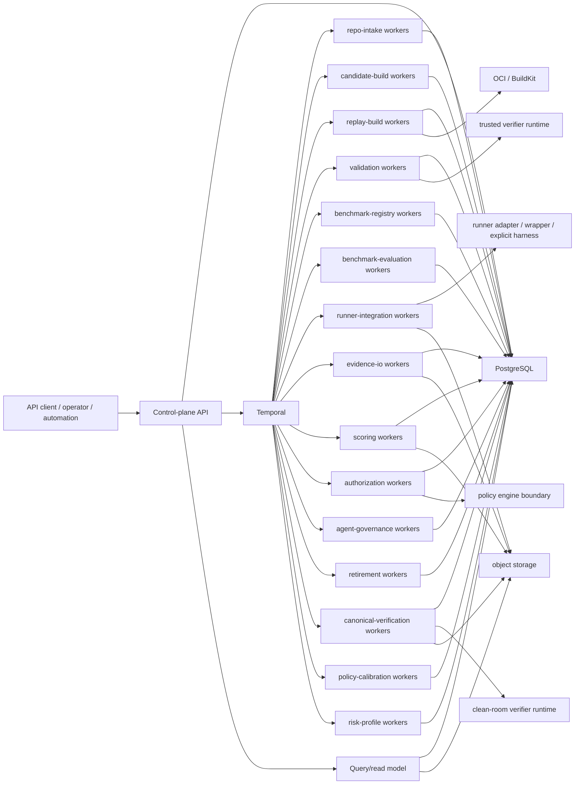

# Backend Control-Plane Design

## 1. Purpose

This document refines the backend/control-plane slice that sits between:

- [system design](./system-design.md)
- [module design](./module-design.md)
- [benchmark admission rubric](./benchmark-admission-rubric.md)
- [scoring semantics](./scoring-semantics.md)
- [policy calibration](./policy-calibration.md)
- [interface contracts](./interface-contracts.md)
- [data model](./data-model.md)
- [api schema](./api-schema.md)
- [workflow runtime](./workflow-runtime.md)

The goal is to make the implementation boundary explicit: which backend processes exist, which state each process owns, how synchronous API commands hand off into Temporal workflows, and where trust and failure boundaries must remain hard.

This document stays implementation-facing, but it does not define source code layout, HTTP routes, or database migrations.

## 2. Control-Plane Stance

- The control plane owns metadata, lineage, workflow coordination, audit state, and authorization outputs.
- The runner-integration plane invokes native agents, wrappers, or explicit harness-native sessions and can never become the source of truth for scores, validation verdicts, canonical verification, or policy decisions.
- The default boundary is the Runner Integration Layer, not a Barcarolle agent scaffold. If `evaluation_mode = harness_native` or adapter purity is `A3_harness_native_controller`, the ACUT is `Agent + Harness`.
- PostgreSQL is the source of truth for queryable control-plane state.
- S3-compatible object storage is the source of truth for large immutable artifacts.
- Temporal is the durable coordinator for long-running state transitions, retries, and cancellation.
- Policy evaluation remains separate from scoring, consistent with the existing scoring-versus-authorization split.
- Policy calibration remains separate from both scoring and authorization: it writes calibration truth observations and calibrated profile facts that future scoring and authorization consume by exact version/profile ref, but it does not rewrite scorecards or decisions.
- Risk-profile governance remains separate from calibration and authorization: it writes explicit appetite facts that constrain future policy selection, but it does not supply calibration labels, benchmark truth, or runtime enforcement.
- Golden/Judge remain benchmark-side capabilities owned by trusted lanes: Golden discovery/selection can run on the candidate-build side before a candidate exists, Golden validation support runs on the validation side, and Judge runs on the scoring side.
- Benchmark admission remains in trusted control-plane lanes: task-level hard gates, oracle grading, and leakage checks are validation-owned; suite coverage profiles and supported authorization scopes are benchmark-registry-owned; post-release quarantine and invalidation are retirement/governance-owned.
- Supported evaluation modes are `patch_only`, `trace_submission`, `observed_run`, and `harness_native`; supported adapter purity levels are `A0_transport_only`, `A1_environment_wrapper`, `A2_tool_mediation`, and `A3_harness_native_controller`.
- Evidence trust tiers are `trusted_barcarolle_evidence`, `adapter_observed_evidence`, `agent_submitted_evidence`, and `third_party_evidence`; only trusted Barcarolle evidence can root correctness and admission.
- This phase assumes trusted internal collaboration and low-adversarial operation. The control plane therefore treats immutable benchmark facts, append-only admission/change-review records, and mutable current operating state as separate entity families rather than trying to collapse them into one state machine.

`Inference`: these concerns can be deployed from one backend repository, but they should remain separate process roles even if some roles share infrastructure.

## 3. Process Topology

Recommended deployable roles:

| Role | Primary responsibility | May write | Must not write |
| --- | --- | --- | --- |
| Control-plane API | Request validation, idempotency, workflow start/signal, read-model queries | request-visible control-plane rows and handles | evidence blobs, runner state |
| Read-model/query service | Query assembly from PostgreSQL and evidence manifests | none or derived cache only | workflow state, verdict rows |
| Control-plane workflow workers | repository intake, candidate build, benchmark release publication, benchmark evaluation coordination, retirement orchestration | owned control-plane metadata | runner filesystem |
| Replay-build workers | replay planning, dependency resolution, OCI image build, environment registration | replay-plan and environment records | score and policy records |
| Validation workers | base/target verification, oracle admission probes, leakage checks, validation verdicts, benchmark-admission gate summaries, candidate-side Golden outputs | validation results, task approval/rejection | runner artifacts |
| Benchmark-registry workers | benchmark-definition lookup, release publication, immutable membership snapshot writes, release coverage profiling, supported/unsupported authorization-scope computation | benchmark definitions, releases, membership records | runner artifacts |
| Benchmark-evaluation workers | benchmark-evaluation lifecycle, child-run coordination, aggregate coverage state | benchmark evaluations, run coordination state | validation verdicts or policy records |
| Runner-integration workers | task package delivery, native runner invocation, wrapper observation, and submission coordination | coarse run progress and submission handoff only through owned workflow path | validation, benchmark release, canonical verification, score, or policy records |
| Evidence-IO workers | append-only evidence manifesting with producer, trust tier, source class, digest, redaction, score-contribution metadata, and sealed bundle versions | evidence bundle versions and artifact metadata | task validity, canonical verdict, score rows, or decision rows |
| Canonical-verification workers | clean-room patch/result application and verifier execution | `canonical_verification_record` and trusted Barcarolle evidence refs | runner invocation, score, or policy rows |
| Scoring workers | score computation, run-outcome classification, repeated-run aggregation, score weighting, benchmark scorecard aggregation, missing-run denominator accounting, and Judge assessment | score bundles, benchmark scorecards | runner state, policy rows, or mutable evidence pointers |
| Risk-profile workers | risk-profile registration, constraint normalization, effective-profile resolution, lifecycle transitions, and impact triggers | repository risk profiles and transition records | score bundles, scorecards, decisions, or runner state |
| Policy-calibration workers | automatic calibration manifests, truth-observation normalization, controls, baseline runs, unsafe false-positive measurement, high-tier control-power checks, profile fitting, sensitivity analysis, and calibrated policy-profile lifecycle under explicit risk-profile constraints | policy calibration runs, calibration truth observations, and calibrated policy profiles | score bundles, benchmark scorecards, authorization decisions, or runner state |
| Authorization workers | policy input loading and decision persistence, including release coverage and unsupported-scope enforcement | authorization decisions | run evidence and score internals |
| Agent-governance workers | tested-agent snapshots, change reviews, repository admissions, current operating-state projection | tested-agent snapshots, change reviews, repository-agent admissions, operating-state read models | benchmark facts, runner state |

The important deployment rule is that `runner-integration` is isolated from validation, canonical verification, scoring, and authorization. Those trusted roles must not share writable state with the runner integration path.

## 4. Service Boundaries and Ownership

### 4.1 API service boundary

The API service is the only synchronous entrypoint for command and query traffic. It should:

- validate request shape, actor identity, and idempotency key;
- allocate or look up the stable resource handle;
- start or signal the owning Temporal workflow using a deterministic workflow ID;
- return the current accepted state without waiting for the full business chain to finish.

It should not:

- execute repository mining directly;
- build environments directly;
- run verifiers directly;
- launch or control agent loops directly outside explicit runner-integration or `harness_native` workflow ownership;
- compute final scores or authorization decisions inline.

### 4.2 Workflow boundary

Temporal workflows own long-running state transitions and cross-process coordination. The workflow layer maps cleanly to the runtime document. The first-release business workflow coverage is:

- `SnapshotIntakeWorkflow`
- `CandidateBuildWorkflow`
- `ReplayEnvBuildWorkflow`
- `ValidationWorkflow`
- `BenchmarkReleaseWorkflow`
- `AgentGovernanceWorkflow`
- `BenchmarkEvaluationWorkflow`
- `RunnerInvocationWorkflow`
- `SubmissionWorkflow`
- `CanonicalVerificationWorkflow`
- `ScoreWorkflow`
- `AuthorizationWorkflow`
- `RetirementWorkflow`
- `AdmissionReviewWorkflow`
- `GovernedAssessorWorkflow`
- `RiskProfileGovernanceWorkflow`
- `PolicyCalibrationWorkflow`

Workflows should keep only compact control-plane data in history: identifiers, status transitions, digests, manifest references, retry class, and coarse summaries.
Golden discovery/selection work should run inside `CandidateBuildWorkflow` or a trusted child activity before candidate creation. Golden validation support stays inside `ValidationWorkflow`, and Judge assessment stays inside `ScoreWorkflow`. None of these runs on runner-integration queues or changes the tested ACUT loop.

### 4.3 Activity boundary

Activities are the only code allowed to touch external systems such as Git, GitHub, BuildKit, runner adapters, clean-room verifier runtimes, object storage, and the policy engine. Activities must be idempotent at their natural business key because they are retried at least once.

### 4.4 Storage boundary

- PostgreSQL stores resource identity, lifecycle state, lineage, audit fields, tested-agent snapshots, benchmark release and evaluation summaries, run submissions, canonical verification records, score/decision summaries, repository risk profiles, policy calibration runs, calibration truth observations, calibrated policy profiles, change reviews, repository admissions, current operating-state read models, admission-review records, governed assessor configuration lineage, and object references.
- Object storage stores logs, transcripts, submitted patches, native traces, wrapper observations, canonical verifier logs, build logs, screenshots, replay bundles, and other large immutable artifacts.
- Temporal history stores workflow coordination state, not large evidence payloads.

## 5. Persistence and Transaction Ownership

The backend should keep a single-writer rule for each entity family, even when multiple processes read it.

| Entity family | Writer of record | Notes |
| --- | --- | --- |
| `repository`, `repository_snapshot`, `source_artifact` | snapshot-intake path | Intake owns repository catalog lineage. |
| `extracted_signal`, `candidate_generation_run`, `task_candidate` | candidate-build path | Candidate generation remains separate from validation and can own pre-candidate Golden discovery evidence before a candidate exists. |
| `replay_plan`, `replay_environment` | replay-build path | Replay feasibility and environment materialization stay outside validation and runner integration. |
| `validation_result` | validation path | Validation is the only writer of admissibility verdicts, benchmark-admission gate summaries, oracle profiles/probes, leakage reports, review reason codes, and any Golden-side artifact refs attached to them. |
| `admission_review_record` | validation/governance review path | Admission review lineage is append-only and queryable for compliance checks. |
| `task` approval state | validation path | Task materialization happens only after validation passes. |
| `benchmark_definition`, `benchmark_release`, `benchmark_release_membership` | benchmark-registry path | Release publication is the only writer of immutable benchmark basis state, release coverage profiles, supported authorization scopes, and unsupported authorization scopes. |
| `tested_agent_snapshot` | agent-governance path | The evaluated-reference subject is immutable and reused across evaluations, admissions, and operating-state reads. |
| `benchmark_evaluation` | benchmark-evaluation path | Benchmark evaluation owns release-bound evaluation lifecycle and child-run coordination under an explicit capability-envelope contract basis. |
| `evaluation_run` | benchmark-evaluation path | Child runs are coordinated under one benchmark evaluation or an explicit ad hoc path, and the immutable capability envelope, evaluation mode, adapter purity, and adapter manifest are persisted with the run record. |
| `run_submission` | submission path | Submitted patch/result/artifacts are recorded without claiming correctness. |
| `canonical_verification_record` | canonical-verification path | Clean-room verification is the trusted Barcarolle correctness root, with semantic re-verification represented by `verification_attempt_number` under a fixed verifier basis. |
| `evidence_bundle`, `evidence_artifact` | evidence-io path | Evidence manifesting is append-only and separate from runner integration, with producer, source class, trust tier, redaction, digest, score-contribution metadata, and immutable sealed versions keyed by `subject_type + subject_id + bundle_kind + manifest_version`. This covers pre-candidate Golden artifacts on `candidate_generation_run`, post-candidate Golden artifacts on `task_candidate` or `validation_result`, and run-side evidence. |
| `score_bundle` | scoring path | Scoring reads exact sealed evidence bundle versions and canonical verification but does not mutate them; Judge-side assessment refs remain score-owned audit material, and score identity includes `score_input_evidence_digest`, run-outcome classification basis, and score-basis Judge lineage. |
| `benchmark_scorecard` | scoring path | Aggregate benchmark result is owned by scoring, must stay pinned to one benchmark release, and must persist the complete score input set, denominator summary, weighting summary, missing-run summary, minimum-sample summary, reliability label, and authorization-readiness fields needed by policy. |
| `repository_risk_profile` | risk-profile governance path | Appetite profiles are append-only policy inputs with normalized constraint digests. They constrain calibration and authorization, but they are not benchmark truth, human labels, or runtime enforcement. |
| `policy_calibration_run`, `calibration_truth_observation`, `calibrated_policy_profile` | policy-calibration path | Calibration is automatic, append-only, and consumes immutable releases, scorecards, canonical verification, controls, baselines, prior agent configs, repeated-run variance, maintenance findings, explicit risk-profile constraints, and sensitivity analyses. Truth observations carry objective expected policy effects and unsafe false-positive measurement basis. It does not require human labels or manual benchmark acceptance, and it does not mutate scorecards or decisions. |
| `governed_assessor_configuration` | governance/configuration path | Register Golden/Judge configuration fingerprints and read lineage for version, promotion, rollback, and comparison state. |
| `authorization_decision` | authorization path | Policy output is separate from score computation and resolves to benchmark scorecard context, release coverage profile, unsupported-scope findings, and the authorized capability envelope. |
| `agent_change_review`, `repository_agent_admission`, `repository_agent_operating_observation`, `repository_agent_operating_state`, `license_certificate`, `license_status_record`, `license_status_receipt`, `license_consumption_audit_event` | agent-governance path | Post-evaluation carry-forward review, structured condition-delta classification including ACUT field evidence-basis deltas, explicit target-condition basis capture, repository license lineage, explicit `fresh`/`reused`/`supplemented` evidence-lineage propagation, append-only operating observations, current operating-state projection with per-target-condition `coverage_entries[]`, signed durable certificate projections, signed status publication/logging, status receipts, and consumer audit events stay separate from immutable benchmark facts. |
| `task_retirement` | retirement path | Retirement is the writer of task-level drift, leakage, weak-oracle, quarantine, and retirement state plus task-scoped invalidation impact summaries. |
| `release_maintenance_finding` | retirement/governance path | Retirement/governance is the writer of release, release-membership, scorecard, authorization-decision, repository-admission, and release-coverage invalidation findings that are not represented by a single task retirement. |

The `benchmark_evaluation` and `evaluation_run` writers must verify that evaluation mode, adapter purity, adapter manifest, and run-environment declaration match the referenced `tested_agent_snapshot` canonical values before accepting the record. The `evaluation_run` writer must also persist the durable capability-envelope contract, including tool policy, network or egress posture, runtime limits, evidence destination, evaluation mode, adapter purity, and adapter manifest. Before starting the envelope-sensitive run workflow, the command path must reserve or check the envelope-independent `run_attempt_slot`; same slot plus the same normalized envelope/mode/purity/adapter basis is replay, same slot plus a different normalized value is `policy_conflict`, and a different slot creates a new accepted run identity. Scoring and authorization read the persisted run contract, ACUT identity field evidence-basis summary, run observation basis, and canonical verification basis back rather than reconstructing them from runtime limits or agent-submitted traces. Run-level adapter observation can affect audit, process scoring, Judge confidence, and risk analysis, but it must not overwrite the tested-agent snapshot field-basis map; stronger field basis intended for admission requires a new snapshot or explicit governed carry-forward.

### 5.1 Transaction model

There is no distributed transaction across PostgreSQL, Temporal, and object storage. The implementation rule is:

1. commit the local control-plane transaction for the accepted command or resource stub;
2. start or signal the deterministic workflow;
3. let the owning workflow advance the authoritative domain state.

If step 2 fails after step 1, the API layer must rely on idempotent retry plus deterministic workflow IDs instead of trying to make PostgreSQL and Temporal commit atomically.

### 5.2 Blob write model

Large artifacts follow the workflow-runtime evidence path:

1. runner integration, submission, canonical verifier, validator-side Golden capability, or scoring-side Judge capability writes the raw artifact to object storage;
2. evidence-io computes digest, metadata, producer, source class, trust tier, retention class, score-contribution flag, and controlled-read fields such as sensitivity, redaction, audience, and blind-safe posture;
3. evidence-io appends the evidence manifest row in PostgreSQL;
4. downstream scorers and auditors read only by manifest reference.

This prevents scorers, policy evaluators, and UI queries from depending on runner-local paths or agent-submitted traces as correctness roots.

Admission-review record writes are owned by `AdmissionReviewWorkflow`, and governed-assessor lifecycle mutations are owned by `GovernedAssessorWorkflow`. Tested-agent snapshot registration, change-review writes, repository-agent admission writes, operating-observation writes, and current operating-state projection updates are owned by `AgentGovernanceWorkflow`. All of those are append-only control-plane operations except the operating-state read model, which is a mutable projection over append-only facts. `AgentGovernanceWorkflow` must also enforce that at most one repository-agent admission is `Effective` for any one `repository_id + scope + target_condition_basis_identity`, while allowing policy-approved coexistence across different target-condition bases or authorization dimensions. The operating-state projection must preserve that coexistence in `coverage_entries[]` instead of selecting a single admission and dropping the others.

Risk-profile writes are owned by `RiskProfileGovernanceWorkflow`. The workflow normalizes constraints, resolves effective profile basis, and triggers impact or recalibration work, but it does not write scorecards, authorization decisions, or runtime guard state. Policy-calibration writes are owned by `PolicyCalibrationWorkflow`. The workflow may start or reference ordinary benchmark-evaluation and scoring workflows for automatic controls and baselines, but truth-observation normalization, unsafe false-positive measurement, high-tier control-power checks, profile fitting, sensitivity analysis, profile activation, promotion, resume, supersession, pause, and rollback state remain calibration-owned. Human governance records can pause, annotate, or roll back a profile, but they are not calibration labels, cannot promote or resume a profile, and are not required for normal promotion.

## 6. API-to-Workflow Handoff

All mutating API commands follow the same handoff shape.

### 6.1 Synchronous phase

- validate payload and idempotency key;
- resolve natural key conflicts;
- persist the initial accepted record or handle;
- start or signal the owning workflow;
- return `202 Accepted` plus the stable resource identity.

For `StartBenchmarkEvaluation` and `StartRunnerInvocation`, payload validation must include an explicit `attempt_number`, evaluation mode, adapter purity level, and adapter manifest before workflow ID derivation. The application layer treats the tuple of command type, caller, natural attempt basis, `attempt_number`, mode, purity, adapter manifest, and idempotency key as the retry boundary: same tuple replays, same idempotency key with a different attempt number or basis conflicts, and a new semantic attempt uses a new idempotency key plus the next attempt number. The control plane must not auto-increment attempt number while recovering from a transport retry.

### 6.2 Asynchronous phase

The owning workflow then performs the real business chain, writes domain state through its owning worker path, and emits queryable status transitions.

### 6.3 Mapping

| API command family | Workflow entrypoint | First durable owner after handoff |
| --- | --- | --- |
| repository registration | `SnapshotIntakeWorkflow` | intake workers |
| candidate generation run reservation/completion and task candidate creation | `CandidateBuildWorkflow` | candidate-build workers |
| replay planning / env build | `ReplayEnvBuildWorkflow` | replay-build workers |
| task approval / rejection | `ValidationWorkflow` | validation workers |
| benchmark release publication | `BenchmarkReleaseWorkflow` | benchmark-registry workers |
| admission-review record write | `AdmissionReviewWorkflow` | validation/governance review workers |
| tested-agent snapshot register / change review / admission / operating-observation record | `AgentGovernanceWorkflow` | agent-governance workers |
| benchmark evaluation start / cancel | `BenchmarkEvaluationWorkflow` | benchmark-evaluation workers |
| runner invocation start / cancel | `BenchmarkEvaluationWorkflow` or ad hoc runner path | benchmark-evaluation and runner-integration workers |
| run submission | `SubmissionWorkflow` | runner-integration and evidence-io workers |
| canonical verification | `CanonicalVerificationWorkflow` | canonical-verification workers |
| score computation and scorecard aggregation | `ScoreWorkflow` or benchmark-evaluation signal | scoring workers |
| risk-profile register / effective-profile resolution / transition | `RiskProfileGovernanceWorkflow` | risk-profile workers |
| policy calibration and calibrated policy-profile transition | `PolicyCalibrationWorkflow` | policy-calibration workers |
| authorization decision | `AuthorizationWorkflow` | authorization workers |
| governed assessor configuration register / lifecycle transition | `GovernedAssessorWorkflow` | governance workers |
| retirement request and release-maintenance finding write | `RetirementWorkflow` | retirement workers |

Workflow IDs should follow the same deterministic shape as the runtime design so API retries do not create duplicate long-running chains:

- `snapshot:{repository_id}:{source_revision}`
- `candidate:{repository_id}:{candidate_generation_identity}`
- `env:{task_candidate_id}:{plan_version}`
- `validation:{task_candidate_id}:{environment_id}`
- `benchmark-release:{benchmark_definition_id}:{release_label}`
- `agent-snapshot:{repository_scope}:{snapshot_fingerprint}`
- `agent-governance:{repository_scope}:{subject_key}`
- `benchmark-eval:{benchmark_release_id}:{tested_agent_snapshot_id}:{evaluation_policy_version}:{evaluation_mode}:{adapter_purity_level}:{capability_envelope_contract_id}:{assurance_mode}:{attempt_number}`
- benchmark-linked `run-slot:{benchmark_evaluation_id}:{benchmark_release_membership_id}:{attempt_number}`
- ad hoc `run-slot:{task_id}:{tested_agent_snapshot_id}:{environment_id}:{attempt_number}`
- benchmark-linked `run:{benchmark_evaluation_id}:{benchmark_release_membership_id}:{capability_envelope_id}:{evaluation_mode}:{adapter_purity_level}:{adapter_manifest_digest}:{attempt_number}`
- ad hoc `run:{task_id}:{tested_agent_snapshot_id}:{environment_id}:{capability_envelope_id}:{evaluation_mode}:{adapter_purity_level}:{adapter_manifest_digest}:{attempt_number}`
- risk profile: `risk-profile:{organization_or_repository_scope}:{scope_digest}:{risk_profile_version_or_constraint_digest}`
- policy calibration: `policy-calibration:{repository_scope}:{target_policy_family_digest}:{repository_risk_profile_id_or_seed}:{risk_profile_digest}:{calibration_input_manifest_digest}:{run_attempt_number}`
- calibrated policy transition: `calibrated-policy:{calibrated_policy_profile_id}:{transition_type}:{transition_basis_digest}`
- `authz:{repository_scope}:{authorization_policy_version}:{calibrated_policy_profile_id_or_seed}:{repository_risk_profile_id_or_seed}:{risk_profile_digest}:{benchmark_scorecard_id}:{authorized_capability_envelope_id}:{target_condition_basis_identity}`

`Inference`: the `agent-snapshot` workflow ID uses the backend-validated canonical `snapshot_fingerprint`, not an unchecked caller token. The candidate-generation workflow ID must be derived from the backend-normalized `candidate_generation_run` reservation identity when pre-candidate discovery runs, including `golden_input_manifest_digest` when Golden is used. The task-candidate workflow ID must be derived from the backend-normalized candidate-generation identity, not `source_anchor` alone. That identity must include `snapshot_id` and generation-context lineage, and that lineage must encode candidate-specific selection identity plus `candidate_generation_run_id`, Golden input/configuration/artifact lineage, exact evidence-bundle version/digest, and selected output digest when Golden materially assists discovery, selection, or contract synthesis, so regenerated candidates remain distinct when the snapshot, extractor lineage, Golden basis, or candidate selection changes.

### 6.4 Query rule

Read APIs should query PostgreSQL-backed read models and evidence manifests, not inspect live workflow history for user-facing state. Canonical reads must cover candidate-generation runs, candidates, admission reviews, approved tasks, tested-agent snapshots, change reviews, repository-agent admissions, current operating state, benchmark definitions, benchmark releases, release memberships, benchmark evaluations, benchmark scorecards, replay plans, replay environments, validation results, runs, run submissions, canonical verification records, decisions, repository risk profiles, policy calibration runs, calibration truth observations, calibrated policy profiles, governed assessor configurations, evidence, and any Golden/Judge summaries or artifact refs attached to candidate-generation, validation, score, or scorecard records. When Golden/Judge refs are not blind-safe, read models should expand them in summary-only form unless the caller has the required audience and sensitive-artifact access. Temporal is the coordination engine, not the long-term query model.

## 7. Worker Role Partitioning

The worker split should follow the task-queue plan in [workflow runtime](./workflow-runtime.md).

| Queue | Capability | Why it is separate |
| --- | --- | --- |
| `repo-intake` | Git and forge metadata collection | external metadata access, but no runner invocation |
| `candidate-build` | signal extraction, governed Golden discovery/selection/contract synthesis, `candidate_generation_run` writes, and candidate creation | trusted repository-evidence lane with no ACUT or runner workspace access; candidate identity comes from snapshot and generation-context lineage, with candidate-specific selection identity and any Golden generation-run lineage encoded in the lineage rather than source anchor alone |
| `replay-build` | dependency recovery and OCI/BuildKit image work | build privileges without invoking the ACUT |
| `validation` | trusted verifier execution, leakage checks, and Golden-side reference construction | must remain outside the agent writable boundary |
| `benchmark-registry` | release publication and immutable membership snapshot writes | freezes benchmark basis outside runner integration |
| `agent-governance` | tested-agent snapshot registration, change-review lineage, admission writes, append-only operating observations, operating-state projection, signed License certificate projection, signed status publication, status receipt ingest, consumer audit ingest | keeps benchmark fact, repository license, signed certificate, signed status, live observations, current state, receipts, and consumer audit distinct |
| `benchmark-evaluation` | benchmark evaluation lifecycle and child-run coordination | durable control-plane logic for one release/tested-snapshot/policy/assurance tuple |
| `runner-integration` | native runner invocation, observed wrapper coordination, harness-native launch, and submission handoff | closest to untrusted code and adapter outputs, so isolate operationally |
| `evidence-io` | digesting, upload finalization, manifest append | append-only evidence pipeline |
| `canonical-verification` | clean-room submitted-result application and verifier execution | produces trusted Barcarolle evidence without modifying the ACUT |
| `scoring` | correctness and stability computation, benchmark scorecard aggregation, plus Judge-side assessment | must read sealed evidence and canonical verification without runner privileges |
| `risk-profile` | appetite profile registration, effective-profile resolution, and transition impact triggers | must write policy appetite only; no benchmark truth, score, or runtime enforcement authority |
| `policy-calibration` | truth-observation normalization, automatic controls, baseline evaluations, unsafe false-positive measurement, high-tier control-power checks, sensitivity analysis, and calibrated policy-profile writes | must read immutable evidence, score facts, and explicit risk-profile constraints without mutating them; no human baseline or manual benchmark acceptance is required |
| `authorization` | policy evaluation and decision persistence | must not depend on runner-local state |
| `retirement` | drift, leakage, release-maintenance invalidation, and repair handling | governance path, separate from hot execution |

Recommended scaling rule:

- scale `runner-integration` independently based on native runner, wrapper, or harness-native capacity;
- scale `canonical-verification` independently based on verifier backlog;
- scale `replay-build` independently based on image-build pressure;
- keep `validation`, `benchmark-registry`, `scoring`, `policy-calibration`, and `authorization` on smaller trusted fleets with tighter change control;
- keep `benchmark-evaluation` stateless and cheap so it can absorb high request fan-out without gaining shell or build privileges.

## 8. Implementation-Facing Module Responsibilities

Within the backend codebase, the main implementation boundaries should mirror the process boundaries above.

| Module boundary | Responsibility |
| --- | --- |
| API schema layer | FastAPI/Pydantic request and response models aligned with the API schema doc. |
| Command application layer | idempotency, workflow-ID derivation, resource-handle creation, and request-to-workflow dispatch. |
| Query/read-model layer | PostgreSQL-backed lookup and evidence manifest expansion for status/read APIs. |
| Workflow definitions | durable business state machines for intake, mining, replay, validation, admission review, tested-agent governance, benchmark release publication, benchmark evaluation, runner invocation, submission, canonical verification, scoring, risk-profile governance, policy calibration, governed assessor lifecycle, authorization, and retirement. |
| Activity adapters | integration code for Git, GitHub, BuildKit, runner adapters, clean-room verifier runtime, object storage, and policy engine calls. |
| Persistence layer | repositories/mappers for the relational entities in the data-model doc. |
| Evidence layer | manifest sealing, digesting, artifact pointer normalization, trust-tier classification, score-contribution flags, and retention metadata. |
| Scoring layer | deterministic score computation, repeated-run aggregation, and benchmark scorecard assembly. |
| Risk-profile governance layer | appetite profile normalization, effective profile resolution, transition lineage, and impact triggers. |
| Policy-calibration layer | automatic calibration manifests, truth-observation normalization, control generation, baseline scoring, unsafe false-positive measurement, high-tier control-power checks, sensitivity analysis, calibrated profile lifecycle, and impact previews under risk-profile constraints. |
| Policy layer | benchmark scorecard, risk-profile basis, and release context to scope mapping plus policy-engine invocation. |
| Agent-governance layer | tested-agent snapshot registration, carry-forward review, repository admission issuance, and current operating-state projection. |

Implementation rule: do not let API handlers, workflow code, and side-effect adapters collapse into one module. The code structure should make it obvious which layer is pure orchestration and which layer touches external systems.

## 9. Failure and Isolation Boundaries

### 9.1 Control-plane versus runner boundary

The native runner, wrapper, or harness-native session may fail, be canceled, or produce malformed artifacts without corrupting validation, canonical verification, scoring, or policy state. `runner-integration` can report invocation and submission state; it cannot decide admissibility, canonical correctness, scoring, admission, or authorization.

### 9.2 Build versus validation boundary

Replay-build failures are environment failures, not benchmark-task failures. Validation decides whether a built environment is admissible. This preserves the distinction already established in the architecture and workflow docs.

Validation may reuse the replay image, but it must run with a fresh workspace and separate mounts from the evaluated agent run, native runner submission, or canonical verifier.
Post-candidate Golden validation work belongs on this validation side of the boundary. Pre-candidate Golden discovery work belongs on the candidate-build lane and must write `candidate_generation_run` evidence subjects rather than validation verdicts.
Task-level benchmark admission also belongs here: validation workers grade oracles, run canonical/no-op/known-bad/flakiness/runtime/leakage probes, write review reason codes, and block approval on hard-gate failures. Runner integration and scoring cannot repair a missing task-admission proof after the fact.

### 9.3 Validation versus scoring boundary

Validation answers "is this task trustworthy enough to run." Canonical verification answers "what happened when the submitted result was applied cleanly." Scoring answers "how did this run perform." A run should never create or revise a validation verdict.
Golden-side outputs can inform validation, and Judge-side outputs can inform scoring, but the two capabilities should not cross those ownership lines.

### 9.3a Release publication versus evaluation boundary

Benchmark release publication answers "which immutable task basis is benchmark-authoritative right now." Benchmark evaluation answers "how did one ACUT perform on that frozen basis under one explicit policy, evaluation mode, adapter purity, capability-envelope contract basis, and assurance mode." Evaluation must never mutate release membership; refreshes publish a new release instead.
Release publication also answers "which authorization scopes this release can support." It computes the release coverage profile and unsupported scopes from certified task profiles. Benchmark evaluation can fail to complete enough released tasks and thereby narrow authorization readiness, but it cannot widen release-supported scope or change release certification.

### 9.3b Benchmark fact versus admission versus operating-state boundary

Benchmark evaluation answers "what ACUT identity was evaluated on what immutable benchmark release and under what mode, adapter purity, capability-envelope contract, ACUT field evidence basis, and evidence trust basis." Repository-agent admission answers "what repository-scoped license or permission was granted from that fact or from a later reviewed carry-forward decision, and to what target condition boundary." Repository-agent operating observation answers "what snapshot was observed or declared as live at a point in time." Operating state answers "what snapshot is live now, after projecting those facts together, and which target-condition coverage entries apply." A signed License certificate answers "what durable consumer-readable projection of that admission and exactly one coverage entry was signed." A signed License status record/log answers "what lifecycle state, status sequence/watermark, revocation/suspension/supersession/expiration state, and issuer-key status are current for that certificate." A receipt or consumer audit event answers "which status watermark an external consumer acknowledged or how it says it used or rejected that certificate/status." When older evidence is accepted under changed conditions, the control plane must surface that acceptance as `reused` or `supplemented` lineage on the governance side together with the explicit target-condition basis rather than collapsing it into a rewritten benchmark fact. The control plane must not collapse those answers into one mutable row, and it must not collapse multiple effective target-condition admissions into one operating-state summary field or make certificate/status/audit rows authoritative over admission state.

### 9.4 Score versus policy boundary

Scoring persists evidence-derived outcomes rooted in canonical verification. It is the only layer that computes `aggregate_score`, and it must do so from the complete score input set defined by [scoring-semantics.md](./scoring-semantics.md), including missing or blocked release-membership entries rather than only successful score bundles. Authorization consumes benchmark scorecards plus benchmark release context, policy version, risk-profile basis, mode/purity basis, evidence trust-tier basis, reliability/sample fields, invalidation state, and scope. A policy denial must not mutate the underlying score or scorecard records.
Raw Judge output should therefore remain score-owned audit material rather than a direct authorization input.

### 9.4a Policy calibration boundary

Risk-profile governance writes explicit appetite constraints and transition lineage. Policy calibration reads immutable benchmark releases, scorecards, canonical verification records, control/baseline runs, repeated-run summaries, maintenance findings, and the effective risk-profile basis. It writes `policy_calibration_run`, `calibration_truth_observation`, and `calibrated_policy_profile` records only. It may request ordinary benchmark generation/running for automatic controls, but those controls follow the normal workflow and evidence boundaries. Calibration must not require human baselines, human labels, risk-profile edits as labels, manual benchmark acceptance, or a human-in-the-loop calibration step for normal operation.

### 9.5 Metadata versus blob boundary

If an object upload succeeds but manifest append fails, the artifact is not yet queryable evidence. The system should mark it incomplete and reconcile through the evidence path, not read directly from runner-local storage.

### 9.6 Agent workspace boundary

The following stay outside any agent, wrapper, or harness-native writable workspace Barcarolle controls:

- verifier code and final verifier outputs;
- canonical verification workspaces and records;
- Golden/Judge prompts, configurations, and trusted-side output artifacts;
- evidence manifest append logic;
- score computation;
- authorization policy evaluation;
- PostgreSQL credentials and control-plane tokens.

### 9.7 Network boundary

Barcarolle-controlled verifier sandboxes and observed/harness-native wrapper portions default to no outbound network unless a task family explicitly requires it and contamination policy allows it. Non-invasive external native-agent networking is recorded as ACUT/adapter metadata with field evidence basis such as `declared` or `third_party_attested` unless the adapter actually controls or observes it. Control-plane services may access their dependencies; runner environments should not inherit that privilege by default.

## 10. Control-Plane Sequence Summary

The end-to-end ownership chain should be:

1. API accepts a command and returns a stable handle.
2. Temporal workflow coordinates the long-running chain.
3. Domain-specific workers write only their owned entity families.
4. Benchmark-registry workers publish immutable benchmark releases before benchmark-authoritative evaluation begins.
5. Benchmark-evaluation workers coordinate child runs against one benchmark release.
6. Runner-integration workers invoke native runners, wrappers, or explicit harness-native sessions and collect submissions without deciding correctness.
7. Evidence-io seals PostgreSQL manifests with producer, source class, trust tier, digest, redaction, and score-contribution metadata.
8. Canonical-verification workers apply submitted results in clean-room workspaces and write trusted verification records.
9. Scoring reads exact sealed evidence bundle versions plus canonical verification, writes per-run score bundles keyed by score input evidence digest, classifies missing and blocked terminal run outcomes, and aggregates benchmark scorecards from the complete score input set.
10. Risk-profile governance resolves explicit appetite constraints for the repository or organization scope and records profile transition lineage.
11. Policy calibration reads immutable evidence, score facts, and risk-profile constraints, writes calibration truth observations and calibrated policy profiles, and promotes new policy versions automatically when machine-checkable gates pass.
12. Authorization reads benchmark scorecards, exact calibrated policy-profile refs, and risk-profile basis, then writes scoped decisions bound to ACUT, mode, purity, verification, evidence-trust basis, and appetite constraints.
13. Agent-governance workers register tested-agent snapshots, write change reviews and repository admissions, and project current operating state with per-target-condition coverage entries without mutating the benchmark fact.
14. Retirement handles later drift, leakage, oracle-quality failures, and release-maintenance invalidation findings without rewriting prior evidence history.

This gives the system one control plane, several isolated worker planes, and a single audit trail across repository snapshots, tasks, tested-agent snapshots, benchmark releases, benchmark evaluations, runs, submissions, canonical verification records, evidence, scores, scorecards, risk profiles, calibration truth observations, calibrated policy profiles, change reviews, admissions, operating-state projections, and decisions.
