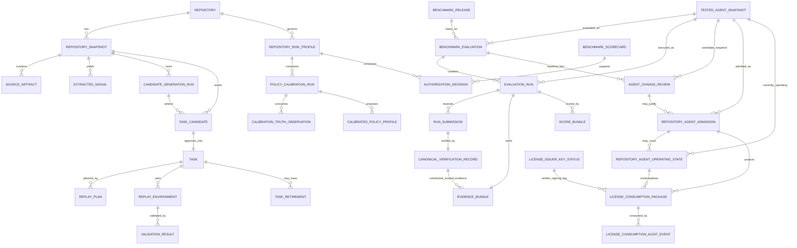

# Data Model for Repository-Specific Agent Benchmarking

## 1. Purpose

This document refines [docs/analysis/requirements.md](./requirements.md), [docs/architecture/system-design.md](./system-design.md), [docs/architecture/module-design.md](./module-design.md), [docs/architecture/benchmark-admission-rubric.md](./benchmark-admission-rubric.md), [docs/architecture/scoring-semantics.md](./scoring-semantics.md), [docs/architecture/interface-contracts.md](./interface-contracts.md), [docs/architecture/authorization-semantics.md](./authorization-semantics.md), [docs/decisions/dependency-selection.md](../decisions/dependency-selection.md), [docs/decisions/module-dependencies.md](../decisions/module-dependencies.md), [docs/draft/abstract.md](../draft/abstract.md), and the research notes under `docs/research/**` into a data model for the core repository-specific evaluation pipeline.

The focus is the minimum relational model that can support:

- snapshot
- task
- tested agent
- environment
- run
- evidence
- score
- risk profile
- policy calibration
- decision
- admission
- operating state

It does not define business logic or API payloads.

## 2. Modeling Rules

**Fact.** The architecture and dependency decisions place PostgreSQL at the center of relational state, with S3-compatible object storage for large immutable blobs and traces.

**Fact.** The interface contracts require contract versioning, idempotency, audit identifiers, and explicit separation between generation, replay, validation, execution, scoring, and authorization.

**Inference.** The cleanest implementation model is:

- PostgreSQL stores normalized entities, status, lineage, hashes, policy metadata, and queryable summaries.
- Object storage stores large immutable artifacts such as logs, patches, transcripts, screenshots, replay bundles, and build outputs.
- Mutable runner-invocation state stays outside the trust boundary of validation, canonical verification, and scoring.
- The default runtime boundary is the Runner Integration Layer, not an agent scaffold. The data model must distinguish the ACUT, adapter, submitted result, observed evidence, and trusted canonical verification instead of treating a Barcarolle-controlled harness as implicit.
- Candidate-side Golden artifacts and run-side Judge artifacts can remain append-only references attached to evidence bundles and validation or score records. Pre-candidate Golden discovery needs a stable `candidate_generation_run` subject so evidence can be stored before any `task_candidate_id` exists.
- Benchmark facts and scorecards should stay immutable and useful on their own for configuration comparison and optimization, even when no repository License is requested.
- Repository or organization risk appetite should be an explicit append-only policy resource. Calibration and authorization consume its resolved effective basis; they must not infer risk tolerance from benchmark facts alone.
- Policy-calibration facts should be append-only and useful without rewriting scorecards. A calibrated policy profile can govern future scoring or authorization versions, but historical scorecards and decisions keep the exact calibrated-profile and risk-profile refs they used.
- Repository admission/license and current operating state should be modeled as separate records rather than inferred from the same row.
- Runtime enforcement is not a v1 data-model responsibility. The model stores License-consumption and operating-envelope compatibility facts for external consumers instead of storing Barcarolle-owned runtime guard state.

Evaluation mode enum values are `patch_only`, `trace_submission`, `observed_run`, and `harness_native`. Adapter purity enum values are `A0_transport_only`, `A1_environment_wrapper`, `A2_tool_mediation`, and `A3_harness_native_controller`.

**Assumption.** Identifiers are opaque UUID/ULID-class values, and any agent-configuration catalog may live in a separate service if the product later needs to persist it locally.

## 3. Entity Graph

## 4. Core Entities

### 4.1 `repository`

Canonical row for one tracked repository.

- Key fields: `repository_id`, provider, external slug, default branch, display name, visibility, created timestamps.
- Uniqueness: `provider + external_slug` should be unique.
- Indexes: provider/slug lookup, default-branch lookup, recent activity if the product supports refresh scheduling.
- Lifecycle: mostly immutable after registration; display labels may change, but provider identity should not.

### 4.1a `repository_risk_profile`

Append-only policy record that declares risk appetite for an organization, repository, or narrower repository scope.

- Key fields: `repository_risk_profile_id`, optional `organization_id`, optional `repository_id`, scope descriptor, profile name, risk-profile version, predecessor profile ref, inheritance parent ref, risk tolerance class, constraint artifact ref, constraint digest, effective constraint summary, tier eligibility or forbidden-tier matrix, unsafe-control budget by tier/slice, minimum control-separation margins, minimum coverage/reliability/evidence-basis requirements, freshness ceilings, required review triggers, calibration objective weights, external-consumer assumption summary, lifecycle state, activation timestamp, optional expiration timestamp, supersession or rollback refs, producer identity.
- Uniqueness: `organization_id_or_repository_id + scope_descriptor + risk_profile_version` should be unique. `organization_id_or_repository_id + scope_descriptor + constraint_digest` should be idempotent for equivalent profiles.
- Indexes: organization, repository, scope descriptor, lifecycle state, risk tolerance class, activation timestamp, predecessor profile.
- Lifecycle: `Draft -> Candidate -> Active -> Paused -> Superseded/RolledBack/Retired`, with append-only transition history. At most one active profile should resolve for a given repository scope after deterministic inheritance and override rules.
- Notes: this row is policy appetite, not calibration evidence, benchmark truth, or runtime enforcement. Organization defaults, repository profiles, and component/path overrides are resolved into an effective profile basis that calibration runs, calibrated policy profiles, scorecards, authorization decisions, admissions, and operating-state coverage entries copy by ref/digest. Changing the active risk profile does not mutate historical facts; it triggers impact preview, recalibration, reauthorization, targeted validation, suspension/revocation, or full rebenchmarking when policy requires. The external-consumer assumptions field documents what downstream systems must verify before relying on a License, but Barcarolle still does not implement a live License enforcement plane.

### 4.2 `repository_snapshot`

Immutable repository state at a specific source revision and import mode.

- Key fields: `snapshot_id`, `repository_id`, `source_revision`, `snapshot_time`, `import_mode`, provenance summary, extraction timestamps, catalog status.
- Uniqueness: `repository_id + source_revision + import_mode` should be unique.
- Indexes: `repository_id + snapshot_time desc`, `source_revision`, `catalog_status`.
- Lifecycle: `Registered -> Indexed -> Available -> Superseded/Retired`.
- Notes: this is the root for time-aware mining and replay selection.

### 4.3 `source_artifact`

Normalized record for repository-native material such as commits, issues, pull requests, review comments, CI files, manifests, lockfiles, tests, and docs.

- Key fields: `artifact_id`, `snapshot_id`, artifact type, upstream reference, checksum, path or URL, excerpt, full content pointer, provenance.
- Uniqueness: `snapshot_id + artifact_type + upstream_ref` should be unique; checksum can be a secondary dedupe key.
- Indexes: `snapshot_id + artifact_type`, upstream reference, checksum.
- Lifecycle: append-only. If the upstream artifact changes, store a new row.

### 4.4 `extracted_signal`

Derived signal used for task mining and replay planning.

- Key fields: `signal_id`, `snapshot_id`, `source_artifact_id`, signal type, confidence, temporal window, affected files/symbols/tests, extraction method, signal payload.
- Uniqueness: `snapshot_id + signal_type + source_artifact_id + signal_key` should be unique.
- Indexes: `snapshot_id + signal_type`, confidence, temporal fields.
- Lifecycle: append-only and reproducible from the snapshot plus extraction version.
- **Inference.** Signal schemas should remain narrow and derivable so they can be regenerated when extraction logic improves.

### 4.4a `candidate_generation_run`

Pre-candidate generation attempt that can own Golden-assisted discovery, selection, and contract-synthesis evidence before any `task_candidate_id` exists.

- Key fields: `candidate_generation_run_id`, `repository_id`, `snapshot_id`, generation strategy, signal/input manifest digest, optional `golden_configuration_id`, optional Golden input-manifest digest, selection policy version, run attempt number, status, created timestamp, and optional completion metadata such as selected output digest, exact Golden output evidence-bundle version/digest, selection/ranking identity, completion event identity, completed timestamp, and completion producer.
- Uniqueness: `repository_id + snapshot_id + generation_strategy + signal_input_manifest_digest + selection_policy_version + optional golden_configuration_id + optional golden_input_manifest_digest + run_attempt_number` should be unique. For Golden-assisted runs, `golden_input_manifest_digest` is part of the generation identity because two Golden input packages under the same signal manifest and Golden configuration are different generation facts.
- Indexes: `repository_id`, `snapshot_id`, optional `golden_configuration_id`, selection policy version, status, created timestamp.
- Lifecycle: append-only event semantics. `ReserveCandidateGenerationRun` creates the immutable reservation basis. `CompleteCandidateGenerationRun` appends a completion event; `completed` events must include selected output digest and selection/ranking identity, while `failed` or `superseded` events may omit selected-output fields but must carry failure cause or summary. Read models may project completion fields onto the generation-run view, but the reservation basis is not mutated. A different Golden configuration, Golden input manifest, selection policy, or semantic rerun creates a new generation run.
- Notes: this row breaks the pre-candidate evidence identity cycle. The `candidate_generation_run_id` is allocated from the generation natural key before Golden output artifacts need to be stored. Golden discovery artifacts created before a candidate exists attach to evidence bundles with subject `candidate_generation_run`. Output evidence-bundle refs, selection/ranking identity, and selected output digests are completion metadata on the generation run, not part of the generation-run natural key; if they change after a completion is sealed under the same attempt, that is a conflict or a new semantic attempt. Later `task_candidate.generation_context_lineage` may reference the `candidate_generation_run_id`, the selected Golden output digest, and the exact evidence bundle version/digest, but the candidate identity no longer has to exist before the evidence can be stored.

### 4.5 `task_candidate`

Draft evaluation instance before approval.

- Key fields: `task_candidate_id`, `repository_id`, `snapshot_id`, optional `candidate_generation_run_id`, `generation_context_lineage`, optional Golden-assisted discovery/selection/contract-synthesis summary, task family, source anchor type and reference, `source_refs[]`, fixed `T_task`, base revision, expected transition, verifier hint, task statement, allowed inputs, disallowed inputs, expected artifacts, required permissions, capability tags, component/path tags, risk class, high-impact path classes, duplicate-cluster identity, provisional `task_admission_gate_results`, provisional `oracle_profile_draft`, `leakage_kind[]`, `leakage_severity`, `leakage_handling_decision`, `leakage_review_required`, `acut_visible_surfaces[]`, `redaction_revalidation_lineage`, optional `leakage_report_ref`, optional `leakage_report_digest`, status, `review_required`, `review_state`, `review_reason_codes[]`, optional `latest_admission_review_id`, contamination flags, retirement reason, contract version.
- Uniqueness: `repository_id + snapshot_id + generation_context_lineage + task_family + contract_version` should be treated as the natural key for the candidate-generation instance. This key shape stays unchanged, so `generation_context_lineage` must already encode per-candidate selection identity when one regeneration pass emits multiple same-family candidates under the same snapshot.
- Indexes: `status`, `task_family`, `base_revision`, `snapshot_id`, `review_state`, `review_required`, `leakage_severity`, `leakage_handling_decision`, contamination/retirement flags.
- Lifecycle: `Draft -> Candidate -> Planned -> EnvironmentReady -> Validated -> Approved`, with non-terminal `RepairRequired` and terminal `Rejected`, `Retired`, or `Failed`.
- Notes: `source_anchor` is historical source lineage. `T_task` is the temporal boundary for all agent-visible inputs. `generation_context_lineage` is the regeneration-safe identity axis and must capture extractor lineage plus candidate-specific selection identity at minimum; it may also carry broader candidate-build context when that context materially changes candidate semantics. When Golden materially assists candidate discovery, selection, or contract synthesis before the candidate row exists, `generation_context_lineage` must include `candidate_generation_run_id`, the governed `golden_configuration_id`, Golden input-manifest digest, selected output digest, exact evidence-bundle version/digest, and selection/ranking identity used to create the candidate. The rejected critique that `source_anchor` should join the natural key is not adopted here. The candidate should retain the evidence needed to explain why it was accepted or rejected, including benchmark-admission hard-gate results, leakage findings, and any governance-routing triggers. Candidate `review_state` is a projection over the latest review and allows `not_required`, `pending`, `approved`, `rejected`, `repair_required`, `waived_warning`, or `retired`; `not_required` is never stored as an append-only admission-review record.

### 4.6 `task`

Approved benchmark instance.

- Key fields: `task_id`, `task_candidate_id`, `approval_validation_result_id`, `approved_environment_id`, optional `approval_review_id`, task family, approved timestamp, active status, benchmark scope, expected transition, verifier reference, certified task profile, benchmark-admission policy version, oracle grade, capability tags, component/path tags, risk class, required permissions, high-impact path classes, duplicate-cluster identity, leakage-clearance summary, flakiness/runtime labels, retirement marker, drift marker.
- Uniqueness: one approved task per approved candidate.
- Indexes: `task_candidate_id`, `status`, `task_family`, `benchmark scope`.
- Lifecycle: `Approved`, with terminal `Retired`.
- Notes: this row is the approved benchmark instance, not the execution, scoring, or publication lifecycle. The certified task profile is copied from the approving validation path so release publication can compute coverage without resolving mutable candidate state. Run progress belongs to `evaluation_run`, aggregate scoring belongs to `score_bundle` / `benchmark_scorecard`, and benchmark publication belongs to `benchmark_release`.
- **Assumption.** Task content stays stable after approval; if the benchmark definition changes materially, create a new candidate/task instead of mutating the historical record.

### 4.7 `replay_plan`

Plan that decides how to reconstruct the task faithfully.

- Key fields: `replay_plan_id`, `task_candidate_id`, optional `task_id`, plan version, base commit or snapshot, dependency resolution strategy, verifier reference, feasibility label, notes.
- Uniqueness: `task_candidate_id + plan_version` should be unique.
- Indexes: `task_candidate_id`, optional `task_id`, feasibility label, verifier reference.
- Lifecycle: `Planned -> Feasible/Unfeasible`, with later regeneration creating a new plan version.

### 4.8 `replay_environment`

Materialized runtime for the historical task.

- Key fields: `environment_id`, `task_candidate_id`, optional `task_id`, `replay_plan_id`, build recipe, OCI image digest, package source snapshot, install commands, build status, environment fingerprint, build provenance.
- Uniqueness: `task_candidate_id + replay_plan_id` should be unique.
- Indexes: `task_candidate_id`, optional `task_id`, build status, image digest, package source snapshot.
- Lifecycle: `Building -> Ready -> Validating -> Validated`, with terminal `Rejected` or `Failed`.
- **Inference.** Environment rows should store the minimal reproducibility metadata in PostgreSQL and point to the heavy build artifacts in object storage.

### 4.9 `validation_result`

Decision record for whether a reconstructed candidate is acceptable.

- Key fields: `validation_result_id`, `task_candidate_id`, optional `task_id`, `environment_id`, validation kind, benchmark-admission policy version, `oracle_profile` with grade/verifier family/confidence/scope/limits/runtime/flakiness, validation probe results for canonical solution, no-op, known-bad, base-state, flakiness, runtime budget, oracle-log leakage, and optional mutation/equivalence checks, repeated-run count, flakiness label, contamination flag, `leakage_kind[]`, `leakage_severity`, `leakage_handling_decision`, `leakage_review_required`, `acut_visible_surfaces[]`, `redaction_revalidation_lineage`, leakage report ref, leakage report digest, task-quality gate summary, admission verdict (`certify`, `reject`, `needs_review`, or `repair_required`), verdict, failure reason, `review_required`, `review_reason_codes[]`, reviewer notes, optional `golden_artifact_refs`, optional `golden_configuration_id`, optional `latest_admission_review_id`.
- Uniqueness: `validation_result_id` is the durable key; later corrections or policy-version reruns may create additional rows for the same candidate/environment pair.
- Indexes: `task_candidate_id`, optional `task_id`, `environment_id`, verdict, flakiness label, contamination flag, `leakage_severity`, `leakage_handling_decision`.
- Lifecycle: immutable once written; corrections should create a new validation result rather than updating the old one.
- Notes: this is where fail-to-pass, build-fail-to-build-pass, oracle grading, validation probes, leakage checks, and contamination checks become queryable facts. Candidate-side Golden outputs can attach here as append-only references instead of a new first-class entity, but C-grade Golden or human/Judge evidence is advisory and cannot be the sole certified-task oracle. Any required admission review can link here without mutating prior review records.

### 4.9a `leakage_report`

Machine-readable report for future leakage, answer leakage, artifact exposure, or provenance contamination.

- Key fields: `leakage_report_id`, `subject_kind`, optional `task_candidate_id`, optional `validation_result_id`, optional `task_id`, optional `task_retirement_id`, optional `release_maintenance_finding_id`, `T_task`, source-time evidence refs, agent-visible input inventory with refs and digests, `leakage_kind[]`, `leakage_severity` (`none`, `minor_redactable`, `suspected`, or `confirmed`), `acut_visible_surfaces[]`, scan-result summary, handling decision (`clear`, `redact_and_revalidate`, `requires_review`, `reject`, `quarantine`, or `retire`), `review_required`, redaction/revalidation lineage, full report ref, full report digest, created timestamp.
- Uniqueness: `subject_kind + subject_id + report_digest` should be unique; a changed scan input, visibility surface, redaction, or handling decision creates a new report.
- Indexes: subject identity, `task_candidate_id`, optional `validation_result_id`, optional `task_id`, optional `release_maintenance_finding_id`, `leakage_severity`, `leakage_kind`, handling decision, `review_required`, created timestamp.
- Lifecycle: immutable once sealed. Redaction and revalidation append a new report and link the prior report through `redaction_revalidation_lineage`; they do not overwrite confirmed or suspected findings.
- Notes: `leakage_report_ref` on candidate, validation, retirement, or maintenance records points to the full report artifact, while the first-class severity, kind, surface, handling, and digest fields are the enforcement/query surface. Consumers must not parse report blobs to distinguish suspected, confirmed, or redacted leakage.

### 4.10 `benchmark_definition`

Stable benchmark identity for one repository-scoped benchmark line.

- Key fields: `benchmark_definition_id`, `repository_id`, scope descriptor, benchmark line key or slug, status, creation timestamp, optional `latest_published_release_id`, optional retirement marker.
- Uniqueness: `repository_id + scope_descriptor + benchmark_line_key` should be unique.
- Indexes: `repository_id`, scope descriptor, status, `latest_published_release_id`.
- Lifecycle: `Draft -> Active -> Retired`, with refreshes publishing new releases instead of mutating the benchmark identity.
- Notes: this row is the stable answer to "which benchmark line is this result about?" Historical evaluations stay attached to the same definition even after later releases are published.

### 4.11 `benchmark_release`

Immutable publication snapshot for one benchmark definition.

- Key fields: `benchmark_release_id`, `benchmark_definition_id`, release label or sequence, publication timestamp, release status, publication rationale, optional `source_snapshot_id`, optional `supersedes_release_id`, release-admission policy version, release certification verdict, `release_coverage_profile`, `supported_authorization_scopes[]`, `unsupported_authorization_scopes[]`, optional release admission review refs, optional helper digest for UI/reporting.
- Uniqueness: `benchmark_definition_id + release_label` should be unique.
- Indexes: `benchmark_definition_id`, publication timestamp, release status, optional `supersedes_release_id`.
- Lifecycle: `Draft -> Published -> Superseded/Retired`. Membership is frozen at publish time and later refreshes create a new release instead of editing this one.
- Notes: `benchmark_release_id` is the canonical same-benchmark comparison basis. `release_coverage_profile` is computed from immutable membership and certified task profiles at publication time; authorization may narrow below that profile but must not widen beyond `supported_authorization_scopes[]`.

### 4.12 `benchmark_release_membership`

Immutable membership snapshot entry for one approved task inside one benchmark release.

- Key fields: `benchmark_release_membership_id`, `benchmark_release_id`, `task_id`, ordinal, task family, membership role, immutable release `inclusion_weight`, inclusion rationale, certified task profile snapshot, oracle grade, capability tags, component/path tags, risk class, required permissions, high-impact path classes, duplicate-cluster identity and capped release-weight contribution, optional retirement snapshot marker.
- Uniqueness: `benchmark_release_id + task_id` should be unique; `benchmark_release_id + ordinal` should also be unique when order matters.
- Indexes: `benchmark_release_id`, `task_id`, task family, membership role.
- Lifecycle: immutable once written. Membership changes require a new benchmark release, not edits to existing membership rows.
- Notes: this row is the durable answer to which exact task basis a child run belonged to inside a benchmark release. It snapshots admission-relevant task metadata so later candidate edits, task repair attempts, or policy recalculation do not change the historical release basis. Release weight is the immutable coverage and comparison basis. Score weight is derived later on `benchmark_scorecard` from release weight, oracle grade, duplicate caps, high-impact/risk policy, and requested scope under [scoring-semantics.md](./scoring-semantics.md); scorecard computation must not mutate release membership.

### 4.13 `tested_agent_snapshot`

Immutable evaluated-reference snapshot of the ACUT relevant to repository benchmarking.

- Key fields: `tested_agent_snapshot_id`, `snapshot_fingerprint`, optional upstream `agent_configuration_id`, repository scope, snapshot kind, subject label such as `native_agent` or `Agent + Harness`, ACUT manifest digest, model/provider identity, prompt or rubric digest plus canonical prompt artifact ref, tool-profile digest plus canonical tool-profile artifact ref, permission-profile digest plus canonical permission-profile artifact ref, memory or retrieval digest plus canonical memory-strategy artifact ref, runtime-budget/runtime-policy digest plus canonical runtime-policy artifact ref, control-loop digest, run-environment declaration digest, adapter manifest digest, `evaluation_mode`, `adapter_purity_level`, ACUT field evidence-basis map, environment or orchestrator digest, capture timestamp, provenance summary.
- Uniqueness: `repository_scope + snapshot_fingerprint` should be unique, where `snapshot_fingerprint` is the canonical digest over the repository-relevant ACUT inputs and is recomputed by the backend at registration time. Subject label, `evaluation_mode`, `adapter_purity_level`, adapter manifest, run-environment declaration, and the ACUT field evidence-basis map are part of that digest because results from different subjects, modes, purity levels, runtime boundaries, or field-basis strengths are not directly interchangeable.
- Indexes: optional `agent_configuration_id`, repository scope, snapshot kind, capture timestamp, snapshot fingerprint.
- Lifecycle: immutable once written. Later configuration changes or evidence-basis upgrades create a new tested-agent snapshot rather than mutating the old row.
- Notes: `tested_agent_snapshot_id` remains the canonical opaque identity. `snapshot_fingerprint` is the stable natural-key and idempotency anchor for re-registering the same repository-scoped snapshot contents, but the stored value must come from backend recomputation over the submitted repository-relevant digests and ACUT field evidence-basis map rather than blind caller trust. This row is the durable answer to what ACUT identity was benchmarked, later reviewed, admitted, or observed as operating; it is not a claim that every ACUT field was equally verified. The ACUT field evidence-basis map must classify material fields as `declared`, `adapter_observed`, `third_party_attested`, or `barcarolle_trusted`, must cover all material ACUT fields required by the contract, and must be backed by provenance or attestation refs for non-`declared` values. In non-invasive modes such as `patch_only` and `trace_submission`, native workspace, network, tool posture, and runtime-environment fields are often `declared` or `third_party_attested`; they must not be presented as trusted verification evidence, but they can still be part of a high-fidelity native YOLO ACUT when binding/attestation and License-consumption compatibility gates pass. This row is intentionally narrower than a full external configuration catalog and stores only the fields needed to preserve benchmark meaning, but it must still retain both digests and canonical artifact refs so later change review can answer what changed without reconstructing prompt/tool/permission/memory/runtime/adapter state from logs. If `evaluation_mode = harness_native` or `adapter_purity_level = A3_harness_native_controller`, the row must label the subject as `Agent + Harness`.

### 4.14 `benchmark_evaluation`

Benchmark-level evaluation of one tested-agent snapshot against one benchmark release under one benchmark-level capability-envelope contract basis.

- Key fields: `benchmark_evaluation_id`, `benchmark_definition_id`, `benchmark_release_id`, `tested_agent_snapshot_id`, optional upstream `agent_configuration_id`, evaluation policy version, `evaluation_mode`, `adapter_purity_level`, adapter manifest digest/ref, run-environment declaration, ACUT field evidence-basis summary, `capability_envelope_contract_id`, capability-envelope contract ref, caller-supplied attempt number, assurance mode, status, requested/started/finished timestamps, planned member count, completed member count, failed member count, optional comparability summary.
- Uniqueness: `benchmark_release_id + tested_agent_snapshot_id + evaluation_policy_version + evaluation_mode + adapter_purity_level + capability_envelope_contract_id + assurance_mode + attempt_number` should be unique.
- Indexes: `benchmark_definition_id`, `benchmark_release_id`, `tested_agent_snapshot_id`, optional `agent_configuration_id`, status, `started_at desc`.
- Lifecycle: `Requested -> Running -> Scoring -> Completed`, with terminal `Failed` or `Canceled`.
- Notes: historical evaluations stay pinned to the release and tested-agent snapshot they ran against even after later releases are published or later snapshots are reviewed. The stored `evaluation_mode`, `adapter_purity_level`, adapter manifest digest/ref, and run-environment declaration must match the referenced tested-agent snapshot's canonical normalized values; otherwise the record would point at one ACUT while evaluating another. Inconsistent command inputs must be rejected as validation errors before persistence, or as `policy_conflict` when attempting to reuse an existing benchmark-evaluation basis. A real fresh benchmark under changed ACUT axes requires a new tested-agent snapshot. Governed change review and `target_condition_basis` may justify later admission carry-forward, reused evidence, or supplemented evidence, but must not alter the benchmark fact being executed. `assurance_mode`, `evaluation_mode`, and `adapter_purity_level` are benchmark-evaluation identity axes so trusted-internal and stricter future assurance modes, native `patch_only` runs, `observed_run` runs, and `harness_native` runs can coexist without ambiguity. `capability_envelope_contract_id` is part of the same identity because materially different execution conditions must not be collapsed into the same benchmark fact or hidden behind `attempt_number`. `attempt_number` is a command-supplied semantic attempt ordinal, not an infrastructure retry counter; transport retries must reuse the same idempotency key and attempt number, while an intentional rerun uses a new idempotency key and the next attempt number for the same benchmark-evaluation basis. Cross-release comparison is explicit historical analysis, not an implicit same-basis claim. The persisted capability-envelope contract ref is the benchmark-level policy used to derive per-run immutable capability envelopes and later authorization coverage.

### 4.15 `evaluation_run`

One runner invocation for a tested-agent snapshot against a validated task and environment, usually as a child unit inside a benchmark evaluation.

- Key fields: `run_id`, optional `benchmark_evaluation_id`, optional `benchmark_release_membership_id`, run basis type, `task_id`, `environment_id`, `tested_agent_snapshot_id`, optional upstream `agent_configuration_id`, `evaluation_mode`, `adapter_purity_level`, adapter manifest digest/ref, declared observation boundary, run-environment declaration, ACUT identity field evidence-basis summary copied from the tested-agent snapshot, run observation basis, command-supplied attempt number, derived `run_attempt_slot`, run state, started/finished timestamps, `capability_envelope_id`, immutable capability-envelope summary, runtime limits, optional `run_submission_id`, optional `canonical_verification_record_id`, canonical verifier result, resource summary, cancellation reason.
- Uniqueness: the envelope-independent `run_attempt_slot` identifies the attempted task or benchmark membership invocation before the capability envelope is accepted. For ad hoc runs, the slot is `task_id + tested_agent_snapshot_id + environment_id + attempt_number`; the accepted run identity is `run_attempt_slot + capability_envelope_id + evaluation_mode + adapter_purity_level + adapter_manifest_digest`. For benchmark-linked child runs, the slot is `benchmark_evaluation_id + benchmark_release_membership_id + attempt_number`; the accepted run identity is `run_attempt_slot + capability_envelope_id + evaluation_mode + adapter_purity_level + adapter_manifest_digest`. The same `benchmark_release_membership_id` may therefore appear in multiple benchmark evaluations without conflict when different evaluation policies, reruns, modes, adapters, or later release-level retries create distinct parent `benchmark_evaluation` records.
- Indexes: optional `benchmark_evaluation_id`, optional `benchmark_release_membership_id`, `task_id`, `environment_id`, `tested_agent_snapshot_id`, optional `agent_configuration_id`, `run_state`, `started_at desc`.
- Lifecycle: `Queued -> InvokingRunner -> AwaitingSubmission -> EvidenceIngesting -> CanonicallyVerifying -> Completed`, with terminal `Failed` or `Canceled`.
- Notes: the immutable run subject is `tested_agent_snapshot_id`. Run-scoped `evaluation_mode`, `adapter_purity_level`, adapter manifest, and run-environment declaration must match the tested-agent snapshot and, for benchmark-linked runs, the parent benchmark evaluation. A mismatch is not an execution retry; it is a malformed request before acceptance or `policy_conflict` when the caller reuses an existing `run_attempt_slot`. The immutable capability envelope is the authoritative run contract and must cover tool policy, network or egress posture, evidence destination, and any run-scoped controls; `runtime_limits` are a component of that envelope, not a substitute for it. `capability_envelope_id` is the normalized durable identity of that run contract and part of accepted run identity because materially different execution conditions are different execution facts. The `run_attempt_slot` is the envelope-independent idempotency and conflict guard: same slot plus same normalized envelope, evaluation mode, adapter purity, and adapter manifest is replay of the same run fact; same slot plus a different normalized value on any of those axes is `policy_conflict`; a different slot creates a new run identity. `attempt_number` is supplied by the direct ad hoc caller or by the parent `BenchmarkEvaluationWorkflow` when planning benchmark-linked child runs; runner workers must not allocate or increment it. Run-level adapter observations can corroborate or weaken confidence through `run_observation_basis`, but they must not rewrite the tested-agent snapshot's ACUT field evidence-basis map. If stronger observed or attested field basis is intended to define an admission boundary, the system must register a new tested-agent snapshot or record an explicit governed change review / target-condition carry-forward rather than silently upgrading the run summary. The optional `agent_configuration_id` is only a convenience reference for external catalogs or UI grouping.

### 4.16 `run_submission`

External/native agent or harness-backed runner submission for one run.

- Key fields: `run_submission_id`, `run_id`, `tested_agent_snapshot_id`, `evaluation_mode`, `adapter_purity_level`, submitted patch/result refs, submitted artifact refs, optional native trace/log/tool/model summary refs, self-run test refs, submission producer identity, submitted timestamp, submission digest, redaction state, declared completeness.
- Uniqueness: one accepted submission per `run_id`; repeated uploads should be append-only artifact repairs or rejected as conflicting unless an explicit rerun creates a new run.
- Indexes: `run_id`, `tested_agent_snapshot_id`, submission digest, submitted timestamp, evaluation mode, adapter purity level.
- Lifecycle: `Received -> EvidenceIngested -> SupersededByRepair` or terminal `Rejected`.
- Notes: `run_submission` records what the agent or runner produced. It is not the correctness root. A `patch_only` submission can be perfectly valid input to canonical verification and can have high native YOLO production fidelity; it supplies limited process observation unless supported by traces, attestations, wrapper observations, or third-party evidence.

### 4.17 `canonical_verification_record`

Clean-room Barcarolle verification of a submitted patch/result.

- Key fields: `canonical_verification_record_id`, `run_id`, `run_submission_id`, `task_id`, `environment_id`, verifier identity/version, clean-room workspace digest, verifier image digest, scoring-relevant policy version, patch application status, canonical test/verifier outputs, hidden-test result refs, policy-check refs, canonical pass/fail result, failure class, `verification_attempt_number`, trusted evidence digest, exact sealed evidence bundle version/digest for verifier artifacts, created timestamp.
- Uniqueness: `run_submission_id + verifier_identity + verifier_image_digest + scoring_relevant_policy_version + verification_attempt_number` should be unique. The first accepted normalized verifier basis plus attempt number is the idempotency anchor; replaying it with the same trusted evidence digest and verifier evidence bundle digest is an idempotent retry, while replaying it with different trusted evidence or bundle content is a conflict. A semantic reverification under the same verifier image and policy must allocate a new `verification_attempt_number`.
- Indexes: `run_id`, `run_submission_id`, `task_id`, verifier identity, canonical result, created timestamp.
- Lifecycle: immutable once sealed; verifier repairs, observation instability, or policy-relevant verifier changes create a new record rather than mutating the earlier one. If the verifier image or scoring-relevant policy changes, the verifier basis changes; if the same basis is intentionally rerun, the attempt number changes.
- Notes: this is `trusted_barcarolle_evidence` and is the correctness/admission root. Agent-submitted traces, wrapper observations, and third-party CI can explain, corroborate, or raise risk, but they cannot replace this record for pass/fail.

### 4.18 `evidence_bundle`

Immutable manifest version that groups artifacts for one stable subject, including pre-candidate Golden discovery runs, candidate validation, submissions, canonical verification, or scoring/audit evidence.

- Key fields: `evidence_bundle_id`, `subject_type`, `subject_id`, optional `candidate_generation_run_id`, optional `task_candidate_id`, optional `validation_result_id`, optional `task_id`, optional `run_id`, optional `environment_id`, optional `run_submission_id`, optional `canonical_verification_record_id`, bundle kind, bundle series key, manifest version, content digest, optional `supersedes_evidence_bundle_id`, sealed timestamp, storage prefix, retention class, evidence trust-tier summary, score-contribution summary.
- Uniqueness: `subject_type + subject_id + bundle_kind + manifest_version` should be unique. Within the same bundle series, `content_digest` should be treated as an idempotency key for the same sealed manifest body rather than creating duplicate versions.
- Indexes: `subject_type + subject_id`, optional `candidate_generation_run_id`, optional `task_candidate_id`, optional `validation_result_id`, optional `task_id`, optional `run_id`, optional `environment_id`, bundle kind, bundle series key, manifest version, content digest, sealed timestamp.
- Lifecycle: append-only until sealed, then immutable.
- Notes: `subject_type + subject_id + bundle_kind` identifies the logical bundle series, not one immutable row. Supported subjects include `candidate_generation_run`, `task_candidate`, `validation_result`, `task`, `environment`, `evaluation_run`, `run_submission`, `canonical_verification_record`, and later aggregate resources when needed. This is required because Golden can emit discovery and selection artifacts before a candidate exists, then validation artifacts before a task is approved. Pre-candidate Golden evidence must use `candidate_generation_run` as the evidence subject; candidate-scoped Golden evidence can use `task_candidate` or `validation_result`. Backfill, artifact repair, or late auxiliary evidence creates a new sealed bundle version instead of updating the earlier version. Current/latest bundle views are read-model projections that select the highest sealed `manifest_version` for a `subject_type + subject_id + bundle_kind` series, with `sealed_timestamp` and `evidence_bundle_id` only as deterministic tie-breakers for malformed imports. Old bundle versions remain addressable and auditable. Canonical verification, Judge assessment, score bundles, and scorecards must reference the exact sealed bundle version and content digest they consumed rather than resolving "latest" at read time. The bundle manifest lives in PostgreSQL; the payloads live in object storage.

### 4.19 `evidence_artifact`

Pointer to a concrete stored artifact.

- Key fields: `artifact_id`, `evidence_bundle_id`, artifact type, evidence producer identity, evidence trust tier, source class, object-store key, checksum, byte size, MIME type, redaction status, `sensitivity_label`, `audience_scope`, `blind_safe`, `default_access`, score-contribution flag, optional summary excerpt/reference, creation timestamp.
- Uniqueness: `evidence_bundle_id + artifact_type + ordinal` should be unique if ordering matters.
- Indexes: `evidence_bundle_id`, checksum, artifact type, storage key, `sensitivity_label`, `blind_safe`.
- Storage boundary: large logs, patches, transcripts, screenshots, and replay archives belong here as object-store payloads, with only metadata persisted in PostgreSQL. Golden/Judge refs should point here through metadata that supports summary-only default reads when artifacts are not blind-safe. Trust tiers are `trusted_barcarolle_evidence`, `adapter_observed_evidence`, `agent_submitted_evidence`, and `third_party_evidence`.

### 4.20 `score_bundle`

Per-run score record computed from a scoreable terminal run outcome.

- Key fields: `score_bundle_id`, `run_id`, optional `benchmark_evaluation_id`, optional `benchmark_release_id`, optional `benchmark_release_membership_id`, `tested_agent_snapshot_id`, `evaluation_mode`, `adapter_purity_level`, ACUT identity field evidence-basis summary copied from the tested-agent snapshot, run observation-basis summary, run observation-basis digest, `run_submission_id`, optional `canonical_verification_record_id`, optional `terminal_outcome_evidence_digest`, scoring semantics version, scoring policy version, `run_outcome_class`, `score_state`, `failure_class`, `failure_taxonomy_version`, `outcome_owner`, `score_input_evidence_digest`, sealed score-input evidence bundle refs, raw correctness score, effective correctness score, correctness score, process score, stability label, repeated-run group identity, trial summary when applicable, risk flags, authorization-blocking risk flags, authorization eligibility flag, metrics JSON, evidence trust-tier basis, evidence trust-basis digest, score-contributing evidence tier list, computed timestamp, optional `judge_artifact_refs`, Judge contribution mode, optional score-basis `judge_configuration_id`.
- Uniqueness: `run_id + canonical_verification_record_id_or_terminal_outcome_evidence_digest + scoring_policy_version + score_input_evidence_digest + score_basis_judge_lineage` should be unique, where `canonical_verification_record_id_or_terminal_outcome_evidence_digest` is the canonical verification identity for verified outcomes and the trusted terminal outcome evidence digest for scoreable pre-verification zeroes such as agent timeout or malformed submission. `score_input_evidence_digest` is the canonical digest over every score-contributing or confidence-contributing evidence input, including exact sealed evidence bundle versions/digests, run observation-basis digest, evidence trust-basis digest, contribution modes, run outcome classification inputs, and any policy-visible artifact repair/backfill state. `score_basis_judge_lineage` is the governed `judge_configuration_id` only when the active scoring policy treats that Judge output as score-contributing, and explicit `none` otherwise.
- Indexes: `run_id`, optional `benchmark_evaluation_id`, optional `benchmark_release_id`, optional `benchmark_release_membership_id`, `tested_agent_snapshot_id`, `task_id` if the table denormalizes it for reporting, stability label, scoring policy version, optional score-basis `judge_configuration_id`.
- Lifecycle: immutable once computed; revised scoring under a different score basis should create a new bundle identity rather than overwrite the earlier row.
- Notes: advisory Judge outputs may still be attached in `judge_artifact_refs`, but advisory refs do not split canonical score identity and must not force a fake scoring-policy-version bump unless the active policy treats their inputs as confidence-contributing through `score_input_evidence_digest`. Score-contributing Judge variants may therefore coexist for the same run under one scoring policy as distinct immutable score bundles keyed by their independent Judge lineage axis. Correctness must be rooted in `trusted_barcarolle_evidence`; agent-submitted evidence is process/audit/risk material unless corroborated by canonical verification. Scoreable zeroes such as verified failure, agent timeout, malformed agent submission, or trusted policy violation should be represented as immutable score bundles with `correctness_score = 0`. `authorization_eligible` is true only when the score bundle may be selected into an authorization-bearing scorecard: positive or verified outcomes require canonical verification, while scoreable agent-owned zeroes may use trusted terminal-outcome evidence when no canonical verification record exists. Non-scoreable outcomes such as unresolved verifier flakiness, platform-owned infra failure, operator cancellation, or missing canonical verification are represented on the run and scorecard input-set entries as missing or blocked coverage rather than as positive or hidden score facts. If evidence repair or backfill changes run observation, adapter-observed evidence, agent-submitted trace summaries, third-party evidence, evidence trust basis, run outcome classification, authorization eligibility, or any other score-contributing or confidence-contributing input, scoring must write a new immutable `score_bundle` with a new `score_input_evidence_digest` rather than overwriting or colliding with the earlier score.

### 4.21 `benchmark_scorecard`

Benchmark-level aggregate result for one benchmark evaluation.

- Key fields: `benchmark_scorecard_id`, `benchmark_evaluation_id`, `benchmark_definition_id`, `benchmark_release_id`, `tested_agent_snapshot_id`, evaluated subject label, `evaluation_mode`, `adapter_purity_level`, ACUT identity field evidence-basis summary copied from the tested-agent snapshot, aggregate run observation-basis summary, scoring semantics version, scorecard policy version, optional `calibrated_policy_profile_id`, optional calibrated policy-profile digest, optional `repository_risk_profile_id` or seed risk-profile basis, optional risk-profile version, optional risk-profile digest, aggregation algorithm, aggregate score, diagnostic completed score, aggregate stability label, reliability label, optional `reliability_policy_version`, coverage summary, score and release denominator summary, missing-run summary, minimum sample summary, `task_family_coverage`, release coverage profile digest or exact release coverage ref, `release_admission_policy_version`, `release_certification_verdict`, supported/unsupported-scope summary used for interpretation, canonical-verification coverage summary, weighting summary, evidence trust-tier basis, `evidence_trust_basis_digest`, `score_input_set_digest`, complete score input set summary or digest including scoreable and missing entries, contributing `score_bundle_id` list or digest, `coverage_policy_version`, coverage-gate summary, risk-profile gate summary when coverage/reliability/weighting used a risk profile, policy-input field summary, diagnostic metric summary, `evaluated_capability_envelope_id`, evaluated capability-envelope coverage, authorization readiness, invalidation status and invalidation refs when present, metric breakdown JSON, comparability basis label, computed timestamp, optional score-basis `judge_configuration_id`, optional aggregate Judge summary refs.
- Uniqueness: `benchmark_evaluation_id + scorecard_policy_version + coverage_policy_version + reliability_policy_version + calibrated_policy_profile_id_or_seed + repository_risk_profile_id_or_seed + risk_profile_digest_or_seed + evaluated_capability_envelope_id + evaluation_mode + adapter_purity_level + score_input_set_digest + evidence_trust_basis_digest + score_basis_judge_lineage` should be unique, where `score_input_set_digest` is the canonical digest of the complete score input set: every requested release-membership entry, selected score bundles and their `score_input_evidence_digest` values when present, repeated-run grouping, missing or blocked status when absent, weighting factors, and score-basis Judge lineage. `score_basis_judge_lineage` is the governed `judge_configuration_id` only when the scorecard basis includes score-contributing Judge output, and explicit `none` otherwise.
- Indexes: `benchmark_evaluation_id`, `benchmark_definition_id`, `benchmark_release_id`, `tested_agent_snapshot_id`, aggregate stability label, computed timestamp, optional score-basis `judge_configuration_id`.
- Lifecycle: immutable once computed; recomputation under a new aggregate score basis should create a new scorecard identity rather than overwrite the earlier row.
- Notes: this is the benchmark-authoritative comparison and authorization surface. Same-benchmark comparison keys on `benchmark_release_id`, `tested_agent_snapshot_id`, `evaluation_mode`, `adapter_purity_level`, `score_input_set_digest`, and `evidence_trust_basis_digest`, while refresh analysis compares scorecards across releases under the same `benchmark_definition_id`. `aggregate_score` is computed by the deterministic algorithm in [scoring-semantics.md](./scoring-semantics.md): scoreable task scores are weighted over the requested score-weight denominator, while missing, unverified, canceled, infra-failed, verifier-flaky, policy-invalid, or blocked entries contribute zero and remain visible in denominator and missing-run summaries. `completed_score` is diagnostic and must not replace `aggregate_score` for authorization thresholds. Advisory Judge summaries may remain attached for audit or review without creating a new canonical scorecard identity unless the active policy made that Judge lineage part of the score basis. `coverage_policy_version`, `reliability_policy_version`, calibrated policy profile refs, and risk-profile basis are part of scorecard identity when they affect weighting, coverage, reliability, or authorization readiness; if any of those policies change and a team still wants benchmark-authoritative fresh evidence, the system must materialize a new scorecard rather than silently reinterpret the old row. `evaluated_capability_envelope_id` is also part of scorecard identity because two fresh benchmark-authoritative scorecards that cover different execution postures have different authorization meaning and must not collide under one scorecard key. `task_family_coverage` is the stable policy-gate field for task-family admission thresholds, missing critical-family flags, missing release weight by family, and whether missing coverage would require a changed benchmark basis; `coverage_summary` remains aggregate release/scope coverage and `metric_breakdown` remains diagnostic drill-down. The evaluated capability-envelope coverage should make minimum coverage, partial-evaluation policy, canonical verification coverage, release-supported scope, evidence trust tiers, sample/reliability labels, invalidation state, and risk-profile constraints explicit enough to determine whether the scorecard is authorization-safe, and `evaluated_capability_envelope_id` should remain stable enough for downstream authorization and repository admission to say exactly which execution posture was benchmarked. If post-release leakage or oracle invalidation affects a contributing task, new scorecards or invalidation records must reference the task-retirement cause instead of mutating this scorecard in place.

### 4.22 `authorization_decision`

Policy output that turns benchmark-level evidence into a trust tier or scope decision.

- Key fields: `decision_id`, `repository_id`, scope descriptor, `authorization_policy_version`, optional `calibrated_policy_profile_id`, optional calibrated policy-profile digest, calibrated-profile applicability result, `repository_risk_profile_id` or seed risk-profile basis, risk-profile version, risk-profile digest, risk-profile inheritance/override basis, risk-profile gate results, `benchmark_definition_id`, `benchmark_release_id`, `benchmark_evaluation_id`, `benchmark_scorecard_id`, `tested_agent_snapshot_id`, evaluated subject label, requested admission subject, subject-applicability / production-fidelity basis, `target_condition_basis_identity`, `target_condition_basis`, `evaluation_mode`, `adapter_purity_level`, ACUT field evidence-basis summary, ACUT binding/attestation basis, License-consumption compatibility basis, consumer certificate/status profile basis, policy gate results, optional supporting `score_bundle_id`, canonical-verification basis summary, evidence trust-tier basis, release coverage profile ref or digest, `release_admission_policy_version`, `release_certification_verdict`, requested-scope release coverage result, supported/unsupported authorization scope summaries, unsupported-scope and missing-coverage reason codes when applicable, evaluated capability-envelope coverage, `authorized_capability_envelope_id`, authorization readiness, requested trust tier, granted trust tier, policy outcome, invalidation/suspension cause refs when post-release findings affect the basis, rationale, decision state, reviewer or policy-engine identity, decided timestamp.
- Uniqueness: `repository_id + scope_descriptor + authorization_policy_version + calibrated_policy_profile_id_or_seed + repository_risk_profile_id_or_seed + risk_profile_digest_or_seed + benchmark_scorecard_id + authorized_capability_envelope_id + target_condition_basis_identity` should be unique.
- Indexes: `repository_id`, `benchmark_definition_id`, `benchmark_release_id`, `benchmark_scorecard_id`, `tested_agent_snapshot_id`, `decision_state`, authorization policy version, trust tier.
- Lifecycle: `Proposed -> Effective -> Superseded -> Revoked`.
- **Inference.** Scope should be represented as a structured field, not free text, so later module-scoped or task-family-scoped policies remain queryable. Benchmark-authoritative decisions should always be able to explain which benchmark definition, which immutable release, which tested-agent snapshot, which evaluated subject, which requested admission subject, which evaluation mode, which adapter purity level, which ACUT field evidence-basis summary and binding/attestation basis, which License-consumption compatibility and consumer certificate/status profile basis, which benchmark scorecard, which canonical verification basis, which evidence trust tiers, which calibrated threshold/coverage/reliability profile, which explicit risk-profile basis, and which capability-envelope coverage supported the decision. `authorized_capability_envelope_id` is the durable answer to what tool/network/evidence/runtime posture the decision covers. The tier values are `G0` through `G5` as defined in [authorization-semantics.md](./authorization-semantics.md); downgrade decisions must retain both requested and granted tiers. If the coverage is partial, the decision must record the governing partial-evaluation policy and remain non-effective unless that policy explicitly allows the bounded scope. Direct scorecard-based decisions remain `fresh` evidence only relative to the exact immutable scorecard, including its `scorecard_policy_version`, `coverage_policy_version`, `reliability_policy_version`, calibrated policy-profile ref, risk-profile basis, `evaluated_capability_envelope_id`, subject/applicability basis, mode/purity axes, ACUT field evidence basis, and evidence trust basis. If later policy or governance logic wants to accept the same underlying run evidence under a different interpretation without materializing a new scorecard, that downstream acceptance must be expressed as `reused` or `supplemented` governance lineage rather than by rewriting this benchmark-policy fact.

### 4.23 `agent_change_review`

Append-only post-evaluation review record for changes made after the original evaluated agent snapshot.

- Key fields: `agent_change_review_id`, repository scope, baseline `tested_agent_snapshot_id`, candidate `tested_agent_snapshot_id`, baseline and candidate ACUT field evidence-basis summaries, optional baseline `benchmark_evaluation_id`, optional baseline `benchmark_scorecard_id`, optional prior `repository_agent_admission_id`, optional change summary, structured change classification across execution-condition, ACUT field evidence-basis, and interpretation/authorization deltas, `target_condition_basis_identity`, `target_condition_basis`, optional evidence lineage, review outcome, applicability scope, freshness window, reviewer identity, reviewed timestamp, rationale summary, optional superseded review reference.
- Uniqueness: `agent_change_review_id` is the durable key; repeated or corrected review actions should append new rows instead of mutating earlier reviews.
- Indexes: repository scope, baseline `tested_agent_snapshot_id`, candidate `tested_agent_snapshot_id`, optional baseline `benchmark_evaluation_id`, review outcome, reviewer identity, reviewed timestamp.
- Lifecycle: append-only and auditable. Later review decisions supersede earlier ones by reference rather than update.
- Notes: this row governs whether a later snapshot or a changed operating/authorization context around that snapshot may carry forward the earlier benchmark fact, whether targeted governance review is required, or whether full re-benchmarking is required. The baseline and candidate `tested_agent_snapshot_id` may match only when the reviewed delta is outside the ACUT identity, such as interpretation policy or a narrower authorization target condition. If evaluation mode, adapter purity, adapter manifest, run-environment declaration, or ACUT field evidence basis changes, the candidate must be a new tested-agent snapshot before any fresh benchmark/run uses that boundary, and the review must record the field-basis delta explicitly instead of hiding it inside a generic change summary. `target_condition_basis` is the explicit boundary being approved for carry-forward: it must say what execution posture is being targeted and what interpretation or authorization basis is in force, so later audit can distinguish a timeout tweak from a wider authorized capability envelope or a different coverage-policy interpretation. `evidence_lineage` should be present only when the review outcome actually accepts non-fresh evidence for carry-forward, in which case it must be `reused` or `supplemented`; `targeted_review_required`, `full_rebenchmark_required`, and `blocked` must leave lineage absent. This row never edits the historical benchmark evaluation and never changes the ACUT boundary of an executing benchmark fact.

### 4.24 `repository_agent_admission`

Append-only repository-scoped admission or license record for a tested-agent snapshot.

- Key fields: `repository_agent_admission_id`, `repository_id`, scope descriptor, admitted `tested_agent_snapshot_id`, evaluated subject label, requested admission subject, subject-applicability / production-fidelity basis, `evaluation_mode`, `adapter_purity_level`, ACUT field evidence-basis summary, ACUT binding/attestation basis, License-consumption compatibility basis, policy gate results, optional baseline `benchmark_evaluation_id`, optional `benchmark_scorecard_id`, optional governing `agent_change_review_id`, optional supporting `authorization_decision_id`, `repository_risk_profile_id` or seed risk-profile basis, risk-profile version, risk-profile digest, risk-profile gate result, evidence lineage, canonical-verification basis summary, evidence trust-tier basis, `target_condition_basis_identity`, `target_condition_basis`, evaluated capability-envelope coverage, `covered_capability_envelope_id`, authorization readiness, granted trust tier, admission basis kind, admission status, applicability window, freshness deadline, admission outcome, `admission_lifecycle_events[]`, `admission_lifecycle_sequence`, consumer certificate/status profile, latest signed certificate digest/ref and latest status watermark when materialized, reviewer or policy identity, admitted timestamp, rationale summary.
- Uniqueness: `repository_id + scope_descriptor + tested_agent_snapshot_id + admission_basis_identity + target_condition_basis_identity` should be unique, where `admission_basis_identity` is the governing benchmark evaluation, change review, or authorization decision that justified the record.
- Indexes: `repository_id`, scope descriptor, admitted `tested_agent_snapshot_id`, optional `benchmark_evaluation_id`, optional `agent_change_review_id`, admission status, admitted timestamp, freshness deadline.
- Lifecycle: `Proposed -> Effective -> Suspended -> Effective`, `Effective|Suspended -> Superseded`, `Effective|Suspended -> Revoked`, and `Effective|Suspended -> Expired`. `Suspended` is a reversible emergency hold rather than a required linear step, and returning from `Suspended` to `Effective` requires an append-only `lift_suspension` lifecycle event on the same admission.
- Notes: this row is the repository-side license or admission record. It is distinct from the benchmark evaluation fact that supplied evidence and distinct from the mutable record of which snapshot is operating right now. Historical admissions remain append-only. The scope descriptor must include the repository/resource boundary plus the permission action or risk class being authorized; the target-condition basis carries execution posture, evaluation mode, adapter boundary, capability envelope, evaluated subject, requested admission subject, and interpretation basis. For any one `repository_id + scope_descriptor + target_condition_basis_identity`, at most one admission may be `Effective` at a time; a newer effective admission for the same tuple must supersede the previously effective admission by reference rather than leaving multiple effective rows for the UI to interpret. Different target-condition bases may be simultaneously effective for the same repository/resource scope when policy allows distinct authorizations, such as a high-tier native YOLO `patch_only` admission and a separate observed-wrapper admission. `covered_capability_envelope_id` is the execution-posture component of the admitted boundary, while `target_condition_basis` is the full answer to what condition boundary was approved, including interpretation or authorization basis when that matters. `evidence_lineage` must say whether the admission relies on `fresh`, `reused`, or `supplemented` evidence so later authorization and operator reads do not silently treat bounded reuse as if it were direct benchmark execution. Admission should state whether the snapshot lies inside the evaluated/authorized capability envelope; if the envelope is partial, the admission must carry the partial-evaluation policy and bounded scope explicitly. Admissions must retain granted tier, explicit risk-profile basis, evaluated subject, requested admission subject, evaluation mode, adapter purity, canonical verification, evidence trust-tier basis, ACUT field evidence-basis summary, binding/attestation basis, and License-consumption compatibility basis so `patch_only`, `observed_run`, and `harness_native` results cannot be misread as authorizing the same subject or target condition. `admission_lifecycle_events[]` records transition kind, previous status, next status, cause, resolution summary when applicable, evidence refs, reviewer or policy identity, reviewed timestamp, effective timestamp, and monotonically increasing lifecycle sequence; `lift_suspension` does not change tier, scope, target condition, risk-profile basis, evidence lineage, gate basis, or freshness deadline. The consumer certificate/status profile records signing-key family, certificate schema version, status schema version, default certificate validity, optional certificate-expiry override or unbounded-validity setting, status-staleness ceiling, lifecycle-sequence requirement, status-watermark requirement, and certificate availability state. Those fields let Barcarolle derive a signed durable License certificate and publish signed status without making the admission row a runtime enforcement guard. External consumers must treat `Revoked`, `Expired`, and `Suspended` admissions as `G0`.

### 4.25 `repository_agent_operating_observation` and `repository_agent_operating_state`

Append-only operating observations plus the derived current-state read model for one repository scope.

`repository_agent_operating_observation`

- Key fields: `repository_agent_operating_observation_id`, `repository_id`, scope descriptor, observed `tested_agent_snapshot_id`, state source, optional `evaluation_mode`, optional `adapter_purity_level`, optional adapter manifest digest, optional `target_condition_basis_identity`, optional supporting `repository_agent_admission_id`, optional supporting `agent_change_review_id`, observed timestamp, summary, observer identity.
- Uniqueness: observations are append-only facts; dedupe should use the source-provided observation key when one exists, otherwise `repository_id + scope_descriptor + state_source + tested_agent_snapshot_id + observed_timestamp`.
- Indexes: `repository_id`, scope descriptor, observed `tested_agent_snapshot_id`, state source, observed timestamp.
- Lifecycle: append-only and auditable. Corrections or later observations append new rows instead of mutating prior observations.
- Notes: this row is the explicit observation/declaration basis for operating-state projection. It records what snapshot was observed or selected for a repository scope at a point in time without claiming that the observation is itself the effective admission or benchmark fact. When the row links to an admission or change review, optional mode, purity, adapter manifest, and target-condition-basis values must match that linked basis or be surfaced as drift/conflict. When no admission or change review is linked, those optional fields are the projection's stable source for uncovered operating state, including cases where a live snapshot is observed in a different mode or adapter boundary than its last admission. `state_source` values must normalize into the precedence classes deployment observation, operator declaration or selection, or policy sync before they can drive projection.

`repository_agent_operating_state`

- Key fields: `repository_agent_operating_state_id`, `repository_id`, scope descriptor, current `tested_agent_snapshot_id`, state source, selected or primary evaluated subject label, selected or primary admission subject, selected or primary subject-applicability / production-fidelity basis, selected or primary `evaluation_mode`, selected or primary `adapter_purity_level`, optional adapter manifest digest, optional selected `target_condition_basis_identity`, optional selected `repository_agent_admission_id`, optional latest `agent_change_review_id`, selected risk-profile basis and risk-profile gate result, selected ACUT identity field evidence-basis summary, selected ACUT binding/attestation basis, selected License-consumption compatibility basis, selected run observation-basis summary, selected canonical-verification basis summary, selected evidence trust-tier basis, `coverage_entries[]`, aggregate coverage state, aggregate drift state, required next action, operating-state version, latest certificate/status availability summary, observed timestamp, updated timestamp, summary.
- Uniqueness: one current operating-state row per `repository_id + scope_descriptor` is sufficient.
- Indexes: `repository_id`, scope descriptor, current `tested_agent_snapshot_id`, coverage state, drift state, updated timestamp.
- Lifecycle: mutable read model updated by append-only operating observations plus append-only governance outputs.
- `coverage_entries[]`: each entry carries one target-condition coverage result for the current snapshot, including stable `coverage_entry_id`, `target_condition_basis_identity`, `target_condition_basis`, optional `repository_agent_admission_id`, optional `agent_change_review_id`, evaluated subject label, requested admission subject, subject-applicability / production-fidelity basis, `evaluation_mode`, `adapter_purity_level`, optional adapter manifest digest, coverage state, drift state, `granted_trust_tier`, `admission_status`, `freshness_state`, `freshness_deadline`, risk-profile basis and risk-profile gate result, evidence lineage, canonical-verification basis summary, evidence trust-tier basis, ACUT identity field evidence-basis summary, ACUT binding/attestation basis, License-consumption compatibility basis, run observation-basis summary when applicable, covered capability-envelope identity/coverage, admission lifecycle sequence, certificate profile, status-freshness profile, signed-certificate availability, latest certificate digest/ref, latest signed status ref/watermark when materialized, and required next action. Entries without a covering admission must set `granted_trust_tier = G0`, `admission_status = none`, `freshness_state = not_applicable`, and signed-certificate availability to unavailable.
- Notes: this row answers whether the current live or selected snapshot is exactly benchmarked, carry-forward admitted, pending targeted review, requires full re-benchmark, or is outside current admission. The row remains one current read-model row per repository scope, but `coverage_entries[]` is the authoritative representation of coverage across multiple simultaneously effective target-condition admissions. Top-level mode, purity, coverage, drift, evidence-lineage, admission, review, and target-condition fields are summary or selected-default values only and must not hide other entries. If there is exactly one coverage entry, the top-level summary may mirror it; if there are multiple entries, the projection must preserve all of them so authorization explanation and UI reads can distinguish, for example, a native YOLO `patch_only` admission from an observed-wrapper or harness-bound admission for the same repository/resource scope. `evidence_lineage` should make the same distinction in operator-friendly terms: `fresh` for direct benchmark coverage, `reused` for bounded carry-forward, and `supplemented` when additional targeted validation/review was required before acceptance. It should also surface each effective admission's target-condition basis so operators can tell what execution and interpretation boundary currently covers the live snapshot. It should be recomputable from benchmark facts, change reviews, repository-agent admissions, and append-only operating observations rather than treated as an independently authoritative write surface. Projection chooses the highest-precedence observation for the scope first, then the latest `observed_at` within that precedence class, then the latest persisted observation identity as the deterministic final tie-break. Operating-state views must display evaluation mode, adapter purity, evaluated subject, requested admission subject, canonical verification, evidence trust-tier basis, ACUT identity field evidence-basis summary, run observation basis, binding/attestation basis, and License-consumption compatibility basis separately because a live ACUT can be covered in one mode while requiring re-benchmark in another, and because declared native metadata is not equivalent to trusted verification evidence.

### 4.25a `license_certificate`

Signed, consumer-facing durable License artifact derived from an admission and its relevant operating-state coverage entry. A certificate with `certificate_state = issued` must bind exactly one `coverage_entry_id` from one `repository_agent_operating_state_id`; admission-only or ambiguous diagnostic projections are stored only as `non_consumable` with reason codes and cannot support an `allow` decision.

- Key fields: `license_certificate_id`, certificate digest, `contract_version`, certificate schema version, canonicalization algorithm, issuer, certificate signing-key id, issuer key-set version, issuer-key status ref, issuer-key status digest, issuer-key status, issuer-key validity window, key-status effective timestamp, optional issuer-key revocation timestamp, key-status checked timestamp, signing algorithm, signature, signed timestamp, `certificate_valid_not_before`, nullable `certificate_valid_not_after` for unbounded certificate artifacts, optional `renew_after`, default certificate validity and certificate-validity policy basis, `status_surface_ref`, status schema version, `status_sequence_at_issuance`, `status_watermark_at_issuance`, `max_status_staleness`, optional `next_status_poll_after`, `repository_id`, scope descriptor, `repository_agent_admission_id`, `repository_agent_operating_state_id`, `coverage_entry_id`, `admission_lifecycle_sequence`, `operating_state_version`, event/status watermark, `target_condition_basis_identity`, target-condition basis digest, admitted `tested_agent_snapshot_id`, evaluated subject label, admission subject, subject-applicability basis, ACUT field evidence-basis summary, ACUT binding/attestation basis, License-consumption basis, `covered_capability_envelope_id`, capability-envelope digest, operation/risk class inclusions and exclusions, admission status at issuance, granted trust tier, evidence lineage, freshness state, freshness deadline, risk-profile basis and gate result, authorization policy/profile refs, supporting decision/change-review refs, supersession refs, evidence refs/digests, certificate state, `non_consumable_reason_codes`.
- Uniqueness: certificate digest should be unique. Current issued-certificate lookup is by `repository_agent_admission_id + repository_agent_operating_state_id + coverage_entry_id + target_condition_basis_identity + operating_state_version + admission_lifecycle_sequence + certificate schema version`, with the signed timestamp as a deterministic tie-breaker only when retrying the same projection.
- Indexes: `repository_id`, `repository_agent_admission_id`, `repository_agent_operating_state_id`, `coverage_entry_id`, target-condition basis identity, certificate state, certificate signing-key id, issuer-key status ref, `certificate_valid_not_after`, status watermark.
- Lifecycle: append-only certificate projections. A new certificate is emitted after lifecycle changes that change the durable certificate boundary, operating-state projection changes that change the bound coverage entry, certificate-profile changes, or explicit renewal. Normal signing-key rotation affects new certificates but does not itself require frequent certificate churn; key revocation, emergency retirement, admission lifecycle transitions, or operating-state changes are projected through signed License status records/log entries. Old certificates remain auditable until retention expiry, but consumers must not rely on them after a present `certificate_valid_not_after`, after a signed status invalidation, after status freshness is stale, or after an issuer-key revocation/retirement effective timestamp.
- Notes: the certificate is derived from `repository_agent_admission` and `repository_agent_operating_state`; it does not grant authority independently of current signed status. Its purpose is verifiable distribution to external consumers that may enforce locally. Large evidence remains in evidence bundles or artifacts and is referenced by digest. Signing protects certificate integrity and issuer authenticity, not live-process attestation.

### 4.25b `license_status_record` and `license_status_log_entry`

Signed current-status projection plus append-only lifecycle/status log for License certificates, admissions, operating-state coverage entries, and issuer-key invalidation effects.

- Key fields: `license_status_id`, optional `license_status_log_entry_id`, `license_certificate_id`, certificate digest, `repository_agent_admission_id`, `repository_agent_operating_state_id`, `coverage_entry_id`, `target_condition_basis_identity`, `status_sequence`, `status_watermark`, previous status digest/log pointer, status log root or segment digest, event-stream watermark, `license_lifecycle_state` (`effective`, `suspended`, `revoked`, `expired`, `superseded`, `non_consumable`, or `issuer_key_invalid`), transition kind, cause codes, reviewer or policy identity, status effective timestamp, published timestamp, optional `consumer_deny_after`, current admission status, `admission_lifecycle_sequence`, operating-state version, freshness state/deadline, granted trust tier, superseding admission/certificate refs, certificate validity summary, certificate signing-key status ref/digest/status, status-signing-key status ref/digest/status, status signer key-set version, key validity windows, key status sequences, optional revocation/emergency-retirement timestamps, `max_status_staleness`, `status_fresh_until`, optional `next_status_poll_after`, signature, signing algorithm, canonicalization algorithm, status signer identity, signed timestamp.
- Uniqueness: `license_certificate_id + status_sequence` and `status_watermark` should be unique within the issuer stream. Current status lookup is the highest status sequence whose effective timestamp is at or before the verification time and whose signature/key status verifies.
- Indexes: `license_certificate_id`, `repository_agent_admission_id`, `repository_agent_operating_state_id`, `coverage_entry_id`, target-condition basis identity, lifecycle state, status sequence, status watermark, status effective timestamp, published timestamp, status signer key id.
- Lifecycle: append-only. Suspend, revoke, expire, supersede, lift-suspension, issuer-key revocation, emergency invalidation, and certificate renewal/supersession all append signed status log entries and update the current status projection. Status publication is not a runtime checkpoint; it is the independent consumer-facing lifecycle authority for a durable License certificate.
- Notes: consumers use this surface to determine whether an otherwise valid certificate still supports current Barcarolle-conformant `allow`. A stale or missing status record does not let Barcarolle stop a live agent; it means the consumer cannot claim current Barcarolle conformance after the status-staleness bound.

### 4.25c `license_issuer_key_status`

Append-only signed verification record for Barcarolle signing keys used by License certificates and signed License status records.

- Key fields: issuer identity, `issuer_key_id`, issuer key-set version, governed public-key digest, `issuer_key_status_ref`, status sequence, key-status watermark, previous key-status digest/log pointer, key-status log root digest, issuer-key status, key purpose (`certificate_signing`, `status_signing`, or both), key validity window, status effective timestamp, optional retirement timestamp, optional emergency-retirement timestamp, optional revocation timestamp, cause codes, status digest, event-stream watermark, published timestamp, key-status signer identity, key-status signing-key id, signer key-set or trust-anchor version, signing algorithm, canonicalization algorithm, signature, and signed timestamp.
- Uniqueness: `issuer_key_id + status_sequence` and `issuer_key_status_ref` should be unique. The latest status for a key is the highest sequence whose effective timestamp is at or before the verification time.
- Indexes: `issuer_key_id`, issuer key-set version, key purpose, issuer-key status, status sequence, key-status watermark, validity window, optional retirement timestamp, optional emergency-retirement timestamp, optional revocation timestamp, key-status signing-key id.
- Lifecycle: append-only. Rotation, retirement, emergency retirement, and revocation write new key-status records and emit key-status events. Revocation or emergency retirement also causes signed License status records that invalidate affected certificates or prior status signatures from the key-status effective timestamp.
- Notes: this row is the signed pull surface for certificate and status signature verification, not a repository-agent authorization fact. Consumers verify its signature, canonicalization, signer authority, sequence/watermark, effective timestamp, key purpose, and retirement or revocation timestamps before using a certificate or status signature for current Barcarolle-conformant `allow`. Historical certificate/status audit must use the status ref/digest copied into the signed object and may compare it with later key-status events to determine whether the signed object was still valid at consumer decision time.

### 4.25d `license_status_receipt`

Append-only consumer acknowledgement record for signed License status watermarks.

- Key fields: `license_status_receipt_id`, consumer identity, consumer version, consumer environment or integration id, receipt source (`pull`, `push`, or `replay`), received timestamp, acknowledged timestamp, `license_certificate_id`, certificate digest, `license_status_id`, status digest, status sequence, status watermark, event-stream watermark, certificate signing-key status ref/digest, status-signing-key status ref/digest, verification result, receipt result (`acknowledged`, `ignored`, `verification_failed`, or `stale`), reason codes, created timestamp.
- Uniqueness: consumer-provided idempotency key or `consumer identity + license_status_id + status_watermark + acknowledged timestamp`.
- Indexes: consumer identity, `license_certificate_id`, `license_status_id`, status watermark, receipt result, acknowledged timestamp.
- Lifecycle: append-only. Corrections are compensating receipt events.
- Notes: receipts let Barcarolle prove which status watermark a consumer acknowledged and which consumers are stale or unconfirmed. They do not give Barcarolle runtime control over the consumer.

### 4.25e `license_consumption_audit_event`

Append-only consumer decision record for systems that claim Barcarolle License conformance or choose to stream local enforcement decisions back to Barcarolle.

- Key fields: `license_consumption_audit_event_id`, consumer identity, consumer version, consumer environment or integration id, operation correlation id, decision timestamp, `repository_id`, requested scope, requested operation, requested risk class, requested target-condition basis identity, requested capability-envelope digest, requested tested-agent snapshot identity, requested admission subject, result, reason codes, local policy overlay result, `license_certificate_id`, certificate digest, certificate signing-key id/status ref/status digest, certificate signature verification result, `license_status_id`, status digest, status-signing-key id/status ref/status digest, status signature verification result, `repository_agent_admission_id`, `repository_agent_operating_state_id`, coverage entry id, `admission_lifecycle_sequence`, `operating_state_version`, status sequence, status watermark, event-stream watermark, granted trust tier, admission status, freshness state/deadline, certificate validity timestamps, status freshness timestamps, evidence lineage, risk-profile basis, policy gate basis, failure mode, created timestamp.
- Uniqueness: consumer-provided idempotency key or `consumer identity + operation correlation id + decision timestamp + certificate digest + status watermark`.
- Indexes: `repository_id`, consumer identity, `repository_agent_admission_id`, `license_certificate_id`, `license_status_id`, result, reason codes, decision timestamp, status watermark.
- Lifecycle: append-only. Corrections are compensating audit events and must not mutate prior audit records.
- Notes: audit events explain how a consumer used the certificate and status. They are not a Barcarolle runtime enforcement hook and must not be used to rewrite admissions, scorecards, or operating state.

### 4.26 `task_retirement`

Maintenance record for drifted, contaminated, or broken tasks.

- Key fields: `task_retirement_id`, `task_id`, optional `task_candidate_id`, retirement or quarantine reason, invalidation severity (`advisory`, `quarantine`, `scorecard_invalidating`, or `admission_invalidating`), optional leakage summary fields (`leakage_kind[]`, `leakage_severity`, `leakage_handling_decision`, `acut_visible_surfaces[]`, `leakage_report_ref`, `leakage_report_digest`) when retirement is leakage-related, finding source, evidence refs, affected benchmark release memberships, affected benchmark scorecards, affected authorization decisions, affected repository-agent admissions, affected operating-state coverage entries when known, retired timestamp, replacement task reference, repair ticket reference, reviewer notes.
- Uniqueness: one active retirement record per task is sufficient.
- Indexes: `task_id`, retirement reason, invalidation severity, optional `leakage_severity`, retired timestamp.
- Lifecycle: required as the persisted path for removing a task from active benchmark scope; automated repair may still stay a linked ticket or manual workflow. Quarantine means the task must not enter future certified releases while investigation continues. Scorecard- or admission-invalidating severities trigger downstream suspension, revocation, targeted validation, or full rebenchmarking through authorization/admission workflows rather than editing old benchmark facts.

### 4.26a `release_maintenance_finding`

Post-release maintenance and invalidation finding for release, scorecard, authorization, admission, or release-coverage subjects that are not simply "retire this task."

- Key fields: `release_maintenance_finding_id`, `subject_kind` (`benchmark_release`, `benchmark_release_membership`, `benchmark_scorecard`, `authorization_decision`, `repository_agent_admission`, or `release_coverage_profile`), `subject_ref`, `benchmark_release_id`, finding type (`post_release_leakage`, `oracle_invalidation`, `coverage_drift`, `evidence_corruption`, `policy_change`, or `scope_unsupported`), cause code, invalidation severity (`advisory`, `quarantine`, `scorecard_invalidating`, or `admission_invalidating`), optional leakage summary fields (`leakage_kind[]`, `leakage_severity`, `leakage_handling_decision`, `acut_visible_surfaces[]`, `leakage_report_ref`, `leakage_report_digest`) when leakage-related, evidence refs, affected benchmark release memberships, affected benchmark scorecards, affected authorization decisions, affected repository-agent admissions, required next actions, finding status, review-required flag, latest admission review, effective timestamp, created timestamp.
- Uniqueness: `subject_kind + subject_ref + finding_type + cause_code + evidence_digest` should be unique; a materially different subject, cause, or evidence basis creates a new finding.
- Indexes: `benchmark_release_id`, `subject_kind`, finding type, cause code, invalidation severity, finding status, optional `leakage_severity`, effective timestamp.
- Lifecycle: append-only for the underlying finding. Read models may project status transitions, but supersession or closure should point at the prior finding rather than rewriting affected historical benchmark facts. Scorecard- or admission-invalidating severities flow into scorecard invalidation refs, authorization decisions, admission suspension/revocation, and operating-state next actions.
- Notes: `task_retirement` remains the precise resource for task-level quarantine/retirement. `release_maintenance_finding` is the precise resource for release maintenance, release coverage, scorecard, authorization decision, and repository-agent admission invalidation subjects.

### 4.27 `admission_review_record`

Append-only governance lineage for annotating, repairing, waiving warnings, pausing, overriding, rolling back, or retiring a candidate on the admission side. This record is not normal benchmark-acceptance truth.

- Key fields: `admission_review_id`, review subject kind, optional `task_candidate_id`, optional `validation_result_id`, optional `benchmark_release_id`, optional `task_retirement_id`, optional `release_maintenance_finding_id`, `review_required`, `review_state`, `compliance_state`, deterministic gate summary, review reason codes, required fixes, waived warnings where allowed, reviewer identity, reviewed timestamp, rationale summary, notes, optional superseded review reference.
- Uniqueness: `admission_review_id` is the durable key; later review actions should append a new record instead of mutating the prior one.
- Indexes: `task_candidate_id`, optional `validation_result_id`, reviewer identity, `review_state`, `review_required`, `compliance_state`, reviewed timestamp.
- Lifecycle: append-only and auditable; later approval, rejection, repair requirement, warning waiver, release-certification review, retirement review, or release-maintenance review should supersede prior review records rather than overwrite them. `review_state` is one of `pending`, `approved`, `rejected`, `repair_required`, `waived_warning`, or `retired`; `not_required` is only a task-candidate projection. `repair_required` requires `required_fixes[]`, and `waived_warning` requires `waived_warning_codes[]`. Hard benchmark-admission failures such as confirmed leakage, no faithful replay, or D-grade sole oracle are not waivable into certified task status.

### 4.28 `governed_assessor_configuration`

Append-only configuration lineage for governed Golden/Judge versions used in benchmark-side assessment.

- Key fields: `assessor_configuration_id`, `configuration_fingerprint`, assessor kind, repository scope, model/provider identity, prompt/tool/memory/runtime digests, output schema version, governance state, optional predecessor configuration reference, optional comparison-baseline reference, optional promotion review reference, comparison summary reference, created timestamp.
- Uniqueness: `repository_scope + assessor_kind + configuration_fingerprint` should be unique, where `configuration_fingerprint` is backend-recomputed from the governed model, prompt, tool, memory, runtime, output schema, and assessor-role descriptors. `assessor_configuration_id` remains the durable opaque key.
- Indexes: assessor kind, repository scope, governance state, predecessor configuration reference, comparison-baseline reference.
- Lifecycle: `Registered -> Candidate -> Shadow -> Advisory -> Active -> Superseded/RolledBack`, with append-only lineage for promotion and comparison. Any material configuration change creates a new fingerprint and a new `assessor_configuration_id`; transitions never rewrite the registered configuration body.

### 4.29 `policy_calibration_run`

Append-only automated calibration attempt for policy thresholds, score weights, coverage gates, reliability labels, and policy promotion.

- Key fields: `policy_calibration_run_id`, repository scope, trigger kind, target policy families, predecessor calibrated policy profile refs, effective `repository_risk_profile_id` or seed risk-profile basis, risk-profile version, risk-profile digest, risk-profile inheritance/override basis, risk-constraint summary, calibration input manifest digest, calibration input manifest ref, calibration truth contract version, truth-observation manifest digest/ref, truth-observation summary, evidence source summary, evidence slice coverage summary, excluded slice summary, automatic control suite summary, baseline configuration summary, repeated-run variance summary, canonical verification coverage summary, release coverage summary, task-family/component/risk/high-impact slice summary, unsafe false-positive summary, positive-control false-negative summary, high-tier authorization control summary, risk-budget consumption summary, sensitivity-analysis refs, candidate policy profile refs, selected candidate profile ref, promotion gate summary, run status, failure or blocker reason codes, started timestamp, completed timestamp, producer identity.
- Uniqueness: `repository_scope + target_policy_families + repository_risk_profile_id_or_seed + risk_profile_digest_or_seed + calibration_input_manifest_digest + trigger_kind + run_attempt_number` should be unique.
- Indexes: repository scope, target policy family, status, trigger kind, selected candidate profile, predecessor profile, created timestamp.
- Lifecycle: `Requested -> GatheringEvidence -> GeneratingControls -> RunningBaselines -> FittingProfiles -> ValidatingProfiles -> Completed`, with terminal `Failed`, `Blocked`, or `Canceled`. A later rerun creates a new row; it does not update prior calibration conclusions.
- Notes: this row is the audit root for calibration. It may consume historical merged fixes, known pre-fix states, no-op controls, mutation controls, retrieval-only or rule-based baselines, prior agent configurations, repeated-run variance, canonical verification records, release coverage, release-maintenance findings, explicit risk-profile constraints, and automatically computed sensitivity analyses. Human review records may be linked as governance context, but not as ground-truth labels for normal calibration. Calibration-generated benchmark/control runs must use the existing candidate, replay, validation, benchmark-release, benchmark-evaluation, canonical-verification, and scoring records so calibration does not create a parallel benchmark lifecycle.

### 4.29a `calibration_truth_observation`

Append-only observation entry used by a policy calibration run to measure positive controls, negative controls, safety controls, baselines, prior-agent outcomes, variance, coverage gaps, and invalidation behavior.

- Key fields: `calibration_truth_observation_id`, `policy_calibration_run_id`, manifest-local observation key, observation kind (`positive_control`, `negative_control`, `safety_control`, `baseline_result`, `prior_agent_result`, `variance_sample`, `coverage_gap`, or `maintenance_invalidation`), truth basis kind (`post_fix_canonical_positive`, `known_pre_fix_negative`, `no_op_negative`, `mutation_negative`, `retrieval_or_leakage_negative`, `rule_or_weak_baseline_negative`, `prior_agent_measured_outcome`, `trusted_policy_violation_negative`, `unsupported_scope_negative`, `stability_or_flakiness_control`, or `invalidation_control`), source refs, source evidence bundle digests, expected policy effect, expected maximum safe tier when applicable, semantic slice descriptor, truth confidence basis, observation weight, training/validation/held-out split, exclusion status and exclusion reason, unsafe false-positive evaluation result when candidate profiles are replayed over the observation, created timestamp.
- Uniqueness: `policy_calibration_run_id + manifest_local_observation_key` should be unique. Source refs plus truth basis digest should be idempotent for repeated manifest construction.
- Indexes: policy calibration run, observation kind, truth basis kind, semantic slice digest, split, unsafe false-positive result, exclusion status.
- Lifecycle: immutable once the calibration manifest is sealed. A rerun or repaired source fact creates new observations under a new calibration run or manifest digest rather than updating the prior observation.
- Notes: this row is calibration truth/control lineage, not repository risk appetite. Expected policy effects are derived from objective verifier, release, trusted policy, control, baseline, or maintenance-invalidation evidence. Risk profiles can set unsafe false-positive budgets and confidence requirements, but they do not assign the observation's truth basis. A governance override may be referenced as context only; it must not create or change the truth basis. Implementations may store high-volume per-observation payloads in object storage, but PostgreSQL must retain enough fields and digests to reproduce promotion gates and unsafe false-positive summaries.

### 4.30 `calibrated_policy_profile`

Append-only parameter bundle produced by policy calibration and consumed by scoring and authorization.

- Key fields: `calibrated_policy_profile_id`, semantic policy family such as `authorization_semantics_v1`, target repository scope, applicability slices, predecessor profile ref, `policy_calibration_run_id`, effective `repository_risk_profile_id` or seed risk-profile basis, risk-profile version, risk-profile digest, risk-profile inheritance/override basis, risk-constraint summary, risk-budget consumption summary, `authorization_policy_version`, `scorecard_policy_version`, `coverage_policy_version`, `release_admission_policy_version`, `reliability_policy_version`, parameter artifact ref, parameter digest, evidence manifest digest, calibration truth contract version, truth basis digest, truth-observation summary, evidence coverage summary, objective-control separation metrics, unsafe false-positive metrics, high-tier authorization applicability summary, parameter authority summary, held-out validation metrics, repeated-run confidence summary, sensitivity-analysis summary refs, impact preview refs, promotion gate results, lifecycle state, activation timestamp, optional expiration timestamp, supersession or rollback refs, producer identity.
- Uniqueness: `semantic_policy_family + repository_scope + repository_risk_profile_id_or_seed + risk_profile_digest_or_seed + parameter_digest + applicability_slice_digest` should be unique. Exact policy-version strings may also be unique when populated.
- Indexes: semantic policy family, repository scope, lifecycle state, predecessor profile, calibration run, activation timestamp, policy-version fields.
- Lifecycle: `Candidate -> Shadow -> Active -> Paused -> Active/Superseded/RolledBack`, with terminal or replacement states `Superseded/RolledBack/Blocked`. Promotion, activation, resume, and supersession are automated when machine-checkable gates pass. Human governance may pause, annotate, or roll back a profile, but normal calibration truth and promotion eligibility come from machine-computed evidence and gates rather than human labels or manual benchmark acceptance. The profile must distinguish `evidence_fit` parameters from `constraint_bound` parameters so a risk-profile floor, ceiling, or forbidden-tier rule is not misreported as learned truth. A paused profile is removed from active selection for new scorecards and authorization decisions; selection falls back to the latest eligible non-paused active predecessor for the same semantic family, repository scope, applicability slice, and policy-version surface, or blocks new materialization if no predecessor exists. Existing scorecards, decisions, admissions, and operating-state coverage entries that reference the paused profile remain immutable historical facts.
- Notes: scorecards and decisions copy exact profile refs, policy-version refs, and risk-profile refs/digests. `authorization_decision.authorization_policy_version` is canonical; any legacy `policy_version` API value aliases it and must not be stored as a second ambiguous field. A profile that changes scorecard-level facts requires new immutable scorecards before production authorization treats the changed result as fresh. A profile that changes only authorization thresholds or risk-profile interpretation may produce new `authorization_decision` rows over existing immutable scorecards when the scorecard basis remains compatible. Historical scorecards, decisions, admissions, and operating-state coverage entries are not rewritten.

## 5. Audit Fields

Every row that can affect a score or decision should carry the same audit envelope where applicable:

- `contract_version`
- `schema_version`
- `request_id`
- `correlation_id`
- `causation_id`
- `created_at`
- `created_by` or `producer_identity`
- `source_revision` or `snapshot_id`
- `benchmark_definition_id` where applicable
- `benchmark_release_id` where applicable
- `benchmark_release_membership_id` where applicable
- `tested_agent_snapshot_id` where applicable
- `benchmark_evaluation_id` where applicable
- `run_submission_id` where applicable
- `canonical_verification_record_id` where applicable
- `benchmark_scorecard_id` where applicable
- `repository_agent_admission_id` where applicable
- `agent_change_review_id` where applicable
- `policy_calibration_run_id` where applicable
- `calibration_truth_observation_id` where a calibration metric or promotion gate depends on a specific observation
- `calibrated_policy_profile_id` where calibrated policy parameters affected the record
- `repository_risk_profile_id`, risk-profile version, risk-profile digest, and effective risk-profile basis where appetite constraints affected score, coverage, reliability, calibration, authorization, admission, or operating-state interpretation
- upstream artifact reference
- provenance summary
- `evaluation_mode` where applicable
- `adapter_purity_level` where applicable
- `evidence_trust_tier` or evidence trust-tier basis where applicable
- `updated_at` only for mutable operational rows
- `admission_review_id` where a required benchmark-admission review governed the outcome

For run, score, and decision records, also retain:

- optional upstream `agent_configuration_id`
- `environment_id`
- `authorization_policy_version` for authorization decisions; legacy `policy_version` only as an API alias for that same value
- `benchmark_admission_policy_version` or `release_admission_policy_version` where benchmark-admission gates or coverage profiles affected the record
- `verifier_identity`
- `stability_label`
- `run_basis_type`
- adapter manifest digest and declared observation boundary
- canonical verification basis
- `golden_configuration_id` when Golden materially contributed
- score-basis `judge_configuration_id` when Judge materially contributed to canonical scoring; advisory Judge refs may still be retained separately without changing score identity
- scoring semantics version, scorecard policy version, coverage policy version, failure taxonomy version, aggregation algorithm, score input set digest, weighting summary, denominator summary, missing-run summary, and reliability label when the record is a score or scorecard fact
- reliability policy version and calibrated policy-profile digest when calibrated parameters affected score, coverage, reliability, or authorization interpretation
- governed assessor promotion/comparison lineage reference when the read model materializes it
- rejection or retirement reason

**Inference.** Immutable records should prefer append-only correction records over in-place edits so the benchmark history remains auditable.

## 6. PostgreSQL vs Object Storage Boundary

### PostgreSQL should store

- normalized entities and relationships
- statuses and lifecycle transitions
- foreign keys and natural-key uniqueness constraints
- checksums, sizes, content digests, and storage keys
- short summaries, excerpts, and JSONB metadata
- tested-agent snapshots, change reviews, admissions, and current operating-state read models
- run submissions, canonical verification records, evidence trust-tier summaries, and score-contribution flags
- admission review records and governed assessor configuration lineage
- scoring outputs and authorization decisions
- Golden/Judge artifact references and summary metadata attached to validation or score state
- retention and retirement metadata

### Object storage should store

- terminal transcripts
- command logs and step traces
- diffs, patches, and generated files
- submitted native traces, model/tool summaries, wrapper observations, and third-party CI/provider reports
- canonical verifier logs and clean-room patch-application artifacts
- Golden reference payloads and Judge reports when the system stores them as large immutable artifacts
- replay bundles
- build logs and container layers
- screenshots or other large visual artifacts

### Boundary rules

- PostgreSQL is the source of truth for queryable metadata.
- Object storage is the source of truth for large immutable payloads.
- The object-store key should be stable enough for replay, and the checksum should be stored in PostgreSQL for integrity checks.
- Small summaries may be duplicated into PostgreSQL for search, but the large blob must live outside the relational store.

**Assumption.** The first deployment can use any S3-compatible backend behind the same storage abstraction; the product choice is intentionally deferred.

## 7. Lifecycle Summary

### Publication and evaluation chain

`repository_snapshot -> source_artifact -> extracted_signal -> candidate_generation_run -> task_candidate -> replay_plan -> replay_environment -> validation_result -> task -> benchmark_definition -> benchmark_release -> benchmark_release_membership -> tested_agent_snapshot -> benchmark_evaluation -> evaluation_run -> run_submission -> evidence_bundle -> canonical_verification_record -> score_bundle -> benchmark_scorecard -> authorization_decision`

### Agent governance chain

`tested_agent_snapshot -> benchmark_evaluation -> benchmark_scorecard -> authorization_decision -> repository_agent_admission -> repository_agent_operating_state`

Later agent changes follow:

`tested_agent_snapshot (baseline) + tested_agent_snapshot (candidate) -> agent_change_review -> repository_agent_admission -> repository_agent_operating_observation -> repository_agent_operating_state`

### Policy calibration chain

`repository_risk_profile + benchmark_release + benchmark_scorecard + canonical_verification_record + control/baseline runs + repeated-run summaries + maintenance findings -> policy_calibration_run -> calibration_truth_observation -> calibrated_policy_profile -> future scorecard_policy_version / coverage_policy_version / reliability_policy_version / authorization_policy_version`

### Recommended states

- Task candidate: `Draft, Candidate, Planned, EnvironmentReady, Validated, Approved, Rejected, Retired, Failed`
- Candidate generation run: append-only event records projected into status labels such as `Reserved`, `Completed`, `Failed`, or `Superseded`
- Task: `Approved, Retired`
- Benchmark definition: `Draft, Active, Retired`
- Benchmark release: `Draft, Published, Superseded, Retired`
- Benchmark evaluation: `Requested, Running, Scoring, Completed, Failed, Canceled`
- Run submission: `Received, EvidenceIngested, SupersededByRepair, Rejected`
- Canonical verification record: immutable sealed records with canonical result labels such as `Passed`, `Failed`, `ApplyFailed`, `VerifierFailed`, or `IncompleteEvidence`
- Agent change review: append-only review records with governed outcomes such as `CarryForwardAcceptable`, `TargetedReviewRequired`, `FullRebenchmarkRequired`, `Blocked`
- Repository agent admission: `Proposed, Effective, Suspended, Superseded, Revoked, Expired`
- Repository agent operating observation: append-only observation records
- Policy calibration run: `Requested, GatheringEvidence, GeneratingControls, RunningBaselines, FittingProfiles, ValidatingProfiles, Completed, Failed, Blocked, Canceled`
- Calibrated policy profile: `Candidate, Shadow, Active, Paused, Superseded, RolledBack, Blocked`
- Repository risk profile: `Draft, Candidate, Active, Paused, Superseded, RolledBack, Retired`
- Environment: `Building, Ready, Validating, Validated, Rejected, Failed`
- Run: `Queued, InvokingRunner, AwaitingSubmission, EvidenceIngesting, CanonicallyVerifying, Completed, Failed, Canceled`
- Decision: `Proposed, Effective, Superseded, Revoked`

**Inference.** These states should remain the same even if the runtime implementation changes, because they are the audit vocabulary shared by the interface contract and the data model.

## 8. Indexing and Uniqueness Summary

The system should enforce at least these uniqueness constraints:

- repository provider + external slug
- repository snapshot repository + source revision + import mode
- task candidate repository + snapshot + generation-context lineage + task family + contract version
- replay plan candidate + plan version
- replay environment candidate + replay plan version
- benchmark definition repository + scope + benchmark line key
- benchmark release benchmark definition + release label
- benchmark release membership benchmark release + task
- tested-agent snapshot repository scope + snapshot fingerprint
- benchmark evaluation benchmark release + tested-agent snapshot + policy version + evaluation mode + adapter purity + capability-envelope contract + assurance mode + attempt number
- evaluation run accepted identity: ad hoc run-attempt slot (`task + tested-agent snapshot + environment + attempt number`) + capability envelope + evaluation mode + adapter purity + adapter manifest; benchmark-linked run-attempt slot (`benchmark evaluation + release membership + attempt number`) + capability envelope + evaluation mode + adapter purity + adapter manifest; the run-attempt slot itself guards against envelope, mode, or adapter drift
- run submission accepted submission per run
- canonical verification record run submission + verifier identity + verifier image digest + scoring-relevant policy version + verification attempt number
- candidate generation run repository + snapshot + generation strategy + signal input manifest digest + selection policy + optional Golden configuration + optional Golden input manifest digest + run attempt number
- evidence bundle subject type + subject id + bundle kind + manifest version, with `subject type + subject id + bundle kind` used only as the current/latest read-model series
- score bundle run + canonical verification record or trusted terminal outcome evidence digest + scoring policy version + score input evidence digest + score-basis Judge lineage
- benchmark scorecard benchmark evaluation + scorecard policy version + coverage policy version + reliability policy version + calibrated policy profile or seed basis + repository risk profile or seed basis + risk profile digest + evaluated capability envelope + evaluation mode + adapter purity + score input set digest + evidence trust-basis digest + score-basis Judge lineage
- authorization decision repository + scope + authorization policy version + calibrated policy profile or seed basis + repository risk profile or seed basis + risk profile digest + benchmark scorecard + authorized capability envelope + target-condition basis
- repository agent admission repository + scope + tested-agent snapshot + admission basis + target-condition basis
- license certificate admission + target-condition basis + operating-state version + admission lifecycle sequence + certificate schema version + certificate digest
- license status record certificate + status sequence + status watermark
- license status receipt consumer + certificate + status watermark + acknowledged timestamp
- license consumption audit event consumer + operation correlation id + decision timestamp + certificate digest + status watermark
- repository risk profile organization/repository/scope + risk profile version, and organization/repository/scope + constraint digest for idempotent equivalent definitions
- policy calibration run repository scope + target policy families + repository risk profile or seed basis + risk profile digest + calibration input manifest digest + trigger kind + run attempt number
- calibrated policy profile semantic policy family + repository scope + repository risk profile or seed basis + risk profile digest + parameter digest + applicability slice digest

The system should index at least these query paths:

- repository lookup by provider and slug
- latest snapshot by repository and time
- candidate lookup by status and task family
- task lookup by status and approved scope
- benchmark definition lookup by repository and scope
- benchmark release lookup by benchmark definition and publication time
- benchmark membership lookup by release and task family
- tested-agent snapshot lookup by repository scope, external configuration reference, and fingerprint
- benchmark evaluation lookup by release, tested-agent snapshot, and status
- validation lookup by candidate, environment, and verdict
- environment lookup by build status
- run lookup by task, tested-agent snapshot, run-attempt slot, capability envelope, evaluation mode, adapter purity, and state
- run-submission lookup by run, tested-agent snapshot, submission digest, evaluation mode, and adapter purity
- canonical-verification lookup by run, submission, task, verifier, canonical result, and trusted evidence digest
- evidence lookup by bundle, checksum, producer, trust tier, source class, and score-contribution flag
- score lookup by run, canonical verification record or terminal outcome evidence digest, policy version, score input evidence digest, evidence trust-basis digest, and score-basis Judge lineage
- benchmark scorecard lookup by benchmark evaluation, release, scorecard policy, coverage policy, reliability policy, calibrated policy profile, risk profile, evaluated capability envelope, evaluation mode, adapter purity, score input set digest, evidence trust-basis digest, and score-basis Judge lineage
- decision lookup by repository, scope, and state
- policy calibration lookup by repository scope, target policy family, risk profile, status, predecessor profile, selected profile, and created timestamp
- calibration truth observation lookup by calibration run, observation kind, truth basis, semantic slice, held-out split, and unsafe false-positive result
- calibrated policy profile lookup by semantic policy family, repository scope, risk profile, lifecycle state, policy-version fields, and activation timestamp
- agent change review lookup by repository scope, baseline snapshot, candidate snapshot, and outcome
- repository agent admission lookup by repository, scope, tested-agent snapshot, target-condition basis, and status
- license certificate lookup by repository, admission, operating-state version, target-condition basis, certificate state, and validity window
- license status lookup by certificate, admission, coverage entry, status sequence, status watermark, lifecycle state, and published timestamp
- license status receipt lookup by consumer, certificate, status watermark, receipt result, and acknowledged timestamp
- license consumption audit lookup by repository, consumer, admission, certificate, status watermark, result, reason code, and decision timestamp
- current operating-state lookup by repository, scope, and drift state
- repository risk profile lookup by organization, repository, scope, lifecycle state, risk tolerance class, predecessor, and activation timestamp

## 9. Required Scope and Later Extensions

### Required

- repository
- repository_snapshot
- repository_risk_profile
- source_artifact
- extracted_signal
- candidate_generation_run
- task_candidate
- task
- benchmark_definition
- benchmark_release
- benchmark_release_membership
- tested_agent_snapshot
- replay_plan
- replay_environment
- validation_result
- leakage_report
- task_retirement
- release_maintenance_finding
- admission_review_record
- benchmark_evaluation
- evaluation_run
- run_submission
- canonical_verification_record
- evidence_bundle
- evidence_artifact
- score_bundle
- benchmark_scorecard
- authorization_decision
- agent_change_review
- repository_agent_admission
- repository_agent_operating_state
- license_issuer_key_status
- license_certificate
- license_status_record
- license_status_receipt
- license_consumption_audit_event
- governed_assessor_configuration
- policy_calibration_run
- calibration_truth_observation
- calibrated_policy_profile
- common audit fields and idempotency-friendly natural keys

### Later extensions

- explicit multi-repository federation tables
- richer task retirement analytics
- per-step run event streams as first-class relational tables
- cross-run statistical stability models
- more detailed policy scopes and governance-review workflows
- dedicated Golden/Judge persistence resources if append-only references on validation and score records become insufficient
- alternate verifier families or browser/GUI task families
- stronger attestation or adversarial-proof fields layered onto tested-agent snapshots, admissions, and signed License certificates

**Inference.** The later extensions should be additive. They should not require rewriting the core snapshot-task-release-evaluation-run-scorecard-decision chain.

## 10. Source Alignment

- [docs/analysis/requirements.md](./requirements.md) establishes the need for replayability, auditability, graded output, and trust boundaries.
- [docs/architecture/system-design.md](./system-design.md) provides the pipeline ordering from repository history to policy decision.
- [docs/architecture/policy-calibration.md](./policy-calibration.md) defines automated calibration runs, explicit risk-profile inputs, and calibrated policy profiles.
- [docs/architecture/module-design.md](./module-design.md) defines the module ownership boundaries and the difference between catalog, replay, evidence, scoring, and policy state.
- [docs/architecture/authorization-semantics.md](./authorization-semantics.md) defines the authorization tier scale, threshold gates, subject-applicability / production-fidelity gates, ACUT binding/attestation gates, License-consumption compatibility gates, risk-profile gates, freshness windows, policy outcomes, and signed License-consumption contract.
- [docs/architecture/interface-contracts.md](./interface-contracts.md) defines the required identifiers, states, idempotency rules, and audit fields.
- [docs/decisions/dependency-selection.md](../decisions/dependency-selection.md) and [docs/decisions/module-dependencies.md](../decisions/module-dependencies.md) justify PostgreSQL as the system of record and S3-compatible object storage for large artifacts.
- [docs/draft/abstract.md](../draft/abstract.md) and `docs/research/**` support the repository-specific benchmark and graded authorization framing.

## 11. Conclusion

The data model should stay narrow and relational: repository state, explicit risk profiles, extracted signals, candidate generation runs, candidate tasks, approved tasks, replay plans, reconstructed environments, validation results, benchmark definitions, immutable benchmark releases and memberships, tested-agent snapshots, benchmark evaluations, child runs, evidence bundles, per-run scores, benchmark scorecards, authorization decisions, append-only change reviews, repository-agent admissions, signed License certificates, signed License status records/log entries, consumer receipts/audit events, and a separate current operating-state read model. That shape is sufficient to support the core chain described in the interface contract without inventing a broader business schema than the sources justify.
