# Golden and Judge Agent Design

## 1. Purpose

This document places `Golden Agent` and `Judge Agent` into the existing repository-specific benchmark architecture without changing the canonical benchmark chain already defined in:

- [system design](./system-design.md)
- [module design](./module-design.md)
- [benchmark admission rubric](./benchmark-admission-rubric.md)
- [scoring semantics](./scoring-semantics.md)
- [interface contracts](./interface-contracts.md)
- [data model](./data-model.md)
- [api schema](./api-schema.md)
- [workflow runtime](./workflow-runtime.md)
- [backend control plane](./backend-control-plane.md)
- [platform operations](./platform-operations.md)
- [operator console](./operator-console.md)

The design goal is narrow:

- define where the two agents fit in the benchmark pipeline;
- define what they consume and emit at a design-contract level;
- define how they interact with validation, scoring, governance, and human review;
- preserve the existing separation between generation, replay, validation, runner integration, canonical verification, evidence, scoring, and authorization.

`Inference`: in this document, "agent" means a capability boundary, not a required deployment form. Either capability may be implemented as a model-backed worker, a hybrid rule-and-model worker, a child workflow, or another trusted component behind the same contract.

## 2. Placement in the Existing Pipeline

The repository's canonical benchmark chain remains:

`repository_snapshot -> candidate_generation_run -> task_candidate -> replay_plan -> replay_environment -> validation_result -> task -> benchmark_definition -> benchmark_release -> benchmark_release_membership -> tested_agent_snapshot -> benchmark_evaluation -> evaluation_run -> run_submission -> evidence_bundle -> canonical_verification_record -> score_bundle -> benchmark_scorecard -> authorization_decision`

`Golden Agent` and `Judge Agent` fit into that chain as derived-evidence producers:

```mermaid
flowchart LR
  A0["candidate_generation_run"] --> A["task_candidate"]
  A["task_candidate"] --> B["replay_plan"]
  B --> C["replay_environment"]
  C --> D["Golden Agent"]
  D --> E["validation_result"]
  E --> F["task"]
  F --> F1["benchmark_definition"]
  F1 --> F2["benchmark_release"]
  F2 --> F3["benchmark_release_membership"]
  F3 --> G1["tested_agent_snapshot"]
  G1 --> G["benchmark_evaluation"]
  G --> H["evaluation_run"]
  H --> H1["run_submission"]
  H1 --> I["evidence_bundle"]
  I --> V["canonical_verification_record"]
  V --> J["Judge Agent"]
  J --> K["score_bundle"]
  K --> L["benchmark_scorecard"]
  L --> M["authorization_decision"]

  D -. "low confidence, leakage,\nor ambiguity" .-> R["Human review queue"]
  J -. "disagreement, low confidence,\nor override need" .-> R
  E -. "candidate approval or\nambiguous validation" .-> R
  M -. "override, audit,\nor revocation review" .-> R
```

Placement rules:

- `Golden Agent` belongs on the candidate and validation side of the pipeline, before a `task` is approved.
- The runtime-boundary correction does not reduce or remove Golden. Golden still supports task discovery, reference material construction, oracle calibration, weak-task detection, and leakage/ambiguity marking on the trusted benchmark-construction side.
- Benchmark publication sits between approved tasks and benchmark evaluation. Neither agent bypasses that release-publication boundary.
- The Runner Integration Layer sits between benchmark release and run submission; neither Golden nor Judge turns that layer into an agent scaffold.
- `Judge Agent` belongs on the sealed-evidence and scoring side of the pipeline, after run submission and clean-room canonical verification and before the resulting per-run score contributes to a benchmark scorecard or authorization.
- Neither agent replaces `Task Validator`, `ScoreWorkflow`, or `AuthorizationWorkflow`.
- Neither agent runs inside the evaluated agent runner, wrapper, or harness-native workspace or receives authority to mutate benchmark truth directly.
- Golden and Judge configurations are governed assessor configurations. A new model, prompt, tool, memory, runtime, output-schema, or role descriptor combination must be registered as a new `assessor_configuration_id` with a backend-derived `configuration_fingerprint` before it can be used for candidate discovery, validation support, scoring support, or lifecycle promotion.

## 3. Design Rules

The two agents should follow the same architectural rules as the rest of the benchmark system.

- Keep them outside the evaluated agent's writable workspace.
- Keep them on trusted queues or trusted workers, consistent with the existing validation/scoring trust split.
- Persist their outputs as immutable, versioned records or artifact references.
- Allow reruns and supersession when policy versions, replay environments, or scoring logic change.
- Treat their outputs as evidence and recommendations, not self-executing governance decisions.
- Treat Golden/Judge and human-rubric-only outputs as auxiliary C-grade evidence unless they are paired with an objective repository-native verifier that passes the benchmark-admission oracle probes.

The architecture should not hard-lock a single topology. The repository only needs stable ownership boundaries:

- `Golden Agent` is candidate-scoped and validation-adjacent.
- `Judge Agent` is run-scoped and scoring-adjacent.
- Human approval, retirement, and policy override remain separate control points.

Judge reasoning must preserve the evaluation-mode values `patch_only`, `trace_submission`, `observed_run`, and `harness_native`; adapter-purity values `A0_transport_only`, `A1_environment_wrapper`, `A2_tool_mediation`, and `A3_harness_native_controller`; evidence trust tiers `trusted_barcarolle_evidence`, `adapter_observed_evidence`, `agent_submitted_evidence`, and `third_party_evidence`; and ACUT field evidence-basis values `declared`, `adapter_observed`, `third_party_attested`, and `barcarolle_trusted`. Judge may use run observation basis to adjust confidence or risk findings, but it must not treat run-scoped observation as an in-place upgrade to the tested-agent snapshot's ACUT identity field basis.

## 4. Golden Agent

### 4.1 Responsibility

`Golden Agent` is the trusted reference producer for benchmark admission. Its job is to turn repository-native task evidence into a stronger candidate-side reference package that validation and reviewers can inspect.

Its responsibilities are:

- synthesize a candidate-local "golden" view of the task from repository evidence;
- generate or reconstruct reference artifacts when the repository history supports that;
- surface ambiguity, weak-oracle risk, leakage risk, or under-specified task boundaries;
- support oracle calibration by proposing known-bad probes, no-op expectations, expected artifacts, and verifier-log leakage checks for validation to execute;
- provide structured evidence that helps the validator decide whether the candidate is benchmark-worthy.

It does not:

- approve a task on its own;
- convert a C- or D-grade oracle into a certified task;
- write `score_bundle` or `authorization_decision` records;
- expose solution-bearing artifacts to the evaluated agent run;
- bypass repository-native verifiers.

### 4.2 Architectural Placement

`Golden Agent` can participate in two trusted benchmark-construction moments. Before candidate creation, it may assist discovery, selection, and verifier/oracle contract synthesis when deterministic mining struggles to identify high-value tasks from repository history. After candidate creation and replay planning, it may build stronger reference material and review signals for validation.

Typical placement:

- candidate-discovery inputs are assembled from repository history, extracted signals, issues/PRs, tests, CI, and docs;
- optional Golden-assisted discovery/selection/contract synthesis proposes anchors, ranks candidates, or drafts the verifier/oracle contract;
- the pre-candidate attempt is recorded as `candidate_generation_run`, and Golden discovery output evidence bundles use that subject before any `task_candidate_id` exists;
- `generation_context_lineage` records `candidate_generation_run_id`, `golden_configuration_id`, input-manifest digest, selected Golden output digest, exact evidence-bundle version/content digest, and selection/ranking identity when Golden materially contributed;
- candidate is created from repository history and the recorded generation context;
- replay plan and environment are prepared;
- `Golden Agent` reads the candidate, replay context, and trusted repository evidence;
- validation consumes the golden outputs together with repository-native verifier results;
- normal approval happens through automated validation and policy-admission gates; retirement and exceptional paths can route through governance review.

In workflow terms, pre-candidate Golden discovery belongs inside `CandidateBuildWorkflow` or a trusted child activity owned by the candidate-build lane. Post-candidate Golden validation support belongs inside `ValidationWorkflow` or as a child workflow/activity owned by the validation lane. Both run on trusted benchmark-construction queues, not on the `runner-integration` queue.

### 4.3 Inputs

`Golden Agent` consumes repository- and candidate-side trusted inputs only; it does not consume evaluated-agent runner state.

| Input | Source in current architecture | Purpose |
| --- | --- | --- |
| `candidate_generation_run` | candidate-build path | Pre-candidate generation attempt, Golden configuration, input manifest, selected output digest, and evidence-bundle version |
| `task_candidate` | candidate-build path | Candidate identity, source anchor, task family, draft problem statement, contamination hints |
| `source_artifact` and `extracted_signal` refs | snapshot and mining paths | Historical intent, changed files, tests, PR or issue linkage, review traces |
| `replay_plan` | replay-build path | Base revision, verifier choice, environment strategy, fidelity policy |
| `replay_environment` | replay-build path | Trusted execution substrate for reference reconstruction when needed |
| repository-native verifier refs | replay/validation path | Test commands, fail-to-pass expectations, build or migration checks |
| validation policy metadata | validation path | Contract version, strictness, and leakage-handling posture |

`Inference`: when the repository history contains a clear target revision or accepted patch lineage, `Golden Agent` may use that trusted historical material to derive a reference patch or reference behavior. That use stays on the trusted side and must not leak into evaluated execution inputs.

### 4.4 Outputs

`Golden Agent` emits candidate-generation- or candidate-scoped derived artifacts and summaries.

| Output | Scope | Downstream consumer |
| --- | --- | --- |
| golden summary | candidate-generation or candidate-scoped | validator, governance reviewer, task detail views |
| reference artifact refs such as patch, trace, or normalized oracle description | candidate-generation or candidate-scoped | validator, scorer, later audits |
| confidence and ambiguity markers | candidate-generation or candidate-scoped | validator, review queue, retirement path |
| leakage or contamination findings | candidate-generation or candidate-scoped | validator, retirement workflow, governance reviewers |
| recommended governance routing | candidate-generation or candidate-scoped | review queue, repair/retirement path, and exceptional policy flow |

The minimal contract should include:

- stable reference to `candidate_generation_run_id` for pre-candidate discovery artifacts, or to the owning `task_candidate_id` / `validation_result_id` once the candidate exists and the output is attached to the audit chain;
- input provenance such as `snapshot_id`, `replay_plan_id`, `environment_id`, and contract version;
- `golden_configuration_id` plus input-manifest digest, selected output digest, and exact evidence-bundle version/content digest when Golden influenced candidate discovery, selection, or contract synthesis;
- artifact references rather than large inline payloads;
- confidence and ambiguity metadata;
- explicit flags for leakage suspicion, weak oracle suspicion, or incomplete reconstruction.

The system should introduce `candidate_generation_run` as the lightweight first-class subject for pre-candidate Golden discovery evidence. The Golden output payloads themselves can still be stored as immutable artifact references attached to evidence bundles and candidate-, validation-, or task-linked records as long as they remain queryable through the audit chain. Pre-candidate Golden artifacts use `candidate_generation_run` subjects; post-candidate validation artifacts use `task_candidate` or `validation_result` subjects rather than forcing a link to a not-yet-approved `task_id`.

### 4.5 Lifecycle Boundary

`Golden Agent` is candidate-generation- and candidate-scoped.

Its lifecycle begins when:

- candidate-discovery evidence is available for Golden-assisted selection or contract synthesis; or
- a `task_candidate` exists and the system has enough replay context to generate a trustworthy reference.

Its lifecycle ends when one of the following happens:

- the candidate is approved and the approved task records the referenced golden outputs;
- the candidate is rejected or retired;
- the candidate's replay environment or validation policy changes and the prior golden output is superseded.

Rerun triggers should include:

- replay plan changes;
- environment fingerprint changes;
- validation policy changes;
- later leakage discovery;
- candidate repair or re-review.

## 5. Judge Agent

### 5.1 Responsibility

`Judge Agent` is the structured run assessor for scoring and review. Its job is to interpret sealed run evidence in the context of the approved task contract and any golden reference material, then emit a run-scoped assessment that scoring and humans can inspect.

Its responsibilities are:

- interpret run evidence after submission and canonical verification finish;
- compare run outputs to the approved task contract, canonical verification record, repository-native verifier results, and evidence trust tiers;
- use golden reference artifacts when they help distinguish semantic success from superficial similarity;
- emit structured rationale, confidence, anomaly flags, evidence-strength labels, and escalation markers for downstream scoring and governance review.
- identify suspected cheating, authorization boundary violations, deleted tests, verifier bypasses, irrelevant changes, or trace/result inconsistencies.
- identify post-release oracle or leakage concerns that should route to retirement, quarantine, scorecard invalidation, or admission review.

It does not:

- mutate the evidence bundle;
- decide authorization directly;
- read live runner state or unsealed artifacts;
- replace canonical verification outcomes when the verifier is authoritative;
- treat agent-submitted traces as correctness root evidence.
- widen a benchmark release's supported authorization scope or grant repository-agent admission.

### 5.2 Architectural Placement

`Judge Agent` sits after `evaluation_run` submission evidence has been sealed and `canonical_verification_record` exists, then before the per-run score is finalized and aggregated into a benchmark scorecard.

Typical placement:

- `RunnerInvocationWorkflow`, `SubmissionWorkflow`, and `CanonicalVerificationWorkflow` finish and evidence is sealed;
- `Judge Agent` reads the approved task contract, benchmark-release context, run record, run submission, canonical verification record, verifier outputs, evidence manifest, evaluation mode, adapter purity, and evidence trust-tier basis;
- `ScoreWorkflow` consumes the judge assessment and persists the final per-run `score_bundle`;
- benchmark aggregation persists the final `benchmark_scorecard`;
- `AuthorizationWorkflow` continues to consume the benchmark scorecard, not the raw judge output.

In workflow terms, this capability belongs inside `ScoreWorkflow` or as a child workflow/activity owned by the scoring lane. It should run on the scoring/evidence side of the trust boundary and read evidence only by manifest reference.

### 5.3 Inputs

`Judge Agent` consumes run-scoped, task-scoped, and benchmark-release-scoped inputs.

| Input | Source in current architecture | Purpose |
| --- | --- | --- |
| `task` | approved task registry | Canonical task contract, approved validator references |
| `benchmark_release` and optional `benchmark_release_membership` | benchmark registry path | Immutable benchmark basis and membership context for same-benchmark comparison |
| `benchmark_evaluation` | benchmark-evaluation path | Parent evaluation identity, tested-agent snapshot identity, aggregate coverage context, and agent/release pairing |
| `evaluation_run` | benchmark-evaluation path | Run identity, tested-agent snapshot identity, evaluation mode, adapter purity, runtime envelope, terminal status, with optional upstream agent-configuration reference when needed |
| `run_submission` | submission path | Submitted patch/result/artifacts and any native traces or self-run tests |
| `canonical_verification_record` | canonical-verification path | Clean-room application result, verifier image digest, trusted Barcarolle pass/fail, hidden-test outputs, and failure class |
| `evidence_bundle` and artifact refs | evidence path | Exact sealed bundle version plus transcript, patch, logs, verifier outputs, environment digests, producer identity, trust tier, source class, redaction state, digest, and score-contribution metadata |
| verifier result | canonical verification and validation paths | Deterministic pass/fail or task-specific oracle output |
| optional golden outputs | candidate and validation paths | Reference patch, rubric, or expected transition summary |
| scoring policy metadata | scoring path | Policy version, rubric weights, escalation criteria |
| optional multi-run context | scoring path | Stability or repeated-run interpretation |

### 5.4 Outputs

`Judge Agent` emits run-scoped assessment outputs.

| Output | Scope | Downstream consumer |
| --- | --- | --- |
| judge assessment summary | run-scoped | scoring workers, run detail UI, auditors |
| structured rationale and comparison findings | run-scoped | scoring workers, review queue |
| confidence and disagreement markers | run-scoped | scoring workers, governance review |
| escalation recommendation | run-scoped | review queue, retirement path, override flow |

The minimal contract should include:

- stable reference to the owning `run_id`, `task_id`, `benchmark_evaluation_id`, `benchmark_release_id`, and scoring policy version;
- evaluation mode, adapter purity, adapter manifest summary, and ACUT identity;
- canonical-verification-record references, evidence trust-tier basis, ACUT identity field evidence-basis summary copied from the tested-agent snapshot, and separate run observation-basis summary;
- artifact references for supporting comparison data;
- machine-readable finding codes for agreement, ambiguity, policy concern, suspected benchmark gaming, suspected cheating, deleted tests, verifier bypass, unauthorized access, irrelevant changes, or trace/result inconsistency;
- confidence and escalation metadata;
- explicit statement of conclusion strength based on evidence mode, ACUT identity field basis, and separate run observation basis: weaker for `patch_only`, stronger but still bounded for `trace_submission`, observation-boundary-limited for `observed_run`, labeled `Agent + Harness` for `harness_native`, and downgraded when key native runtime fields are only `declared`;
- an explicit statement of whether the judge output is advisory or score-contributing under the active policy version and whether it contributes only to per-run scoring or also to benchmark-level aggregation summaries;
- when the judge output is score-contributing, the governed `judge_configuration_id` that becomes an independent score-identity axis alongside the scoring policy version.

As with `Golden Agent`, the system does not require a new first-class entity if the outputs can be attached immutably to existing `score_bundle` or evidence-linked records.

### 5.5 Lifecycle Boundary

`Judge Agent` is run-scoped.

Its lifecycle begins when:

- an `evaluation_run` reaches terminal runner/submission/canonical-verification state; and
- the exact evidence bundle versions needed for scoring are sealed or otherwise declared complete enough for scoring.

Its lifecycle ends when one of the following happens:

- the associated `score_bundle` is persisted under the active scoring policy, the score input evidence digest, and the applicable score-basis Judge lineage, which is explicit `none` for advisory-only Judge output;
- the run is re-scored under a new policy and the prior judge output is superseded;
- later evidence repair, bundle backfill, or repeated-run aggregation requires a new assessment/score input digest while retaining the earlier assessment for audit.

Rerun triggers should include:

- scoring policy changes;
- multi-run stability aggregation;
- evidence backfill or artifact-repair events;
- verifier/judge disagreement that required manual review.

## 6. Interaction with Validation, Scoring, and Governance

### 6.1 Validation

`Golden Agent` strengthens validation, but it does not become the validator.

Validation remains the owner of:

- admissibility verdicts;
- contamination and flakiness handling;
- task approval gating;
- transition from `task_candidate` to `task`.

`Golden Agent` should therefore be treated as:

- a source of richer candidate-side evidence;
- a way to detect under-specified tasks earlier;
- a structured input into `needs_review`, `repair_required`, `rejected`, or `accepted` decisions.

If golden output conflicts with repository-native verifier results, the result should escalate to review rather than silently auto-select one side.

### 6.2 Scoring

`Judge Agent` strengthens scoring, but it does not become the score registry.

Scoring remains the owner of:

- score computation under a versioned scoring policy;
- repeated-run aggregation and stability labeling;
- final per-run `score_bundle` persistence; and
- final `benchmark_scorecard` persistence.

`Judge Agent` should therefore be treated as:

- an evidence interpreter that produces structured findings;
- an optional contributor to process-quality or semantic-equivalence scoring;
- an escalation source when automated scoring is not trustworthy enough on its own.

The benchmark scorecard persisted for comparison and authorization must still be a scoring-layer output, not a direct judge output.

Judge artifacts must declare one contribution mode from the scoring contract:

- `advisory`: audit/review only, no score identity effect;
- `confidence_contributing`: affects reliability, risk, review triggers, or authorization readiness and is included in the score input evidence digest;
- `process_contributing`: affects process score and is included in the score input evidence digest;
- `score_contributing`: affects correctness, score caps, or aggregate score and requires governed `judge_configuration_id` as score-basis lineage.

When Judge is score-contributing under the active policy, canonical per-run score identity must include the governed `judge_configuration_id` as an independent lineage axis alongside the policy version and score input evidence digest. Benchmark scorecard identity must include the same governed Judge lineage alongside `score_input_set_digest` and `evidence_trust_basis_digest`. This allows shadow or challenger Judge variants to persist parallel `score_bundle` and `benchmark_scorecard` records under one scoring policy instead of pretending the scoring-policy version changed.

When Judge output is advisory only, the artifacts remain attached audit material and review evidence. Advisory Judge outputs must not split canonical score identity or scorecard identity by themselves. Confidence- or process-contributing Judge inputs affect `score_input_evidence_digest`; score-contributing Judge inputs also affect the explicit score-basis Judge lineage. Evidence backfill that changes score-contributing or confidence-contributing inputs must produce a new score input evidence digest and therefore a new immutable score bundle.

### 6.3 Authorization and Governance

Authorization remains downstream of scoring.

`AuthorizationWorkflow` should continue to consume:

- `benchmark_scorecard`;
- `benchmark_release_id`;
- scope;
- policy version;
- any explicit human override or review status already supported by governance.

It may retain supporting links back to per-run `score_bundle` rows, but it should not consume raw `Golden Agent` or raw `Judge Agent` output as a substitute for the score layer.

Governance rules:

- golden and judge outputs are part of the audit trail;
- policy can require human acknowledgement when those outputs carry low confidence or explicit escalation flags;
- overrides, revocations, and retirements remain append-only governance actions;
- neither agent may grant broader repository authority by itself.

### 6.4 Retirement and Repair

Both agents can surface signals that feed `RetirementWorkflow`.

Examples:

- `Golden Agent` finds that a candidate cannot support a trustworthy hidden oracle or is contaminated by future information.
- `Judge Agent` repeatedly finds semantic ambiguity, suspicious shortcut behavior, or mismatch between verifier pass/fail and actual repository intent.

Those findings should trigger retirement or repair review through the existing maintenance path, not hidden mutation of historical benchmark state.

## 7. Human Review and Review Surfaces

Human review remains in the loop at the points where the current architecture already expects it.

### 7.1 Candidate Admission

Human reviewers should remain able to inspect:

- source anchor and candidate summary;
- replay plan and replay environment;
- validation result;
- golden summary, confidence, and leakage flags.

Approval, rejection, and retirement stay human-visible actions in the review queue and task-candidate detail flow described in the operator-console design.

### 7.2 Run Adjudication

Human review should be available when:

- judge confidence is low;
- judge findings disagree with deterministic verifier outputs;
- multiple plausible semantic outcomes exist;
- evidence is incomplete, repaired, or suspicious.

The run-detail and review-queue surfaces should show the judge summary, supporting artifacts, benchmark-release basis, and escalation reason without requiring operators to inspect raw blobs first.

### 7.3 Policy and Override

Human governance remains the control point for:

- decision overrides;
- narrower-scope approval after ambiguous evidence;
- revocation or supersession when later evidence contradicts prior conclusions.

The decision-detail view should retain links from:

`authorization_decision -> benchmark_scorecard -> benchmark_evaluation -> benchmark_release -> benchmark_release_membership -> score_bundle -> judge outputs -> evidence_bundle -> evaluation_run -> task -> candidate -> candidate_generation_run -> golden outputs`

That preserves an auditable explanation path without letting the model-produced artifacts become self-justifying authority.

## 8. Topology and Schema Flexibility

This design does not require one implementation topology.

Allowed deployment shapes include:

- validation/scoring activities inside existing trusted workers;
- child workflows attached to `ValidationWorkflow` and `ScoreWorkflow`;
- separately versioned services behind the same command/query and artifact contracts;
- governance-assisted fallback operation when the automated path returns `needs_review`.

This design also does not require that `Golden Agent` and `Judge Agent` share a model, a runtime, or a queue. The only hard requirement is that:

- `Golden Agent` stays candidate-generation/candidate-scoped and benchmark-construction-adjacent;
- `Judge Agent` stays run-scoped and scoring-adjacent;
- both remain outside the evaluated agent runner, wrapper, or harness-native workspace;
- final benchmark publication, benchmark scorecard, and authorization state still flows through the existing validation, release-publication, scoring, retirement, and policy owners.

## 9. Summary

`Golden Agent` is the trusted candidate-side reference producer. `Judge Agent` is the trusted run-side assessment producer. Both add evidence and structured reasoning to the benchmark pipeline, but neither replaces the existing owners of admissibility, scoring, retirement, or authorization.

That placement keeps the architecture aligned with the current repository benchmark design:

- candidate admission still flows through replay and validation;
- benchmark publication still freezes an immutable release before evaluation;
- runner integration still produces a run submission, evidence ingestion, and clean-room canonical verification before scoring;
- authorization still consumes benchmark-level scored outcomes rather than raw model judgments;
- governance review remains explicit at escalation, retirement, override, rollback, pause, and exceptional policy boundaries; normal benchmark approval remains automated.
