# Module Design for Repository-Specific Agent Benchmarking

## 1. Design Goal

This document refines the system in [docs/architecture/system-design.md](/Users/chenmohan/gits/barcarolle/docs/architecture/system-design.md) into module boundaries that are concrete enough for implementation planning, but still stay at the module level rather than interface-field level.

The design is grounded in:
- [docs/analysis/requirements.md](/Users/chenmohan/gits/barcarolle/docs/analysis/requirements.md)
- [docs/architecture/system-design.md](/Users/chenmohan/gits/barcarolle/docs/architecture/system-design.md)
- [docs/architecture/benchmark-admission-rubric.md](/Users/chenmohan/gits/barcarolle/docs/architecture/benchmark-admission-rubric.md)
- [docs/architecture/scoring-semantics.md](/Users/chenmohan/gits/barcarolle/docs/architecture/scoring-semantics.md)
- [docs/architecture/policy-calibration.md](/Users/chenmohan/gits/barcarolle/docs/architecture/policy-calibration.md)
- [docs/decisions/dependency-selection.md](/Users/chenmohan/gits/barcarolle/docs/decisions/dependency-selection.md)
- [docs/draft/abstract.md](/Users/chenmohan/gits/barcarolle/docs/draft/abstract.md)
- [docs/research/replayable-repository-task-construction.md](/Users/chenmohan/gits/barcarolle/docs/research/replayable-repository-task-construction.md)
- [docs/research/repository-context-selection-and-cross-file-editing.md](/Users/chenmohan/gits/barcarolle/docs/research/repository-context-selection-and-cross-file-editing.md)
- [docs/research/repository-evaluation-infrastructure-landscape.md](/Users/chenmohan/gits/barcarolle/docs/research/repository-evaluation-infrastructure-landscape.md)
- [docs/research/agent-configuration-evaluation.md](/Users/chenmohan/gits/barcarolle/docs/research/agent-configuration-evaluation.md)
- [docs/research/benchmark-trustworthiness-risks.md](/Users/chenmohan/gits/barcarolle/docs/research/benchmark-trustworthiness-risks.md)
- [docs/research/environment-replay-and-reproducible-execution.md](/Users/chenmohan/gits/barcarolle/docs/research/environment-replay-and-reproducible-execution.md)
- [docs/research/repository-specific-benchmark-generation-related-work.md](/Users/chenmohan/gits/barcarolle/docs/research/repository-specific-benchmark-generation-related-work.md)

## 2. Design Stance

- The benchmark is repository-specific, not a generic coding leaderboard.
- Barcarolle is a verification-first, evidence-aware admission system for one repository's agent collaboration boundary, not a default Agent framework.
- The evaluated unit is the full `ACUT` (`Agent Configuration Under Test`), not just the base model. ACUT includes model, prompt, tools, permissions, retrieval/memory, runtime budget, control loop, run environment, adapter manifest, evaluation mode, and adapter purity.
- ACUT fields must carry field evidence basis values (`declared`, `adapter_observed`, `third_party_attested`, `barcarolle_trusted`) so non-invasive native-agent metadata is not confused with Barcarolle-trusted verification evidence.
- Barcarolle is not a default agent framework. The default runtime boundary is a Runner Integration Layer that packages tasks, invokes or receives results from native runners, ingests evidence, and verifies submissions without taking over the agent's internal loop.
- Generation, replay, verification, scoring, and authorization must be separated.
- Benchmark admission is a validation/release policy over existing candidate, validation, task, release, review, and retirement resources; it is not a replacement for those resources.
- Benchmark identity, release publication, and evaluation must be first-class concepts rather than implicit side effects of an approved-task list.
- Candidate-side Golden capability and run-side Judge capability must stay explicit even if they are implemented inside validation and scoring rather than as separate top-level services.
- Evidence must be replayable and auditable after the run.
- License distribution must be consumer-verifiable through durable signed License certificates, independent signed status publication, status receipts, and audit records while remaining separate from runtime enforcement.
- First-release breadth is intentional. The design should ship the full evidence -> scorecard -> calibration -> authorization -> admission surface while preserving strict trust boundaries rather than reducing scope by hiding calibration or policy governance.

**Assumption.** The initial product scope is one repository at a time, with later support for multiple repositories as an extension. This is consistent with the system-design framing, but the source material does not require it.

## 3. Module Map

```mermaid
flowchart LR
  A[Repository Intake] --> B[Signal Mining and Catalog]
  B --> C[Candidate Task Builder]
  C --> D[Replay Planner]
  D --> E[Environment Reconstruction]
  E --> F[Task Validator]
  F --> G[Benchmark Registry and Release Publication]
  G --> H[Benchmark Evaluation Orchestrator]
  H --> I[Runner Integration Layer]
  I --> I1[Run Submission]
  I1 --> J[Evidence Store and Canonical Verification]
  J --> K[Scoring and Benchmark Scorecards]
  K --> P[Automatic Policy Calibration]
  P --> L[Trust Policy, Admission, and Authorization]
  K --> L
  G --> L
  L --> N[License Package Distribution and Consumer Audit]
  F --> M[Repair and Retirement Queue]
```

## 4. Core Modules

### 4.1 Repository Intake and Source Catalog

**Responsibility.** Acquire and index the repository and its historical artifacts so later stages can reason over a stable catalog rather than raw ad hoc files.

**Internal subcomponents.**
- Repository fetcher and snapshotter.
- Host integration adapter for forge metadata.
- Artifact normalizer for commits, issues, PRs, tests, CI configs, docs, and reviews.

**Inputs.**
- Repository URL or local checkout.
- Historical repository artifacts.

**Outputs.**
- Canonical repository inventory.
- Versioned snapshot references.
- Source provenance records.

**State boundary.**
- Owns read-only catalog state.
- Does not own task definitions or execution results.

**Key data.**
- Commit graph, merge history, PR links, issue links, CI files, dependency manifests, lockfiles, test locations.

**Failure modes.**
- Missing history or rate-limited forge access.
- Partial clones that omit needed metadata.
- Inconsistent repository identifiers across sources.

**Extension points.**
- New forge providers.
- New artifact types such as review norms or ownership metadata.
- Language-specific source adapters.

**Relations.**
- Feeds all downstream modules.
- Depends on the repository-specific extraction guidance in the research corpus.

**Launch priority.** Must ship.

### 4.2 Signal Mining and Catalog Enrichment

**Responsibility.** Convert raw repository artifacts into structured signals that can support task mining and replay planning.

**Internal subcomponents.**
- Issue/PR/commit linker.
- Temporal metadata extractor.
- Context hint generator for files, symbols, tests, and dependency surfaces.

**Inputs.**
- Repository catalog from Module 4.1.

**Outputs.**
- Structured signal set for candidate task discovery.
- Confidence tags for linkage quality.

**State boundary.**
- Owns derived signal records only.
- Does not decide whether a candidate becomes a benchmark instance.

**Key data.**
- Link confidence, changed-file sets, affected modules, timestamps, test references, dependency windows.

**Failure modes.**
- Wrong issue-to-commit or PR-to-commit linking.
- Overly broad context hints.
- Leakage from future artifacts if time filtering is not enforced.

**Extension points.**
- Graph-based traceability.
- Static-analysis enrichment.
- Retrieval embeddings for context selection.

**Relations.**
- Supplies the candidate task builder and replay planner.

**Launch priority.** Must ship, but can start with a narrow rule-based version.
**Inference.** The research supports multi-signal mining, but not one required canonical schema.

### 4.3 Candidate Task Builder

**Responsibility.** Create executable task candidates from historical signals.

**Internal subcomponents.**
- Task-family selector.
- Golden-assisted discovery, selection, and contract-synthesis adapter.
- Historical intent summarizer.
- Patch/test split derivation.
- Synthetic-task fallback generator for sparse repositories.

**Inputs.**
- Enriched signals from Module 4.2.
- Optional Golden discovery/selection artifacts from governed Golden configurations.

**Outputs.**
- Candidate-generation-run records when pre-candidate discovery/selection needs a stable evidence subject.
- Candidate tasks with task family, base snapshot, expected oracle, source provenance, frozen `T_task`, allowed/disallowed input boundary, expected artifact shape, required permissions, capability/component/risk tags, duplicate-cluster identity, and generation-context lineage that records `candidate_generation_run_id`, Golden configuration, selected output digest, exact evidence-bundle version/content digest, and selection identity when Golden materially contributed.

**State boundary.**
- Owns candidate-generation-run records and candidate task drafts only.
- Does not own the benchmark registry or score history.

**Key data.**
- Issue-derived tasks, PR-derived tasks, commit-derived regression tasks, CI-failure tasks, migration/refactor tasks, Golden-assisted ranking/selection identity, verifier/oracle contract-synthesis digest when present, `T_task`, source refs, admission gate draft, leakage-risk draft, and authorization-relevance tags.

**Failure modes.**
- Task statements that are too leaky or too vague.
- Multi-commit histories that cannot be decomposed cleanly.
- Synthetic fallback tasks that drift away from repository intent.

**Extension points.**
- New task families.
- Different prompt synthesis strategies.
- Repository-specific module-scoped task filters.

**Relations.**
- Consumes mined signals and hands off to replay planning.

**Launch priority.** Must ship for useful evaluation.

### 4.4 Replay Planner

**Responsibility.** Decide how each candidate task should be reconstructed faithfully before it is allowed into the evaluation set.

**Internal subcomponents.**
- Base snapshot selector.
- Dependency resolution strategy chooser.
- Verifier selector.
- Replay feasibility checker.

**Inputs.**
- Candidate tasks from Module 4.3.

**Outputs.**
- Replay plan with snapshot, environment strategy, verifier command, and feasibility status.

**State boundary.**
- Owns planning metadata only.
- Does not create the runtime environment itself.

**Key data.**
- Base commit, target commit, package source policy, image digest candidates, verifier identity.

**Failure modes.**
- Choosing an unrecoverable environment.
- Replaying with the wrong snapshot boundary.
- Over-optimistic fallback when fidelity is low.

**Extension points.**
- Multiple environment strategies.
- Different fidelity policies by task family.
- Heuristics for time-aware dependency resolution.

**Relations.**
- Bridges historical mining to runtime reconstruction.

**Launch priority.** Must ship.

### 4.5 Environment Reconstruction

**Responsibility.** Materialize the historical runtime needed to execute the task.

**Internal subcomponents.**
- Container/image builder.
- Package resolution and pinning service.
- Build bootstrapper.
- Environment evidence recorder.

**Inputs.**
- Replay plan from Module 4.4.
- Manifests, lockfiles, CI files, docs, and package metadata.

**Outputs.**
- Runnable environment or explicit reconstruction failure.
- Build metadata and image digests.

**State boundary.**
- Owns ephemeral runtime state and immutable build artifacts.
- Must not share writable trust state with the runner, wrapper, harness-native controller, or external native agent.

**Key data.**
- OCI image digest, package source snapshot, install commands, build logs, environment fingerprint.

**Failure modes.**
- Dependency drift.
- Missing external services.
- Build succeeds but historical fidelity is weak.

**Extension points.**
- Docker/OCI baseline.
- Stronger isolation layers such as gVisor or VM-backed runners.
- Archive-backed dependency resolution.

**Relations.**
- Provides the executable substrate for validation, clean-room canonical verification, and any runner mode that uses Barcarolle-controlled environments.

**Launch priority.** Must ship.
**Inference.** Docker/OCI is the baseline because of the dependency-selection decision, with stronger isolation as a later hardening path.

### 4.6 Task Validator and Oracle Calibration

**Responsibility.** Decide whether a reconstructed candidate is valid enough to enter the benchmark registry.

**Internal subcomponents.**
- Base-state verifier.
- Target-state verifier.
- Candidate-side reference constructor or Golden capability.
- Oracle grader and validation-probe runner.
- Flakiness detector.
- Future-leakage, answer-leakage, and contamination check.
- Task-quality gate evaluator.
- Retirement/repair classifier.

**Inputs.**
- Reconstructed environment from Module 4.5.
- Replay plan and candidate task metadata.

**Outputs.**
- Accepted certified benchmark instance, rejected candidate, repair ticket, review queue item, and any Golden-side artifact references attached to validation state.

**State boundary.**
- Owns validation verdicts and reasons.
- Does not own agent-run evidence.

**Key data.**
- Fail-to-pass status, build-fail-to-build-pass status, oracle grade, oracle profile, canonical/no-op/known-bad/flakiness/runtime/oracle-log probes, hidden-oracle confidence, repeated-run variance, `task_admission_gate_results`, exact `leakage_report` refs/digests plus queryable leakage severity/handling/surface fields, contamination flags, capability/component/risk tags verified during validation, review reason codes, Golden summaries, and Golden artifact references.

**Failure modes.**
- Weak oracle accepted as valid.
- A C-grade Golden/Judge/human signal treated as the sole pass/fail oracle.
- False rejection of a correct but alternative implementation.
- Accepting a flaky task as stable.
- Future or answer leakage missed before approval.

**Extension points.**
- Stronger tests or differential checks.
- Human review gates.
- Domain-specific oracle types.

**Relations.**
- Feeds both the registry and the retirement queue, and carries candidate-side Golden artifacts forward for later audit or scoring-side comparison when policy allows.
- Implements the task-level gates in [benchmark-admission-rubric.md](./benchmark-admission-rubric.md), while benchmark release publication implements suite-level coverage gates.

**Launch priority.** Must ship, because validity is the gate for trust.

### 4.7 Runner Integration Layer

**Responsibility.** Connect an approved benchmark task to the runner that executes the ACUT, then collect a run submission without making Barcarolle the default agent controller.

**Internal subcomponents.**
- Task/verifier package builder.
- Runner or adapter invoker.
- Run-submission intake.
- Adapter-observation collector when the selected mode supports it.
- Evaluation-mode and adapter-purity recorder.

**Inputs.**
- Validated benchmark instance.
- ACUT manifest through `tested_agent_snapshot`.
- Benchmark release membership and evaluation contract.
- Adapter manifest and declared observation boundary.

**Outputs.**
- `run_submission` containing patch/result/artifact refs.
- Adapter-observed evidence where the mode allows observation.
- Agent-submitted native trace/log/tool/model summaries where the agent provides them.
- Mode, purity, adapter manifest, run environment, ACUT identity field evidence-basis metadata copied from the tested-agent snapshot, and separate run observation-basis metadata needed for comparability and audit.

**State boundary.**
- Owns only per-run invocation/submission state.
- Must not be able to tamper with the validator or registry.
- Must not rewrite the ACUT by changing prompt, tool surface, memory, model, control loop, adapter manifest, mode, purity, or run-environment declaration unless the run is explicitly `harness_native` and the tested-agent snapshot is registered as `Agent + Harness`.
- Must not rewrite the ACUT field evidence-basis map with run-level adapter observations; those observations are separate run evidence unless a new tested-agent snapshot or explicit governed carry-forward makes them an admission boundary.
- Must verify mode, purity, adapter manifest, and run-environment declaration against the referenced tested-agent snapshot before accepting a benchmark evaluation or run.

**Key data.**
- `EvaluationMode`: `patch_only`, `trace_submission`, `observed_run`, or `harness_native`.
- `AdapterPurityLevel`: `A0_transport_only`, `A1_environment_wrapper`, `A2_tool_mediation`, or `A3_harness_native_controller`.
- Task package digest, adapter manifest digest, declared run environment, ACUT identity field evidence-basis summary, run observation basis, submission digest, wrapper-observation boundary, resource usage, and termination reason.

**Failure modes.**
- Adapter mutates the prompt, tool surface, memory, model proxy, or loop while claiming a purer mode.
- A `harness_native` result is compared as if it evaluated the native production agent.
- A run or benchmark evaluation points to one tested-agent snapshot but uses different normalized mode, purity, adapter, or run-environment values.
- Submitted artifacts are incomplete, unverifiable, or inconsistent with observed evidence.
- Runner aborts from resource exhaustion.

**Extension points.**
- Alternate agent frameworks.
- Native external agents that only submit patches.
- Observed wrappers that record process, filesystem, network, stdout/stderr, or workspace snapshots.
- Browser or GUI tools for future task families.
- Different budget and permission policies.
- Harness-native controllers for explicit `Agent + Harness` evaluations.

**Relations.**
- Produces run submissions and non-authoritative process evidence. Canonical correctness flows through clean-room verification before scoring and policy use.

**Launch priority.** Must ship.

### 4.8 Evidence Store and Canonical Verification

**Responsibility.** Persist replayable artifacts for audit, debugging, later re-scoring, and clean-room verification. This module is the trusted bridge between a runner submission and scoreable evidence.

**Internal subcomponents.**
- Append-only event sink.
- Patch/artifact archive.
- Environment manifest store.
- Query and retrieval index.
- Clean-room patch/result applicator.
- Canonical verifier runner.

**Inputs.**
- Candidate-generation-run artifacts, task-candidate validation artifacts, run submissions, adapter-observed evidence, agent-submitted traces, third-party artifacts, canonical verifier outputs, environment metadata, derived scores, and any trusted-side Golden/Judge assessment artifacts that require durable audit storage.

**Outputs.**
- Versioned evidence bundles, canonical verification records, audit views, and analysis-ready records.

**State boundary.**
- Owns durable evidence only.
- Does not own mutable runner-invocation state.
- Must append new sealed evidence bundle versions for backfill or repair instead of mutating a bundle consumed by scoring, Judge assessment, canonical verification, or authorization.

**Key data.**
- Evidence producer identity, evidence trust tier, source class, redaction state, digest, bundle kind, manifest version, content digest, score-contribution flag, command logs, tool traces, diffs, environment fingerprints, canonical verifier outputs, timing, retries, resource usage, and immutable Golden/Judge artifact references where present.
- Trust tiers are `trusted_barcarolle_evidence`, `adapter_observed_evidence`, `agent_submitted_evidence`, and `third_party_evidence`.
- Correctness/admission root evidence must come from `trusted_barcarolle_evidence`, especially the `canonical_verification_record`.

**Failure modes.**
- Incomplete traces.
- Oversized artifacts without retention policy.
- Sensitive data captured without redaction policy.
- Agent-submitted traces treated as correctness root evidence instead of audit/risk evidence.
- Canonical verification fails because the submitted patch cannot be applied cleanly in the clean-room workspace.

**Extension points.**
- Object storage backends.
- Structured trace schema upgrades.
- Redaction and access-control policies.

**Relations.**
- Feeds scoring, audits, replay, Judge assessment, scorecards, admission, authorization, and operating-state projections.

**Launch priority.** Must ship.

### 4.9 Benchmark Registry and Release Publication

**Responsibility.** Maintain first-class benchmark identity and publish immutable benchmark releases from approved tasks.

**Internal subcomponents.**
- Benchmark-definition manager.
- Release publisher.
- Release-membership snapshot writer.
- Comparability-basis resolver.
- Release coverage profiler and supported-scope calculator.

**Inputs.**
- Validation status from Module 4.6.
- Approved task metadata and retirement state.
- Optional Golden artifact references carried forward from validation or task state.
- Certified task profiles with oracle grade, admission policy version, leakage clearance, capability/component/risk tags, duplicate cluster, required permissions, high-impact path classes, and flakiness/runtime labels.

**Outputs.**
- Stable benchmark definitions.
- Immutable benchmark releases and release-membership snapshots.
- Release-level metadata that explains which approved tasks formed the benchmark basis.
- `release_coverage_profile`, `supported_authorization_scopes[]`, and `unsupported_authorization_scopes[]` for authorization policy.

**State boundary.**
- Owns benchmark identity, release, and membership records.
- Does not own raw run artifacts or per-run scores.

**Key data.**
- Benchmark definition identity, release identity, publication timestamp, membership snapshot, release provenance, task inclusion weights or roles, retirement exclusions, oracle-grade distribution, duplicate-cluster weights, task-family/component/capability/risk/permission coverage, high-impact path coverage, recent-task coverage, and unsupported-scope reasons.

**Failure modes.**
- Publishing a release from inconsistent task state.
- Mutating membership instead of writing a new release snapshot.
- Failing to answer whether two evaluations used the same benchmark basis.
- Publishing a release that claims authorization support beyond measured task coverage.

**Extension points.**
- Repository-specific release policies.
- Weighted or stratified membership rules by task family.
- Helper digests or comparison summaries layered on top of canonical release identity.

**Relations.**
- Supplies benchmark releases to the benchmark-evaluation module and comparability context to the trust-policy layer.
- Supplies the release coverage profile that caps authorization scope; high-risk permissions require component-specific coverage rather than repository-wide averages.

**Launch priority.** Must ship, because benchmark publication is the canonical boundary between task admission and cross-task evaluation.

### 4.10 Benchmark Evaluation and Scorecards

**Responsibility.** Evaluate one tested-agent snapshot against one benchmark release, coordinate child task runs, and aggregate benchmark-level scorecards.

**Internal subcomponents.**
- Benchmark-evaluation orchestrator.
- Child-run planner.
- Instance scorer.
- Run-side assessor or Judge capability.
- Stability checker.
- Run-outcome classifier and missing-run denominator accountant.
- Score-weight calculator.
- Benchmark-scorecard aggregator.

**Inputs.**
- Benchmark release and release-membership snapshot from Module 4.9.
- Evidence from Module 4.8.
- Validation and task metadata carried from Modules 4.6 and 4.9.

**Outputs.**
- Benchmark evaluation records tied to one tested-agent snapshot and one benchmark release, with optional upstream agent-configuration reference when available.
- Per-run scores, score input evidence digests, run outcome classes, stability labels, repeated-run summaries, and any Judge-side assessment summaries attached to score state.
- Benchmark scorecards used for cross-task comparison and downstream authorization, including aggregate score, complete score input set, denominator summary, missing-run summary, weighting summary, minimum-sample summary, reliability label, and authorization-readiness state.
- Retire/repair signals for drifting tasks discovered during evaluation.

**State boundary.**
- Owns benchmark-evaluation state, child-run coordination metadata, historical score records, and benchmark scorecards.
- Does not own raw run artifacts or release publication state.

**Key data.**
- Benchmark release identity, tested-agent snapshot identity, optional upstream agent-configuration identity, benchmark-evaluation status, evaluation policy version, assurance mode, per-membership run coverage, score input evidence digest or aggregate score input set digest, run outcome classes, minimum coverage thresholds, stable `task_family_coverage`, partial-evaluation policy, evaluated capability-envelope summary, aggregate score, completed diagnostic score, denominator and missing-run summaries, pass/fail, repeatability, variance, task-family metrics, scorecard summaries, Judge finding codes, reliability label, and confidence or escalation markers.

**Failure modes.**
- Overweighting one lucky run.
- Mixing results from different benchmark releases in one evaluation.
- Treating ad hoc task runs as if they were benchmark-authoritative scorecards.
- Hiding missing, canceled, infra-failed, verifier-flaky, or unverified runs behind a completed-only average.
- Retiring tasks too aggressively or too slowly.

**Extension points.**
- New aggregate metrics.
- Multi-run confidence intervals.
- Task-family specific weighting.
- Explicit coverage-gate tuning and partial-evaluation policy configuration.

**Relations.**
- Consumes benchmark releases from Module 4.9 and supplies benchmark scorecards to the trust policy layer.

**Launch priority.** Must ship, but the first version can use a minimal benchmark scorecard resource only if the benchmark evaluation and release basis stay explicit and each scorecard records an explicit scoring semantics version, scorecard policy, aggregation algorithm, coverage gate, evaluated capability-envelope summary, complete score input set digest, denominator/missing-run summaries, reliability label, and evidence trust-basis digest for downstream authorization. The scorecard remains useful as a configuration-optimization artifact even when no repository License is requested.

### 4.11 Automatic Policy Calibration

**Responsibility.** Empirically calibrate score weights, authorization thresholds, coverage gates, reliability labels, and policy-version promotion under explicit repository/organization risk-profile constraints without relying on human baselines, human labels, manual benchmark acceptance, or human participation in benchmark generation/running.

**Internal subcomponents.**
- Calibration manifest builder.
- Risk-profile resolver and constraint normalizer.
- Calibration truth-observation normalizer.
- Automatic control and baseline planner.
- Policy-profile fitter.
- Held-out validation and slice evaluator.
- Unsafe false-positive and high-tier control-power evaluator.
- Sensitivity-analysis and impact-preview engine.
- Calibrated policy-profile lifecycle manager.

**Inputs.**
- Effective repository/organization risk profile, benchmark releases, scorecards, canonical verification records, repeated-run summaries, maintenance findings, historical merged fixes, known pre-fix states, no-op controls, mutation controls, retrieval-only or rule-based baselines, and prior agent configurations.

**Outputs.**
- `policy_calibration_run` records.
- `calibration_truth_observation` records or manifest entries with objective truth basis, expected policy effect, semantic slice, and exclusion reason.
- `calibrated_policy_profile` records with exact risk-profile basis, threshold, weighting, coverage, reliability, promotion, and applicability parameters.
- Shadow impact previews and promotion, pause, resume, supersession, and rollback transition records.

**State boundary.**
- Owns calibration/profile facts only.
- Does not own score bundles, scorecards, authorization decisions, repository admissions, or runtime enforcement.
- Must not treat human review as calibration truth; governance review may annotate, pause, audit, or roll back profile state, but profile activation/resume/promotion remains workflow-owned and machine-checkable.

**Key data.**
- Effective risk-profile ref/version/digest, risk-constraint summary, calibration input manifest digest, truth-observation manifest digest, evidence slice coverage, exclusion reasons, control separation metrics, unsafe false-positive metrics, high-tier control-power summary, parameter authority summary, held-out validation metrics, repeated-run variance, risk-budget consumption, sensitivity analysis, impact previews, policy-version refs, parameter digest, and lifecycle state.

**Failure modes.**
- Overfitting to recent releases or overrepresented task families.
- Promoting a profile with weak negative controls.
- Treating a human review outcome as a label.
- Calibrating broad authorization from under-covered high-impact or high-risk slices.
- Inferring high risk tolerance from strong benchmark evidence instead of an explicit risk profile.

**Extension points.**
- New control generators.
- New baseline agent configurations.
- Alternate objective functions by repository risk profile.
- Cross-repository transfer only when a future policy explicitly declares compatible scope.

**Relations.**
- Consumes immutable benchmark/evidence facts from Modules 4.9 and 4.10.
- Consumes explicit risk-profile facts from trust policy/governance surfaces.
- Supplies exact policy-profile and risk-profile refs to scoring and trust policy.

**Launch priority.** Must ship in the first release as an automatic calibration/profile surface, even if the initial profile begins from seed defaults and calibrates as evidence accumulates.

### 4.12 Trust Policy and Authorization

**Responsibility.** Map evaluation outcomes to the repository-scoped authorization semantics defined in [authorization-semantics.md](./authorization-semantics.md), including `G0` through `G5` admission tiers, deterministic downgrade/deny behavior, explicit risk-profile constraints, gate-based mode/subject applicability, freshness windows, repository-agent admission lifecycle, signed License-certificate distribution, signed License-status publication, and License-consumption inputs for downstream consumers.

**Internal subcomponents.**
- Rule engine for tier mapping.
- Risk-profile resolver and appetite gate.
- Module-scope policy evaluator.
- Human-review escalation hook.
- Admission lifecycle projector and certificate/status profile calculator.
- Signed License certificate issuer.
- Signed License status publisher and status-log projector.
- Status receipt plus consumer audit ingest and conformance reporting.

**Inputs.**
- Benchmark scorecards and release context from Module 4.10.
- Calibrated policy-profile refs from Module 4.11.
- Effective repository/organization risk profile from policy governance state.
- Release admission and coverage profile from Module 4.9.
- Task-family and module-scope metadata.
- Evaluated capability-envelope coverage and authorization-readiness state from Module 4.10.
- Top-level `benchmark_scorecard.task_family_coverage` from Module 4.10 for task-family thresholds, missing critical-family flags, and partial-coverage narrowing.

**Outputs.**
- Authorization decision or trust tier only when score, coverage, correctness, subject-applicability, ACUT-binding, License-consumption compatibility, risk-profile constraints, freshness, and review gates are satisfied; otherwise a bounded deny, downgrade, targeted-validation, full-rebenchmark, suspension, revocation, or review escalation result.
- Repository-agent admission lifecycle records and operating-state coverage projections.
- Signed License certificates derived from admissions and exactly one operating-state coverage entry.
- Signed License status records/logs for lifecycle, revocation, supersession, expiration, and issuer-key-status publication.
- Status receipt and consumer audit records when external systems submit local acknowledgements or consumption decisions.
- Allowed/blocked scope markers.
- Review escalation cases.

**State boundary.**
- Owns policy decisions, repository-agent admissions, certificate projections, certificate/status signing metadata, status publication, received status receipts, and received consumer audit records, not execution evidence or runtime enforcement.

**Key data.**
- Trust grade, requested tier, granted tier, scope restriction, evaluated subject, requested admission subject, production-fidelity basis, ACUT binding/attestation basis, License-consumption compatibility basis, calibrated policy-profile ref, risk-profile ref/digest/gate result, authorized capability-envelope summary, freshness deadline, evidence lineage, admission lifecycle sequence, signed-certificate digest/ref, certificate validity, signed status id/digest, status sequence/watermark, status freshness, event-stream watermark, receipt/audit reason codes, reviewer override, rationale record.

**Failure modes.**
- Overclaiming trust from weak evidence.
- Mapping a single task success or ad hoc run to a broad permission grant.
- Ignoring unsupported release scopes or applying repository-wide coverage averages to high-risk component permissions.
- Policy drift without auditability.
- Treating benchmark evidence as implicit risk appetite.
- Issuing certificates without an independent signed status freshness contract, which would prevent consumers from auditing suspend/revoke semantics.
- Letting consumer audit events mutate admissions or imply Barcarolle enforced every runtime action.

**Extension points.**
- Repository-specific policy rules.
- Module-specific permissions.
- Additional policy profiles layered on the stable `G0` through `G5` tier scale.
- Additional signing formats or stronger attestation modes layered onto the signed certificate/status format without changing the admission/operating-state boundary.

**Relations.**
- Consumes benchmark release and scorecard context, produces admissions plus signed certificates/status for downstream consumers, and records received status receipts and consumer audit decisions for later explanation.

**Launch priority.** Must ship in the first release. Authorization must treat minimum coverage, `task_family_coverage`, partial-evaluation policy, evidence lineage, evaluated subject, requested admission subject, evaluation mode, adapter purity, ACUT binding, License-consumption compatibility, risk-profile constraints, freshness, certificate validity, status freshness, lifecycle sequence, status watermark, and calibrated policy-profile refs as hard gates, not later extensions.
**Inference.** The research supports graded authorization as a project goal, but not a standard permission ladder, so the system needs a minimal, auditable decision boundary.

### 4.13 Repair and Retirement Queue

**Responsibility.** Track tasks that failed validation, drifted, or became suspicious and route them for repair or retirement.

**Internal subcomponents.**
- Failure triager.
- Drift detector.
- Manual review queue.

**Inputs.**
- Validation failures, instability reports, contamination flags, and benchmark maintenance alerts.
- Post-release leakage reports, oracle invalidation, hidden-test exposure, duplicate overweight findings, and release coverage defects.

**Outputs.**
- Repair actions, retirement markers, or manual-review tickets.
- `task_retirement` records for task-level quarantine/retirement and `release_maintenance_finding` records for release, scorecard, authorization, admission, or release-coverage invalidation. Both identify affected releases, scorecards, authorization decisions, repository-agent admissions, and operating-state coverage entries where known.

**State boundary.**
- Owns lifecycle state for problematic tasks and post-release maintenance findings only; it does not mutate historical releases, scorecards, authorization decisions, or admissions in place.

**Key data.**
- Failure reasons, last-valid snapshot, retirement timestamp, repair notes, invalidation severity, leakage severity/handling/report refs when applicable, affected release memberships, scorecard impact, admission impact, required next actions, and replacement task refs.

**Failure modes.**
- Losing track of why a task was retired.
- Reintroducing contaminated tasks.
- Letting broken tasks remain in the active registry.
- Leaving an affected scorecard or admission effective after confirmed leakage or oracle invalidation.

**Extension points.**
- Automated repair workflows.
- Community or maintainer review loops.
- Time-based revalidation.

**Relations.**
- Keeps the benchmark set fresh and trustworthy.

**Launch priority.** Must ship as the persisted retirement path for candidates and tasks; automatic repair workflows can still be deferred if a manual review path exists.

## 5. State Boundaries

The cleanest boundary split is:

- Catalog state: repository artifacts and provenance.
- Derived signal state: mined links, context hints, and task drafts.
- Replay state: environment plans and reconstructed runtime metadata.
- Golden artifacts and summaries: trusted candidate-generation or validation-side derived artifacts linked to candidate-generation, candidate, validation, or task state.
- Benchmark publication state: benchmark definitions, immutable releases, and release-membership snapshots.
- Runner integration state: per-run invocation, adapter, observation-boundary, and run-submission state.
- Evidence state: immutable traces, logs, patches, canonical verification records, evidence trust tiers, and verifier outputs.
- Run-side Judge artifacts and summaries: sealed-evidence-derived findings linked to score and review state.
- Benchmark evaluation state: benchmark evaluations, child-run coverage, per-run scores, benchmark scorecards, and retirement records.
- Policy calibration state: automatic calibration runs, calibration truth observations, calibrated policy profiles, unsafe false-positive summaries, high-tier control-power summaries, sensitivity analyses, impact previews, and profile lifecycle transitions.
- Policy state: trust tiers and authorization decisions.

This separation is important because the trustworthiness research shows that shared-state designs make leakage and evaluator compromise much easier.

## 6. Failure Modes by Layer

- Intake failures usually mean incomplete history or provider access problems.
- Mining failures usually mean bad links or leak-prone context selection.
- Replay failures usually mean the environment cannot be reconstructed faithfully.
- Validation failures usually mean weak, flaky, or misaligned oracles.
- Benchmark publication failures usually mean task membership or release provenance is inconsistent.
- Runner integration failures usually mean adapter, submission, budget, environment-wrapper, or observation-boundary issues.
- Scoring and benchmark-evaluation failures usually mean unstable runs, poor aggregation, or mixed benchmark bases.
- Policy-calibration failures usually mean insufficient objective controls, under-covered slices, brittle sensitivity, unresolved invalidation, or blocked promotion gates.
- Policy failures usually mean overclaiming trust or ignoring module scope.

## 7. First-Release vs Later-Release Split

### Must ship in the first release

- Repository intake and source catalog.
- Signal mining and catalog enrichment.
- Candidate task builder.
- Replay planner.
- Environment reconstruction.
- Task validator.
- Explicit Golden/Judge capability surfaces through candidate build, validation, and scoring, even if they are implemented as subcomponents rather than standalone services.
- Benchmark registry and immutable benchmark-release publication.
- Benchmark evaluation and benchmark scorecards as first-class records.
- Repair and retirement queue with persisted retirement markers and manual review.
- Runner Integration Layer.
- Run submission and clean-room canonical verification records.
- Evidence store with producer, source class, trust tier, redaction, digest, and score-contribution metadata.
- Minimal benchmark scorecard aggregation under [scoring-semantics.md](./scoring-semantics.md), including complete score input set identity and missing-run denominator handling.
- Explicit repository/organization risk profiles and automatic policy calibration under [policy-calibration.md](./policy-calibration.md), including calibration manifests, calibration truth observations, objective controls/baselines, unsafe false-positive measurement, high-tier control-power checks, sensitivity analysis, calibrated profile records, and automated promotion gates under risk-profile constraints.
- Trust policy implementation of [authorization-semantics.md](./authorization-semantics.md) that emits authorization decisions, admissions, downgrade/deny outcomes, targeted-validation requirements, full-rebenchmark requirements, and suspension/revocation/lift outcomes.

### Can be deferred

- Alternate authorization tier scales beyond `G0` through `G5`.
- Automatic repair workflows.
- Multi-repository orchestration.
- Non-container isolation backends beyond the chosen baseline.
- Advanced retrieval and graph-based enrichment.
- GUI or browser task families.

## 8. Traceability Notes

- The need for replayable task construction comes from [docs/research/replayable-repository-task-construction.md](/Users/chenmohan/gits/barcarolle/docs/research/replayable-repository-task-construction.md).
- The separation between context selection, localization, and executable modification comes from [docs/research/repository-context-selection-and-cross-file-editing.md](/Users/chenmohan/gits/barcarolle/docs/research/repository-context-selection-and-cross-file-editing.md).
- The emphasis on traces, runner integration, canonical verification, and isolation comes from [docs/research/repository-evaluation-infrastructure-landscape.md](/Users/chenmohan/gits/barcarolle/docs/research/repository-evaluation-infrastructure-landscape.md) and [docs/research/environment-replay-and-reproducible-execution.md](/Users/chenmohan/gits/barcarolle/docs/research/environment-replay-and-reproducible-execution.md).
- The need to evaluate the whole agent configuration comes from [docs/research/agent-configuration-evaluation.md](/Users/chenmohan/gits/barcarolle/docs/research/agent-configuration-evaluation.md).
- The security and benchmark-gaming risks come from [docs/research/benchmark-trustworthiness-risks.md](/Users/chenmohan/gits/barcarolle/docs/research/benchmark-trustworthiness-risks.md).
- The stack choices in [docs/decisions/dependency-selection.md](/Users/chenmohan/gits/barcarolle/docs/decisions/dependency-selection.md) justify the Docker/OCI baseline and a Python backend path.

## 9. Inference Summary

- **Inference.** The module split above is the smallest structure that preserves the source documents' separation of generation, replay, benchmark publication, evaluation, evidence, and authorization.
- **Inference.** The trust-policy layer should remain separate from scoring because the research supports scored evaluation, but not a stable universal permission model.
- **Inference.** The repair and retirement queue is necessary for a living benchmark, even though no single source document specifies its exact mechanics.
