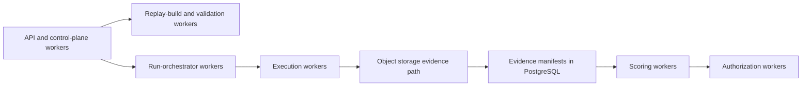

# Platform Operations Architecture

## 1. Purpose

This document defines the platform-operations view for the repository-specific agent benchmarking system. It refines the runtime and control-plane posture around isolation, permission boundaries, secrets and network boundaries, observability, auditability, deployment topology, scaling, failure handling, and evidence retention and cleanup.

It stays aligned with:

- [docs/analysis/requirements.md](/Users/chenmohan/gits/barcarolle/docs/analysis/requirements.md)
- [docs/architecture/system-design.md](/Users/chenmohan/gits/barcarolle/docs/architecture/system-design.md)
- [docs/architecture/module-design.md](/Users/chenmohan/gits/barcarolle/docs/architecture/module-design.md)
- [docs/architecture/interface-contracts.md](/Users/chenmohan/gits/barcarolle/docs/architecture/interface-contracts.md)
- [docs/architecture/data-model.md](/Users/chenmohan/gits/barcarolle/docs/architecture/data-model.md)
- [docs/architecture/api-schema.md](/Users/chenmohan/gits/barcarolle/docs/architecture/api-schema.md)
- [docs/architecture/workflow-runtime.md](/Users/chenmohan/gits/barcarolle/docs/architecture/workflow-runtime.md)
- [docs/decisions/dependency-selection.md](/Users/chenmohan/gits/barcarolle/docs/decisions/dependency-selection.md)
- [docs/decisions/module-dependencies.md](/Users/chenmohan/gits/barcarolle/docs/decisions/module-dependencies.md)

This page intentionally inherits time-sensitive dependency and release facts from the dependency and workflow documents above. It does not restate version snapshots here.

## 2. Operational stance

- Treat the full `ACUT` as the evaluated unit: model, prompt, tools, permissions, retrieval/memory, runtime budget, control loop, run environment, adapter manifest, evaluation mode, and adapter purity.
- Keep generation, replay, validation, runner integration, canonical verification, scoring, and authorization on separate trust boundaries.
- Keep candidate-side Golden capability on the trusted validation side and run-side Judge capability on the trusted scoring side.
- Default to the Runner Integration Layer, not Barcarolle-owned agent loop/control. `harness_native` is explicit and evaluates `Agent + Harness`.
- Default to deny-by-default runtime permissions, outbound network access, and runtime secret injection only for Barcarolle-controlled verifier sandboxes, observed wrappers, and harness-native portions.
- Barcarolle does not implement the runtime enforcement plane for repository-agent Licenses. It records evidence, scorecards, admissions, target conditions, signed License certificates, signed License status records/logs, status receipts, and consumer audit records for downstream consumers. A License is an evidence-backed admission record plus consumer-facing certificate/status publication, not a runtime guardrail.
- Treat repository or organization risk profiles as explicit policy appetite inputs for calibration and authorization. They constrain policy selection and impact workflows, but they are not runtime enforcement controls or calibration truth labels.
- Keep mutable runner or sandbox state ephemeral. Keep benchmark evidence append-only.
- Keep PostgreSQL as the system of record for queryable metadata and audit fields, and keep large immutable evidence in the S3-compatible artifact layer.
- Prefer conservative rejection when replay fidelity, verifier integrity, or evidence completeness is unclear.

Operational policy must preserve the declared evaluation-mode values `patch_only`, `trace_submission`, `observed_run`, and `harness_native`, and adapter-purity values `A0_transport_only`, `A1_environment_wrapper`, `A2_tool_mediation`, and `A3_harness_native_controller`.
Evidence operations must preserve trust-tier values `trusted_barcarolle_evidence`, `adapter_observed_evidence`, `agent_submitted_evidence`, and `third_party_evidence`; correctness and admission root evidence must come from trusted Barcarolle evidence.
ACUT metadata operations must preserve field evidence-basis values `declared`, `adapter_observed`, `third_party_attested`, and `barcarolle_trusted`. Non-invasive native-agent runtime metadata can be part of the ACUT identity while remaining declared or externally attested rather than Barcarolle-trusted.

## 3. Trust boundaries and runtime isolation

### 3.1 Boundary model

The boundary split follows the earlier architecture:

- Control plane: API, repository intake, candidate building, run orchestration, scoring, authorization, and retirement control.
- Build and validation plane: trusted workers that reconstruct environments, run verifier-side checks, and host candidate-side Golden work when enabled.
- Runner integration plane: workers that package tasks, invoke native agents or wrappers, coordinate harness-native runs when explicitly selected, and collect submissions.
- Canonical verification plane: trusted workers that apply submitted results in clean-room workspaces and emit `trusted_barcarolle_evidence`.
- Evidence and policy plane: append-only evidence storage plus scoring, risk-profile governance, policy calibration, and authorization workers that can read evidence but do not share the agent's writable workspace; Judge runs on the scoring side of that boundary.

### 3.2 Sandbox isolation stack

Barcarolle-controlled observed wrappers, canonical verification, and harness-native shared runners should use the nested boundary already established in the workflow runtime design:

1. trusted worker process boundary;
2. OCI container boundary for reproducible environment packaging;
3. gVisor `runsc` boundary for hardened Barcarolle-controlled shared runners;
4. ephemeral writable workspace inside the wrapper/verifier/harness sandbox only for the active `evaluation_run`.

For `patch_only` and `trace_submission` modes, the external native agent's workspace and network posture are declared and recorded as ACUT/adapter metadata unless the adapter actually controls them.

The following must remain outside the agent's writable boundary:

- verifier source and verdict persistence;
- canonical verification workspaces and records;
- Golden/Judge configurations and trusted-side output artifacts;
- evidence manifest append logic;
- score computation;
- authorization policy evaluation;
- PostgreSQL metadata stores;
- object-store credentials with write scope broader than the current run.

### 3.3 Filesystem posture

Required posture for Barcarolle-controlled runner, wrapper, or verifier execution:

- read-only base image layers;
- writable ephemeral workspace mounted only for the observed wrapper, harness-native run, or canonical verifier;
- read-only task inputs and verifier inputs where the task does not require edits;
- no Docker socket or equivalent host-control mount inside the sandbox;
- no direct mount path from runner workspace to evidence-control or policy-control files;
- fresh workspace and mount state for validation, native runner submission, observed wrapper, harness-native execution, and canonical verification, even when they reuse the same `replay_environment`.

`Inference`: separate validation, runner, and canonical-verification mounts are required even when the runtime image is identical, because benchmark-gaming risk comes from writable state sharing more than from image reuse alone.

## 4. Permission Boundaries and License Compatibility

### 4.1 Permission model

Barcarolle enforces permissions only for the benchmark execution and verification surfaces it actually controls. After issuance, a repository-agent License remains an evidence-backed admission record. The platform should still record enough compatibility metadata for downstream consumers to understand whether a requested operation is inside the licensed envelope.

| Level | Primary object | Enforced or recorded by |
| --- | --- | --- |
| Repository and benchmark scope | `repository_snapshot`, `benchmark_release`, `task`, `replay_environment` | API admission checks and workflow routing |
| Tool surface | shell, file edit, search, optional browser/tool adapters | native runner declaration, observed wrapper, or harness-native controller depending on mode |
| Runtime budget | timeout, CPU, memory, process count, output limits | native runner declaration, wrapper, or harness-native supervisor depending on adapter purity |
| Risk appetite | repository/organization tolerance profile, forbidden tiers, coverage/reliability floors, review triggers | policy workers record risk-profile refs/digests and trigger calibration or authorization impact; no live runtime enforcement |
| Authorization / License outcome | `authorization_decision` and `repository_agent_admission` trust tier, target condition, and benchmark-backed scope | policy worker records License-consumption and operating-envelope compatibility metadata for downstream consumers |

The minimum rule is that a run only receives or declares the capability envelope explicitly attached to its benchmark release, task family, environment policy, evaluation mode, adapter purity, and authorization scope. No component should infer broader permissions from historical success alone. That capability envelope should be materialized as an immutable run contract before runner invocation and reused by scoring and authorization reads.

### 4.2 Internal Checkpoints and External Consumption

Permission and compatibility checks should happen at the following points:

1. before `StartBenchmarkEvaluation`, confirm that the target benchmark release is published, membership is immutable, and the requested tested-agent snapshot, plus any optional upstream agent-configuration reference, is within the allowed benchmark scope;
2. before `StartRunnerInvocation`, confirm that the task is `Validated` or `Approved`, the environment is valid, and any parent benchmark evaluation or release-membership reference is consistent with the benchmark release basis;
3. before runner invocation, materialize and persist on `evaluation_run` an immutable run contract that fixes tool policy, network or egress profile, runtime limits, evidence destination, evaluation mode, adapter purity, adapter manifest, and observation boundary;
4. during runner integration, enforce only the boundaries that the declared adapter purity can actually control, and record any non-controlled native environment as ACUT/adapter metadata;
5. after submission, require canonical verifier and scorer to read evidence by manifest reference rather than by live runner path;
6. before any external operational use of results, require a consumer-readable `authorization_decision` or `repository_agent_admission` rather than reading per-run scores or benchmark scorecards directly as permissions, and ensure the decision/admission binds the same evaluated capability envelope, evaluation mode, adapter purity, canonical verification basis, evidence trust tiers, risk-profile basis, target-condition basis, and coverage gate that justified the result.

### 4.3 Deny-by-default posture

The system should deny by default when:

- a requested tool is not part of the task's tool policy;
- a run tries to exceed configured time, memory, process, or artifact limits;
- a Barcarolle-controlled wrapper or verifier needs network access but no approved network profile exists;
- the evidence bundle is incomplete or checksum validation fails;
- a score exists but no effective authorization decision has been recorded.
- the run leaves the evaluated capability envelope, evaluation mode, adapter purity, or adapter manifest basis or would require widening it after launch.

This is consistent with the wider design goal: benchmark evidence informs authorization, but does not bypass it.

## 5. Secrets and network posture

### 5.1 Secret handling

Benchmark runs should assume no secrets by default.

When secrets are unavoidable, the platform should distinguish three classes:

- control-plane secrets for forge sync, workflow infrastructure, or object storage;
- build-time secrets needed by replay workers during environment reconstruction;
- task-scoped runtime secrets required only for a specific benchmark family.

Rules:

- control-plane and build-time secrets stay outside the agent runner, wrapper, and verifier sandbox;
- runtime secrets, if allowed at all for Barcarolle-controlled wrapper or harness-native modes, must be short-lived, scoped to one run, and injected only at runner launch;
- secret material must not be written into PostgreSQL rows, Temporal history, or evidence payloads in cleartext;
- logging and evidence sealing must apply masking before artifact manifests are finalized;
- any run that observes a secret-redaction failure is marked for review before scoring or policy use.

### 5.2 Network posture by phase

The network model should differ by workflow phase.

| Phase | Default posture | Notes |
| --- | --- | --- |
| Repository intake | Restricted egress | Limited to forge and metadata providers required for snapshot collection. |
| Replay build | Restricted egress | Limited to package sources, archives, and registries needed for faithful environment reconstruction. |
| Validation | Prefer offline from reconstructed environment | Temporary restricted egress only when the replay strategy explicitly requires it. |
| Runner integration | Declared per mode | `patch_only` and `trace_submission` record external native-agent networking as ACUT/adapter metadata; `observed_run` and `harness_native` deny by default only for the portions Barcarolle controls. |
| Canonical verification | Deny by default | Allow only per-task profiles with contamination review, because this is trusted correctness-root evidence. |
| Scoring and authorization | No general internet access | Reads PostgreSQL and object storage only. |

This phase split preserves two goals at once: replay fidelity during reconstruction and leak resistance during trusted verification. It avoids claiming that Barcarolle controls a non-invasive external agent's network when it only receives a submission.
For `patch_only` and `trace_submission`, admission and operator views must therefore show native workspace/network/tool posture as declared or attested ACUT metadata. A wrapper observation, third-party attestation, or Barcarolle-controlled path may produce stronger run-observation evidence, but that evidence does not upgrade the existing tested-agent snapshot's field basis in place; using the stronger basis as an admission boundary requires a new tested-agent snapshot or an explicit governed change review / target-condition carry-forward.

### 5.3 Network exceptions and contamination handling

If a task family requires internet access, the exception should be explicit and auditable:

- the task definition records that network access is part of the benchmark contract;
- the run contract records the exact egress profile or allowlist for Barcarolle-controlled portions, or records external native-agent egress as ACUT/adapter metadata when not controlled;
- the evidence bundle records whether the exception was used;
- policy and retirement logic can later downgrade or retire tasks whose network dependency creates contamination risk.
- any benchmark scorecard, authorization decision, or repository admission that relies on the run must retain the same evaluated capability-envelope boundary so later operation cannot silently widen egress or tool posture without a new review path.

`Inference`: network-enabled tasks can exist, but they should be treated as a separate risk class rather than the baseline trusted verification mode.

## 6. Observability and auditability

### 6.1 Two signal planes

The platform should keep operational telemetry separate from benchmark evidence.

Operational telemetry:

- API latency, error rate, and idempotency-conflict rate;
- Temporal workflow latency, queue depth, retry counts, and timeout rate;
- replay-build duration, cache hit rate, and environment reconstruction failure rate;
- runner-adapter startup failures, wrapper or harness-native resource exhaustion, canonical-verifier failures, and cancellation latency;
- object-storage upload lag and checksum mismatch rate.

Benchmark and audit evidence:

- `request_id`, `correlation_id`, `causation_id`, producer identity, and schema/contract versions;
- benchmark definition, release, membership, evaluation, task, environment, run, scorecard, and decision state transitions;
- Golden/Judge configuration identity plus any attached discovery, assessment, or reference artifact refs;
- run submission identity, canonical verification record identity, evaluation mode, adapter purity, and evidence trust-tier basis;
- evidence manifest digests and artifact checksums;
- verifier identity, policy version, and rationale summary;
- retirement, supersession, revocation, and repair events.

OpenTelemetry, Prometheus, and Grafana remain the baseline operational stack. PostgreSQL plus object storage remain the benchmark evidence and audit record.

### 6.2 Required audit chain

At minimum, the platform must let an operator traverse this chain without ambiguity:

`repository_snapshot -> candidate_generation_run -> task_candidate -> replay_plan -> replay_environment -> validation_result -> task -> benchmark_definition -> benchmark_release -> benchmark_release_membership -> tested_agent_snapshot -> benchmark_evaluation -> evaluation_run -> run_submission -> evidence_bundle -> canonical_verification_record -> score_bundle -> benchmark_scorecard -> authorization_decision`

Optional Golden/Judge artifacts should remain attached to that chain through `candidate_generation_run`, `validation_result`, `task`, `score_bundle`, or `benchmark_scorecard` references rather than creating a parallel audit path.

Every transition in that chain should be replayable from append-only records. Corrections should supersede prior conclusions rather than overwrite historical state.

### 6.3 Operator-visible signals

The operator surface should expose at least:

- queue and worker health by trust boundary;
- active run count and stuck-run detection;
- environment-build success and unreplayable-task rate;
- validation outcomes by failure class such as `contaminated_or_leaked` or `flaky_or_unstable`;
- Golden artifact generation failures or low-confidence admission signals;
- benchmark-release publication failures or membership inconsistency alerts;
- benchmark-evaluation coverage gaps and mixed-release comparison attempts;
- evaluation-mode or adapter-purity mismatches in attempted comparisons;
- canonical verification missing, incomplete, or inconsistent with submitted artifacts;
- evidence completeness and artifact-checksum status;
- Judge disagreement, escalation, or high-risk-finding rate by scoring-policy version;
- authorization decisions by policy version and scope;
- retirement and repair backlog.

These are the minimum signals needed to decide whether the system is healthy and whether a benchmark output is still admissible.

## 7. Deployment topology and environments

### 7.1 Logical topology

The recommended deployment shape is a small number of clearly separated worker pools:

- API and control-plane services;
- replay-build workers;
- validation workers;
- runner-integration workers;
- canonical-verification workers;
- evidence I/O workers;
- scoring and authorization workers;
- PostgreSQL, object storage, and observability backends.

Pre-candidate Golden discovery, selection, and contract-synthesis work belongs on the candidate-build lane and writes `candidate_generation_run` evidence subjects. Post-candidate Golden validation work can share the validation pool, and Judge work can share the scoring pool, as long as those trusted boundaries remain intact.

The exact scheduler can change later, but the separation of pools should remain because it encodes trust boundaries, not just scaling convenience.

### 7.2 Environment tiers

The platform should support three operational environments:

| Environment | Purpose | Required posture |
| --- | --- | --- |
| Local development | Architecture iteration and non-authoritative testing | May collapse services for convenience, but should not be used for authoritative benchmark evidence. |
| Staging | End-to-end validation of queue split, evidence flow, and policy wiring | Mirrors production trust boundaries with non-production repositories and credentials. |
| Production | Authoritative benchmark evaluation and authorization support | Enforces isolated runner-integration and canonical-verification workers, append-only evidence handling, and audited retention policy. |

Only production should emit effective authorization decisions. Staging may produce rehearsal evidence and dry-run policy outcomes, but not final trust signals. Local development remains useful for iteration only.

### 7.3 Shared-runner versus higher-risk runner integration

Required posture:

- Docker/OCI + BuildKit for environment reconstruction;
- gVisor-backed shared runners for Barcarolle-controlled observed wrappers or harness-native execution;
- separate validation, runner-integration, and canonical-verification workers.

Later hardening path:

- stronger verifier isolation on separate hosts;
- KVM-backed gVisor modes, Kata, or microVM-backed runners for higher-risk multi-tenancy;
- stricter network segmentation and compliance-driven retention tiers.

## 8. Scaling and failure operations

### 8.1 Scaling model

Scale the system by queue and worker role, not as one undifferentiated pool.

Recommended scaling levers:

- replay-build workers scale on environment-build backlog and image-cache pressure;
- validation workers scale on candidate backlog and repeated-run workload;
- runner-integration workers scale on queued `evaluation_run` count and expected native-runner, wrapper, or harness-native mix;
- canonical-verification workers scale on submitted-result backlog and verifier cost;
- evidence I/O scales on upload backlog and manifest sealing latency;
- scoring and authorization scale on completed-run backlog, independent of runner or verifier demand.

Object-store streaming and small workflow payloads are required so higher run volume does not inflate Temporal history or PostgreSQL row size.

### 8.2 Failure classification

Failure handling should separate infrastructure failures from benchmark-domain outcomes.

Retryable infrastructure failures:

- transient forge or package fetch failures;
- worker crash or lost heartbeat;
- object-store upload interruption;
- runner-adapter or canonical-verifier bootstrap failure;
- temporary storage or network unavailability on trusted control paths.

Non-retryable domain outcomes unless new evidence is added:

- `environment_unreplayable`;
- `task_rejected`;
- `contaminated_or_leaked`;
- `flaky_or_unstable`;
- `verification_failed`;
- policy denial based on a specific score bundle or benchmark scorecard basis and policy version.

This split should remain visible in telemetry, PostgreSQL state, and operator dashboards.

### 8.3 Failure operations

When a run or workflow fails, the platform should:

1. preserve partial evidence already written outside the runner;
2. cancel or quarantine the active runner, wrapper, or harness-native sandbox when Barcarolle controls it;
3. finalize the run into `Failed` or `Canceled` with explicit reason;
4. prevent scoring or authorization if verifier or evidence completeness is unresolved;
5. route task-level defects to retirement or repair review rather than hiding them inside generic retry loops.

Long-running runner-integration, canonical-verification, and build activities should heartbeat so operators can distinguish worker death from legitimate work in progress.

### 8.4 Recovery and compensation

Compensation is appropriate for temporary operational reservations, not for benchmark history.

Use compensation for:

- reserved compute slots;
- temporary runner-invocation leases;
- provisional resource reservations attached to a run request.

Use append-only lifecycle changes for benchmark governance:

- `Rejected`;
- `Retired`;
- `Superseded`;
- `Revoked`;
- `RepairRequired`.

This keeps operational cleanup reversible without erasing audit history.

## 9. Evidence retention and cleanup

### 9.1 Retention model

Evidence retention should be defined at the bundle and artifact level, not only at the bucket or filesystem level.

Each `evidence_bundle` should carry:

- bundle identity and content digest;
- `subject_type`, `subject_id`, bundle kind, and manifest version;
- evidence producer and trust-tier summary;
- retention class;
- retention state;
- sealed timestamp;
- provenance linking it to candidate, validation, run, environment, verifier, and policy context as applicable.

The minimum retention-state lifecycle should be:

`retained -> archived -> tombstoned`

`Tombstoned` means the large payload may be removed, but the manifest, checksums, and audit metadata remain so the system can explain what existed and why it was removed.

### 9.2 Cleanup rules

Cleanup should operate on ephemeral runtime material first and authoritative evidence last.

Delete or recycle aggressively:

- ephemeral runner, wrapper, harness-native, and canonical-verifier workspaces after evidence sealing;
- temporary upload staging areas once checksums and manifests are persisted;
- expired per-run secrets and runner-invocation leases;
- image caches and build caches based on policy, reference count, and age.

Retain longer:

- evidence manifests, checksums, and lifecycle records;
- score bundles and authorization decisions;
- retirement, repair, supersession, and revocation records;
- environment fingerprints and build provenance needed for replayability.

### 9.3 Evidence completeness before cleanup

No authoritative cleanup should begin until:

- all required artifacts for the relevant subject are sealed into an `evidence_bundle`;
- the `run_submission` and `canonical_verification_record` are persisted when the run is scoreable;
- manifest checksums and byte counts are recorded;
- the run has a terminal state;
- scorer inputs are readable by manifest reference.

If an upload gap or checksum mismatch appears later, the system should mark the bundle incomplete, stop downstream policy use, and route the task or run to repair or retirement handling.

### 9.4 Task and decision retention

Retired tasks and superseded decisions should remain queryable. The platform should not hard-delete rows that affected a score or permission outcome. Instead it should:

- mark tasks `Retired` when drift, contamination, or oracle weakness is discovered;
- mark decisions `Superseded` or `Revoked` when policy or evidence changes;
- keep lineage from the active record back to the replaced record.

This is necessary for later audit, re-scoring, and benchmark-maintenance analysis.

## 10. Operations baseline

The minimum operational baseline is:

- queue-separated worker pools for build, validation, runner integration, canonical verification, scoring, and authorization;
- Docker/OCI + BuildKit reconstruction and gVisor-backed shared-runner support for Barcarolle-controlled wrappers and harness-native runs;
- deny-by-default network posture for Barcarolle-controlled verifier sandboxes and controllable wrapper/harness portions;
- append-only evidence manifests backed by object storage;
- explicit permission, budget, and policy checks for Barcarolle-controlled runtime and authorization;
- explicit risk-profile governance and calibration/authorization impact handling;
- signed License-certificate metadata, signed License-status metadata/logs, status receipts, and consumer audit records for downstream consumers, without implementing the repository-agent runtime enforcement plane;
- telemetry that distinguishes infra failures from domain rejection;
- retention and cleanup jobs that preserve audit lineage even when large artifacts expire.

Later work can strengthen the same model with deeper redaction, stricter network profiles, and stronger runner or verification backends, but should not collapse the trust boundaries established here.
