# System Design for Repository-Specific Agent Benchmarking

## 1. Purpose and scope

Barcarolle is a repository-specific, verification-first, evidence-aware admission system for code-agent collaboration. It turns a single software repository and its development history into a replayable, graded benchmark system for a specific code-agent configuration. The evaluation object is the `ACUT` (`Agent Configuration Under Test`), not just the base model: model, prompt, tools, permissions, retrieval or memory policy, runtime budget, control loop, run environment, adapter manifest, evaluation mode, and adapter purity all affect outcomes. This framing follows `docs/draft/abstract.md` and is reinforced by `docs/research/agent-configuration-evaluation.md`.

The design is intentionally narrower than a general benchmark platform and narrower than an agent framework. It focuses on one repository at a time and on repository-specific trust assessment. It does not attempt to train models, replace CI, define business logic, or provide a default generic agent controller, prompt manager, tool loop, memory system, model proxy, shell/edit API, or production agent scaffold. It packages and verifies evaluation tasks, integrates with a runner, ingests evidence, performs clean-room canonical verification, and translates results into a graded authorization signal. That last step is an `Inference` from the research corpus, because the literature supports evaluation and process metrics but does not yet define a mature repository-scoped permission model.

The primary operating assumption is trusted internal collaboration with low-adversarial posture. Repository owners, benchmark operators, and the tested agent supply chain are expected to be governed and reviewable, but not strongly attested end to end. The expected use cases are agent-configuration or agent-framework developers using Barcarolle as a repository-specific evaluation environment, and repository owners, platform teams, research groups, companies, or open-source communities measuring whether a newly introduced agent configuration can work well in a shared repository and how it compares with other configurations in that same repository-specific operating context. In that setting, the ACUT owner and repository owner are assumed to have aligned incentives and no deliberate intent to cheat the benchmark. Barcarolle therefore records declared and owner-attested ACUT fields as meaningful policy inputs where the requested tier allows them, while still keeping correctness-root evidence, score computation, authorization, admission, and operating-state records separate and auditable.

The system still preserves immutable benchmark facts and append-only governance records so a stricter future mode can add stronger attestation, adversarial review rules, or runtime enforcement integrations without rewriting the core semantics. This design does not claim adversarial certification.

## 2. System boundary

### In scope

- Repository history mining from commits, issues, pull requests, tests, CI configuration, docs, and review traces.
- Replayable task generation from historical repository signals.
- Environment reconstruction with time-aware dependency handling.
- Task validation, including fail-to-pass / build-fail-to-build-pass / other repository-native oracles.
- Executable benchmark-admission gating for task quality, oracle strength, leakage resistance, and release coverage as defined in [benchmark-admission-rubric.md](./benchmark-admission-rubric.md).
- Candidate-side `Golden Agent` capability for repository-specific reference artifacts and review signals during validation.
- First-class benchmark definition and immutable benchmark-release publication.
- Runner integration for native external agents, including task package delivery, adapter invocation, run-submission intake, and declared observation boundaries.
- Evidence ingestion, clean-room canonical verification, trajectory/log/artifact capture where available, and replayable audit records.
- Run-side `Judge Agent` capability for interpreting sealed benchmark evidence during scoring and review.
- Benchmark-level evaluation of an agent configuration on a benchmark release.
- Per-run scoring, aggregate benchmark scorecards, stability checks, and configuration-optimization evidence under the deterministic semantics in [scoring-semantics.md](./scoring-semantics.md), even when no License is requested.
- Explicit repository or organization risk-profile policy that declares risk appetite for calibration and authorization instead of deriving tolerance from benchmark evidence alone.
- Automatic policy calibration that empirically validates and promotes threshold, weighting, coverage, reliability, and policy-profile parameters from objective repository evidence under explicit risk-profile constraints without human baselines or human benchmark participation.
- A policy layer that converts evaluation results into graduated authority decisions.
- Repository-scoped License issuance and distribution from benchmark evidence or governed carry-forward review.

### Out of scope

- Model training or fine-tuning.
- Modifying production business code.
- Blind acceptance of unreplayable tasks.
- Any assumption that repository history alone is sufficient for a runnable benchmark.
- Default ownership of the tested agent's prompt, tool loop, memory, model proxy, shell/edit interface, or internal controller.
- Treating `harness_native` results as if they evaluated the unmodified production agent; those results evaluate `Agent + Harness`.
- Runtime enforcement that constrains a live agent to the licensed tier. Barcarolle records the License, target condition, and operating-envelope compatibility assumptions; the License itself is an evidence-backed admission record, not a runtime guardrail.

The boundary is derived from `docs/draft/abstract.md` plus the replay, trustworthiness, and infrastructure research notes.

## 3. Architecture at a glance

```mermaid
flowchart LR
  A[Repository history\ncommits, issues, PRs, tests, CI, reviews] --> B[Signal extraction]
  B --> C0[Golden-assisted discovery\nselection and contract synthesis]
  B --> C[Candidate task miner]
  C0 --> C
  C --> D[Replay planner]
  D --> E[Environment reconstruction]
  E --> F1[Golden reference capability]
  F1 --> F[Task validator]
  F -->|certified approved task| G[Benchmark definition and release registry]
  G --> H[Immutable benchmark release]
  H --> I[Benchmark evaluation orchestrator]
  I --> J[Runner Integration Layer]
  J --> K[Run submission]
  K --> L[Evidence ingestion]
  L --> V[Clean-room canonical verification]
  V --> M1[Judge assessment capability]
  M1 --> M[Per-run scoring]
  M --> N[Benchmark scorecard]
  R[Repository/organization risk profile] --> C2[Automatic policy calibration]
  R --> O
  N --> C2
  C2 --> O[Trust tier policy]
  N --> O
  O --> P[Graded authorization decision]
  F -->|reject| Q[Task retirement / repair queue]
```

The main architectural principle is separation of concerns: task extraction, environment replay, validation, benchmark admission, benchmark publication, per-run execution, per-run scoring, benchmark-level aggregation, and authorization are separate stages, because the research corpus repeatedly shows that collapsing them makes it impossible to distinguish a weak benchmark from a weak agent.
Repository-native or deterministic validation, scoring, and authorization remain primary. Golden/Judge outputs are benchmark-side supporting evidence that stay append-only and governance-review-compatible.
Benchmark admission is the executable gate between mined candidates and certified release membership. It evaluates provenance, `T_task`, replayability, task boundary, oracle grade, validation probes, leakage findings, duplicate pressure, safety/permission mapping, and release coverage. It is recorded on `task_candidate`, `validation_result`, `task`, `benchmark_release`, `task_retirement`, and review records rather than as a separate benchmark product.
The benchmark should therefore be treated as a first-class object family:

- `benchmark_definition` gives the stable identity for one repository-scoped benchmark line.
- `benchmark_release` gives the immutable publication snapshot and the canonical answer for "same benchmark basis".
- `tested_agent_snapshot` gives the immutable answer to "what exact agent setup was evaluated or later admitted".
- `tested_agent_snapshot` is the persisted ACUT identity; results from different `evaluation_mode` or `adapter_purity_level` values are not interchangeable.
- `benchmark_evaluation` records one tested-agent snapshot evaluated against one benchmark release under one benchmark-level capability-envelope contract basis.
- `run_submission` records the patch/result/artifacts provided by the native external agent or harness-backed runner.
- `canonical_verification_record` records Barcarolle's clean-room application of the submitted result and verifier execution.
- `benchmark_scorecard` aggregates child run outcomes into the benchmark-level result used for comparison and authorization, including the exact score input set, missing-run entries, denominator basis, weighting basis, reliability label, and policy-input fields defined by scoring semantics.
- `repository_risk_profile` records explicit organization, repository, or component/path risk appetite used by calibration and authorization. It is policy input, not benchmark evidence, human truth labeling, or runtime enforcement.
- `policy_calibration_run`, `calibration_truth_observation`, and `calibrated_policy_profile` record the automatic empirical loop that governs score weights, coverage gates, reliability labels, authorization thresholds, and policy-version promotion under the effective risk profile without rewriting benchmark facts.
- `repository_agent_admission` records the repository-scoped license or admission granted from a benchmark fact or from a later governed change review.
- `repository_agent_operating_state` records which tested-agent snapshot is actually operating now, even when that differs from the exact snapshot that was benchmarked.

Those resources answer different questions and should not be collapsed:

- Benchmark fact: what immutable evaluation happened, on which benchmark release, against which tested-agent snapshot.
- Admission/license: what repository-scoped permission or trust state was granted, for which scope and validity window.
- Current operating state: what snapshot is actually configured or observed in the repository right now.

The minimum ACUT comparability axes are:

- `EvaluationMode.patch_only`: the external agent runs natively and submits only a patch/result; this is least invasive and can have high production fidelity for common native YOLO operation, while process observation remains limited unless supplied by other evidence.
- `EvaluationMode.trace_submission`: the external agent runs natively and submits a patch/result plus native trace, log, tool, or model summaries; the trace is audit, binding, or risk evidence, not correctness root evidence.
- `EvaluationMode.observed_run`: Barcarolle does not control the agent loop, but an outer wrapper observes workspace, process, command, network, stdout/stderr, or snapshot signals within a declared boundary.
- `EvaluationMode.harness_native`: the agent runs inside Barcarolle or a specified harness; observation and control are higher, but the ACUT is `Agent + Harness` and has lower direct applicability to unmodified native YOLO operation.
- `AdapterPurityLevel.A0_transport_only`: only task transport, external launch, and artifact collection; no prompt/tool/model/memory/loop changes.
- `AdapterPurityLevel.A1_environment_wrapper`: workspace, container, network, or budget wrapper control without changing the internal agent loop.
- `AdapterPurityLevel.A2_tool_mediation`: tool calls are proxied or restricted, so the adapter has contaminated the ACUT and must be recorded as part of it.
- `AdapterPurityLevel.A3_harness_native_controller`: Barcarolle or a specified harness controls loop, prompt, or tools; the evaluated object is `Agent + Harness`.

Material ACUT fields also carry an evidence basis: `declared`, `adapter_observed`, `third_party_attested`, or `barcarolle_trusted`. In non-invasive modes such as `patch_only` and `trace_submission`, the native workspace, network, tool posture, and some runtime-environment fields are usually declared or externally attested metadata, not trusted Barcarolle evidence. That does not make native YOLO evidence inherently low-tier. Scorecards, admissions, and console views must show the field basis so policy can separately evaluate correctness evidence, production fidelity, ACUT binding/attestation, and License-consumption compatibility.

## 4. Core modules

### 4.1 Repository intake and catalog

This module indexes the target repository and its historical artifacts. It should ingest:

- Git commit history and merge structure.
- Issues, PRs, review comments, and linked discussions.
- CI configs, workflow files, build scripts, lockfiles, and dependency manifests.
- Test suites and test reports.
- Optional docs such as README, CONTRIBUTING, and repository-specific rules.

Source basis: `docs/research/replayable-repository-task-construction.md`, `docs/research/repository-evaluation-infrastructure-landscape.md`, and `docs/research/repository-context-selection-and-cross-file-editing.md`.

### 4.2 Signal extraction

This module transforms raw repository artifacts into structured signals:

- Candidate task anchors: issue-resolution, PR-derived feature tasks, commit-derived bug-fix tasks, CI-failure tasks, or migration tasks.
- Context hints: relevant files, symbols, dependencies, and tests.
- Temporal metadata: commit date, merge date, package availability window, and execution snapshot.

This is an `Inference` from the literature. The sources strongly support multi-signal mining and time-aware replay, but they do not prescribe one canonical schema.

### 4.3 Candidate task miner

This module creates candidate evaluation tasks from the extracted signals. The task family should be chosen per repository and may include:

- Issue-to-patch tasks.
- PR-to-feature tasks.
- Commit-to-regression tasks.
- CI-failure replay tasks.
- Migration or modernization tasks where the repository history supports them.

The miner should preserve the original developer intent where possible and should avoid synthetic task invention unless the repository lacks sufficient historical material. That preference follows `docs/research/replayable-repository-task-construction.md` and `docs/research/repository-specific-benchmark-generation-related-work.md`.

Golden may assist this phase before a `task_candidate` exists by proposing high-value historical anchors, ranking weak or ambiguous candidates, or synthesizing an initial verifier/oracle contract from trusted repository evidence. That pre-candidate work must first be recorded as a `candidate_generation_run`, which can own Golden output evidence bundles before any candidate identity exists. When the assistance materially changes candidate discovery, selection, or contract synthesis, the resulting `generation_context_lineage` must include `candidate_generation_run_id`, the governed `golden_configuration_id`, Golden input-manifest digest, selected output digest, exact evidence-bundle version/content digest, and selection identity. The candidate still enters the normal deterministic replay, validation, and automated policy-admission gates before it can become an approved task. Human review can annotate, pause, override, or own exceptional policy decisions, but it is not a normal benchmark-acceptance gate or calibration truth source.
The miner also freezes `T_task`, declares source provenance, allowed/disallowed inputs, expected artifact shape, required permissions, capability/component/risk tags, and duplicate-cluster identity. These are provisional admission facts; the validator must verify them before task approval.

### 4.4 Replay planner

The replay planner decides how a candidate task can be reconstructed faithfully. It selects:

- Base commit or snapshot.
- Dependency resolution strategy.
- Container or VM image.
- Test command or verifier.
- Whether the task is replayable at all.

This module must treat environment recovery as separate from task mining. That separation is directly supported by `docs/research/environment-replay-and-reproducible-execution.md`.

### 4.5 Environment reconstruction

This module materializes the runtime needed to execute the task. The research corpus suggests an evidence-fusing strategy:

- Use manifests, lockfiles, CI files, and docs together.
- Prefer date-aware dependency resolution when historical versions matter.
- Pin images, package sources, and digests where possible.
- Record the full build metadata for later audit.

The system should prefer exclusion over guesswork when reconstruction is not faithful enough. That choice is supported by the literature on setup filtering, time fidelity, and benchmark maintenance.

### 4.6 Task validator

This module checks whether the candidate task is valid before it enters the main benchmark set. Validation should include:

- Does the environment build?
- Does the selected verifier execute?
- Does the task exhibit a meaningful transition such as fail-to-pass?
- Is the oracle grade A or B after canonical, no-op, known-bad, flakiness, runtime, and oracle-log probes?
- Is the task stable across repeated runs?
- Is there evidence of future leakage, answer leakage, contamination, or direct answer retrieval?
- Do task quality hard gates pass, reject, require repair/revalidation, or route to governance without becoming normal calibration evidence?

When available, this module may also consume candidate-side Golden artifacts such as reference patches, structured task rationale, or ambiguity markers, but those artifacts should strengthen automated validation and governance audit rather than replace deterministic validation.

This aligns with `docs/research/environment-replay-and-reproducible-execution.md` and `docs/research/benchmark-trustworthiness-risks.md`.
The detailed rubric for hard gates, oracle grades, validation probes, leakage handling, review triggers, and post-release quarantine is [benchmark-admission-rubric.md](./benchmark-admission-rubric.md).

### 4.7 Benchmark definition and release registry

This module turns approved tasks into reusable benchmark objects rather than leaving them as an implicit set. It should:

- maintain a stable benchmark identity for one repository-scoped benchmark line;
- publish immutable benchmark releases from approved tasks;
- persist release membership as a snapshot rather than as a mutable filter;
- answer whether two evaluations used the same benchmark basis by comparing benchmark release identity.
- compute a release coverage profile from certified task profiles, including task-family, capability, component/path, risk, permission, high-impact-path, oracle-grade, duplicate-cluster, flakiness, and freshness coverage;
- publish supported and unsupported authorization scopes for every certified release.

This is an `Inference` from the requirements and trust goals. The sources justify repository-specific benchmarking and repeatable comparison, while the benchmark-release object model is the minimum design needed to make those comparisons explicit.

### 4.8 Tested-agent identity and change governance

This module preserves the evaluated subject and the post-evaluation review path as first-class records. It should:

- register immutable tested-agent snapshots that capture the repository-relevant ACUT manifest, including model, prompt, tools, permissions, retrieval/memory, runtime budget, control loop, run environment, adapter information, evaluation mode, adapter purity, and field-level ACUT identity evidence basis;
- keep the original benchmark evaluation pinned to the exact tested-agent snapshot that was run;
- support append-only change reviews that compare a later snapshot or changed target-condition boundary against a previously evaluated or admitted basis;
- classify later changes as carry-forward acceptable, targeted-review required, full re-benchmark required, blocked, or another governed outcome;
- issue repository-agent admission or license records without mutating the historical benchmark fact;
- expose current operating state as a separate read model with per-target-condition coverage entries so operators can see whether the live snapshot still matches each evaluated or admitted basis.

This is the minimum coherent expansion that closes the agent-evolution gap while keeping the existing benchmark object chain intact.

### 4.9 Runner Integration Layer

This layer connects benchmark tasks to the runner that executes the ACUT. By default, Barcarolle does not execute the agent loop or expose a generic tool surface. It should:

- package the task, verifier contract, environment declaration, and allowed result shape for the runner;
- start or hand off to an external native agent when the adapter supports that without changing the agent's prompt, tools, model, memory, or control loop;
- collect `run_submission` records containing patch/result/artifact references;
- ingest native traces, logs, wrapper observations, and third-party artifacts according to their evidence trust tier;
- declare the `EvaluationMode` and `AdapterPurityLevel` that define how comparable the result is to other runs.

The default mode is runner integration, not harness ownership. `harness_native` remains a supported non-default mode for strong process observation, but then the ACUT must be labeled as `Agent + Harness` because Barcarolle or a specified harness has taken over part of the controller, prompt, or tool surface.
Per-task execution remains important, but it should normally run as a child of a benchmark-level evaluation that targets a benchmark release. Direct ad hoc task runs may still exist for diagnostics or spot checks, but they are secondary and should not be confused with the canonical cross-task comparison path.

### 4.10 Evidence store and canonical verification

This module stores replayable artifacts:

- Command logs and tool calls.
- File diffs or patches.
- Environment manifests and image digests.
- Verifier outputs and test results.
- Agent trajectory or event history.
- Timing, retries, and resource usage.

Evidence must be tiered by producer and trust source:

- `trusted_barcarolle_evidence`: task digests, verifier image digests, clean-room patch application logs, hidden test results, policy checks, canonical verification logs, score computation, and other Barcarolle-produced records.
- `adapter_observed_evidence`: stdout/stderr, process observations, filesystem deltas, network observations, and workspace snapshots captured by a wrapper or adapter.
- `agent_submitted_evidence`: native traces, model-call summaries, tool-call summaries, self-run tests, internal plans, and other self-reported material.
- `third_party_evidence`: GitHub CI, provider usage reports, artifact signing records, or other external-system evidence.

Correctness and admission root evidence must come from `trusted_barcarolle_evidence`, especially `canonical_verification_record`. Agent-submitted traces can explain or raise risk, but they cannot determine pass/fail by themselves.
This follows the artifact practices documented across `docs/research/environment-replay-and-reproducible-execution.md`, `docs/research/repository-evaluation-infrastructure-landscape.md`, and `docs/research/benchmark-trustworthiness-risks.md`.

### 4.11 Scoring, benchmark evaluation, and stability layer

This module converts execution into benchmark outcomes. It should:

- Score final correctness from `canonical_verification_record` and trusted Barcarolle evidence.
- Classify scoreable agent failures separately from unverified, incomplete, canceled, infra-failed, verifier-flaky, and policy-invalid runs.
- Score process quality where relevant, such as context selection or localization, without treating process evidence as correctness root evidence.
- Consume run-side Judge assessments of sealed evidence when they improve reviewability, confidence, risk analysis, or governed score contribution.
- Run repeated trials for unstable tasks and persist pass-rate, instability, verifier-flakiness, and stochastic-agent summaries.
- Derive release-weight, score-weight, oracle-grade, duplicate-cluster, high-impact/risk, task-family, component/path, permission, and capability weighting facts deterministically.
- Compute `aggregate_score` over the requested score-weight denominator while preserving release-weight coverage and missing-run denominators.
- Flag weak or suspicious oracles.
- Retire tasks that drift or become contaminated.
- Aggregate child run results into a benchmark evaluation and a benchmark scorecard for one tested-agent snapshot on one benchmark release.
- Preserve the link from every aggregate result back to the immutable benchmark release and its membership snapshot.
- Preserve the link from every aggregate result back to the immutable tested-agent snapshot that was actually evaluated.
- Preserve the release admission profile and any post-release invalidation basis used to determine authorization readiness.
- Consume exact calibrated scorecard, coverage, and reliability profile refs when a promoted profile governs aggregation.

The detailed contract is [scoring-semantics.md](./scoring-semantics.md). This is a direct synthesis of the trustworthiness and evaluation literature plus the repository-scoped authorization requirements.

### 4.12 Automatic policy calibration

This module continuously validates the policy assumptions that scoring and authorization consume. It should:

- assemble calibration manifests from repository historical fixes, merged PRs, known pre-fix states, no-op controls, mutation controls, retrieval-only or rule-based baselines, prior agent configurations, repeated-run variance, canonical verification records, release coverage profiles, maintenance findings, and task-family/component/risk slices;
- normalize those inputs into objective calibration truth observations with source refs, expected policy effects, semantic slices, and explicit exclusions for any case that would require human truth;
- generate and run automatic controls through the normal benchmark workflows, excluding candidates whose truth would require human judgment;
- fit candidate score-weight, coverage-gate, reliability-label, and authorization-threshold profiles;
- validate candidate profiles on held-out releases, time slices, components, task families, risk classes, high-impact path classes, prior-agent configurations, and high-tier safety-control slices;
- measure unsafe false-positive rates, confidence upper bounds, high-tier control power, and parameter authority so risk-profile constraints are not mistaken for learned truth;
- compute sensitivity analyses and impact previews before promotion;
- promote calibrated profiles automatically when machine-checkable gates pass, leaving human governance for audit, pause, annotation, or rollback only.

The module writes `policy_calibration_run`, `calibration_truth_observation`, and `calibrated_policy_profile` records. It does not own runtime License enforcement and does not mutate historical scorecards or decisions. The detailed contract is [policy-calibration.md](./policy-calibration.md).

### 4.13 Trust tier policy

This module maps evaluation results to authorization outcomes. The authorization semantics are defined in [authorization-semantics.md](./authorization-semantics.md). The policy uses the repository-scoped `G0` through `G5` admission scale:

- `G0 no_admission`
- `G1 read_only_analysis`
- `G2 patch_proposal`
- `G3 scoped_branch_write`
- `G4 broad_branch_write`
- `G5 autonomous_yolo_repository_operation`

This tiering is an `Inference`. The research corpus supports the need for graded authority decisions, but it does not define a standard permission ladder for repository-specific agent admission.
The policy input should be a benchmark-level scorecard plus benchmark-release context. `aggregate_score`, coverage summaries, task-family coverage, canonical-verification coverage, sample/reliability labels, invalidation status, evidence trust basis, score input set identity, and score-basis Judge lineage are policy inputs when marked as such by [scoring-semantics.md](./scoring-semantics.md). Per-task scores can contribute evidence, but they should not be the primary authorization basis when a benchmark-level evaluation exists. Scorecards are also first-class outputs for agent-configuration comparison and optimization when no License is requested.
Threshold, coverage, reliability, and promotion parameters come from the exact calibrated profile referenced by the scorecard or decision. Seed values may bootstrap `authorization_semantics_v1`, but future decisions must record the promoted calibrated profile they used.
The resulting authorization decision should stay distinct from the repository-agent admission/license record and from the current operating-state read model. Admission can be issued from the decision or from a later carry-forward review, while operating state reports what is live now. External consumers read admissions, signed License certificates, signed License status records/logs, and operating-state coverage entries; they do not reinterpret raw scorecards independently.
Signed License certificates are durable, verifiable projections over admissions and exactly one operating-state coverage entry. Separate signed License status records/logs carry lifecycle sequence, status watermark, target-condition basis, capability envelope, freshness state, issuer-key status, and suspend/revoke/expire/supersede state for downstream consumers that enforce locally. Certificate validity is configurable and may be unbounded at the certificate-artifact layer; status freshness is the conformance gate for current `allow`. This distribution contract does not make Barcarolle a runtime enforcement plane.
The policy must not use evaluation mode as a simple maximum-tier cap. Native `patch_only` and `trace_submission` scorecards can support high-tier native YOLO admission when correctness evidence, subject applicability, ACUT binding/attestation, risk-profile constraints, freshness, scope, review, and License-consumption compatibility pass. `harness_native` can support high-tier admission for `Agent + Harness`, but it is not automatically stronger evidence for unmodified native YOLO operation.

## 5. Main flows

Canonical runtime chain: repository history -> Golden-assisted discovery/selection when used -> task/verifier package generation -> Golden-assisted validation -> benchmark release -> runner integration -> run submission -> evidence ingestion -> clean-room canonical verification -> Judge assessment -> scorecard -> admission / authorization / operating state. Scorecards, releases, controls, and maintenance findings also feed the automatic policy-calibration loop that promotes future policy profiles.

### 5.1 Task generation and replay chain

1. Ingest repository history and supporting artifacts.
2. Extract candidate tasks from issues, PRs, commits, CI, or migration history.
3. Optionally run Golden-assisted discovery, selection, and contract synthesis to identify high-value candidate anchors or stronger verifier/oracle contracts, recording a `candidate_generation_run` before candidate creation and then referencing its Golden configuration, selected output digest, and exact evidence-bundle version in `generation_context_lineage`.
4. Derive a replay plan with a specific base snapshot and verifier.
5. Reconstruct the historical environment using time-aware dependencies and pinned execution inputs.
6. Optionally derive candidate-side Golden/reference artifacts from trusted repository evidence to strengthen later validation and review.
7. Validate the task by running the verifier on the base and target states plus any accepted Golden-side review signals.
8. Retain only tasks that are executable, stable, and clearly discriminative.
9. Publish those approved tasks into an immutable benchmark release owned by a stable benchmark definition.

This chain is supported by `docs/research/replayable-repository-task-construction.md` and `docs/research/environment-replay-and-reproducible-execution.md`.

### 5.2 Evaluation execution and evidence capture chain

1. Select a benchmark release from the benchmark registry.
2. Register or look up the immutable tested-agent snapshot that represents the ACUT identity being evaluated, including field-level evidence basis for declared, observed, attested, and trusted fields.
3. Create a benchmark evaluation for that tested-agent snapshot against the selected benchmark release.
4. Invoke the Runner Integration Layer for each benchmark-release membership item, or another explicit run plan derived from that release.
5. Let the external/native agent operate in its own declared environment unless the evaluation is explicitly `observed_run` or `harness_native`.
6. Receive a `run_submission` containing patch/result/artifact references and any native trace material allowed by the adapter contract.
7. Ingest evidence with explicit trust tiers and producer identity.
8. Apply the submitted result in a clean-room verifier workspace and persist a `canonical_verification_record` keyed by verifier basis plus semantic `verification_attempt_number`.
9. Run repeated submissions or reruns when a task, adapter, verifier, or observation boundary is unstable.
10. Optionally derive mode-aware Judge-side assessments from sealed evidence and verifier outputs without reading live mutable runner state.
11. Persist versioned per-run evidence and per-run score bundles, then aggregate them into a benchmark scorecard tied to the benchmark release, ACUT, evaluation mode, adapter purity, canonical verification record, exact sealed evidence bundle versions, score input evidence digest, complete score input set digest including missing-run entries, weighting/denominator summary, evidence trust-basis digest, ACUT identity field evidence-basis summary, and separate run observation-basis summary when used.
12. Feed the benchmark scorecard into the authorization layer and, when appropriate, issue a repository-agent admission/license for the tested-agent snapshot.
13. Project any effective admission into consumer-readable operating-state coverage and, when requested, a signed License certificate plus signed status surface with configurable certificate validity and status-staleness semantics.

This chain reflects the trajectory, logging, and repeatability patterns described in `docs/research/agent-configuration-evaluation.md`, `docs/research/repository-evaluation-infrastructure-landscape.md`, and `docs/research/benchmark-trustworthiness-risks.md`.

### 5.3 Post-evaluation change-review and operating-state chain

1. Observe or register a post-evaluation change in the tested-agent snapshot or in the target-condition boundary that matters for governed reuse.
2. Compare that changed snapshot or target-condition boundary against the baseline evaluated or admitted basis and the benchmark fact that justified the current admission.
3. Record an append-only change review with explicit outcome such as `carry_forward_acceptable`, `targeted_review_required`, or `full_rebenchmark_required`, plus structured classification for execution-condition, ACUT field evidence-basis, and interpretation/authorization deltas and the explicit target-condition basis under review.
4. If the outcome allows carry-forward for the requested scope, issue a new repository-agent admission/license for the later snapshot or condition boundary without mutating the original benchmark evaluation, and label the accepted evidence as `reused` or `supplemented` rather than as a new fresh benchmark fact.
5. Update the repository-agent operating-state read model to show which snapshot is actually live, every target-condition admission or review coverage entry that applies, and whether further review or re-benchmarking is required.
6. Publish signed License status changes after admission lifecycle transitions, operating-state projection changes, certificate/status profile changes, signing-key rotation, or emergency key revocation; issue a new certificate only when the durable certificate boundary changes or renewal is required.

This chain is a product-level requirement inferred from the whole-agent nature of the evaluated subject and the need to keep benchmark facts immutable while still governing later agent evolution. Interpretation-layer policy changes may remain `fresh` only when they materialize a new immutable benchmark scorecard keyed by the changed `scorecard_policy_version`, `coverage_policy_version`, `reliability_policy_version`, calibrated policy-profile basis, effective risk-profile basis, and evaluated capability-envelope identity as applicable; reinterpreting an older scorecard in place belongs on the governance side and must not be labeled `fresh`. Execution-condition changes that rely on carry-forward or targeted supplementation must stay on the append-only change-review/admission path instead of pretending the benchmark itself was rerun under the new conditions.

### 5.4 Policy calibration chain

1. Resolve the effective risk profile for the repository, organization, or narrower scope.
2. Observe enough new releases, scorecards, canonical verification records, repeated-run data, baseline/control runs, risk-profile changes, or maintenance findings to trigger calibration.
3. Build an input manifest with objective evidence, explicit risk-profile constraints, and explicit exclusions for any slice that would require human truth.
4. Normalize objective inputs into calibration truth observations with expected policy effects and semantic slices.
5. Generate or refresh automatic controls through the normal candidate, replay, validation, benchmark-evaluation, canonical-verification, and scoring paths.
6. Fit candidate calibrated policy profiles over scoring weights, authorization thresholds, coverage gates, reliability labels, and promotion gates under risk-profile constraints.
7. Validate candidates through held-out slices, unsafe false-positive measurement, high-tier control-power checks, parameter-authority checks, and sensitivity analysis.
8. Promote the profile automatically when gates pass, or leave it as shadow/blocked with exact machine-readable blockers.
9. Future scorecards and authorization decisions reference the promoted profile and risk-profile basis; old facts remain unchanged.

## 6. Key technical decisions

### 6.1 Separate generation from evaluation

Do not let task extraction and runner integration share the same code path. The literature repeatedly shows that environment recovery failures can masquerade as agent failures if the stages are merged.

### 6.2 Prefer repository-native oracles

Use repository tests, CI signals, or developer-derived verifiers first. Use synthetic or secondary checks only when the repository lacks enough native signal. This is grounded in the benchmark-generation corpus and in the evaluation landscape review.

### 6.3 Treat environment fidelity as a first-class artifact

Store image digests, package sources, dependency snapshots, and setup logs. Containers help, but the research corpus shows they are not sufficient by themselves for historical replay.

### 6.4 Make evidence replayable

Persist enough state to reconstruct what happened after the fact: commands, tool calls, edits, and verifier decisions. This is the minimum practical requirement for a trust-oriented evaluation system.

### 6.5 Use repeated runs for unstable tasks

If a task, adapter observation boundary, runner invocation, or verifier is noisy, measure it more than once and downgrade or retire it if the result is unstable.

### 6.6 Keep the policy layer separate from the score

The permission decision should consume benchmark evidence, not be embedded inside the runner integration layer or any harness. This keeps the scoring system auditable and allows policy changes without rewriting the benchmark.
Judge-side outputs may enrich the score or review path, but they should not bypass the scoring layer and write policy outcomes directly.
`aggregate_score` is computed only by the scoring layer under a versioned scoring policy. Authorization reads it with the exact coverage, reliability, missing-run, invalidation, and release-support fields recorded on the scorecard; it does not recompute the aggregate from raw run rows.

### 6.6a Calibrate policy parameters automatically

Thresholds, score weights, coverage gates, and reliability labels must be validated by an automatic empirical loop under an explicit risk profile. Calibration uses objective repository evidence and automatic controls; it does not rely on human baselines, human labels, manual benchmark acceptance, or human participation in benchmark running. Calibrated profile promotion is append-only and versioned so policy can evolve without rewriting benchmark history.

### 6.6b Make risk appetite explicit

Repository or organization risk appetite is an append-only policy input. It can define forbidden tiers, minimum coverage/reliability/evidence requirements, freshness ceilings, review triggers, and optimization weights by scope, risk class, permission class, task family, and high-impact path class. It may tighten or block future decisions, but it must not supply calibration truth, widen release-supported scope, or become a Barcarolle-owned runtime enforcement plane.

### 6.7 Use benchmark release identity as the comparison basis

Cross-configuration comparison should key on immutable benchmark release identity, not on an inferred overlap of approved tasks or an operator's memory of what was run. That is the minimum reliable answer to "did these two results use the same benchmark basis".

### 6.8 Keep benchmark facts immutable and governance append-only

Once recorded, a benchmark evaluation should keep pointing to the exact tested-agent snapshot, benchmark release, and benchmark-level capability-envelope contract basis that were evaluated. Later carry-forward decisions, targeted reviews, or re-benchmark requirements should be expressed as new change-review and admission records, not by editing the historical evaluation. `fresh`, `reused`, and `supplemented` evidence are separate governance labels over later use of the fact; they are not alternate identities for the benchmark evaluation itself, and they must carry an explicit target-condition basis when they describe governed reuse.

### 6.9 Keep operating state separate from admission state

The system should not infer "currently safe" only from the most recent benchmark evaluation or the most recent decision. A separate current operating-state surface is required so operators can detect drift between what was benchmarked, what was admitted, and what is actually deployed. Because multiple target-condition admissions can be effective for one repository/resource scope, the operating-state read model should keep one current live-snapshot row with `coverage_entries[]` for each target condition rather than collapsing authorization to a single admission. Each coverage entry must carry the consumer-visible tier, admission status, freshness state/deadline, lineage, lifecycle sequence, certificate availability, status-freshness profile, and latest status watermark for that target condition.

### 6.10 Keep License Distribution Separate From Runtime Enforcement

Barcarolle owns License issuance, durable certificate signing, signed License status/key-status publication, admission lifecycle events, and consumer audit ingest. External consumers own their local allow/deny behavior, including any stricter human approval or online-check policy. A `G5` `license_certificate` can carry a durable autonomous YOLO-class admission inside the recorded scope and target condition for a configurable certificate validity window, including an unbounded certificate artifact when repository policy chooses that profile, while current Barcarolle-conformant `allow` also requires fresh signed status, valid issuer-key status, exact matching inputs, and deny behavior after suspend, revoke, expire, or supersede transitions.

## 7. Extensibility points

- New repository languages and build systems.
- New verifier types beyond tests, such as migration checks or policy checks.
- New sandbox backends, including stronger isolation where trust boundaries require it.
- New artifact schemas for trajectory replay and audit.
- New task families drawn from later repository history.
- New benchmark-release publication rules and release-comparison helpers.
- New policy rules for different authorization tiers.
- New scoring policy rules, as long as they materialize new immutable score bundles or scorecards instead of rewriting prior score facts.
- New calibrated policy-profile and risk-profile rules, as long as they keep calibration evidence, explicit appetite inputs, profile promotion, scoring recomputation, and authorization decisions append-only and versioned.
- New trust modes, including stronger attestation or more adversarial review posture, layered on the same benchmark fact and admission semantics.

These extension points are consistent with the research landscape’s emphasis on multi-signal mining, replayable execution, and benchmark maintenance.

## 8. Main technical risks

### 8.1 Contamination and leakage

Public repository artifacts may already contain or reveal the answer. This includes future git state, linked PRs, issue text, and external references. The trustworthiness corpus treats this as a core risk.

### 8.2 Weak or misaligned oracles

Tests may be too narrow, too broad, or simply wrong. Passing visible tests is not enough to claim repository-level trust.

### 8.3 Harness compromise

If the agent can tamper with tests, parsers, or scoring code, the benchmark is invalid.

### 8.4 Environment drift

Package registries, base images, hosted CI semantics, and external services change over time. Historical replay must therefore be treated as time-sensitive.

### 8.5 Flakiness and infra variance

Scores may shift because of retries, resource budgets, sandbox settings, or stochastic agent behavior.

### 8.6 Maintenance debt

Tasks will age, drift, or become contaminated. The system needs explicit retirement and repair rules.

### 8.7 Overclaiming authority

The policy layer is an `Inference` area. The system should not claim fine-grained permission guarantees that the evidence does not support.
Signed License certificates and status records reduce ambiguity for consumers by making the admitted scope, target condition, capability envelope, certificate validity, lifecycle sequence, and status watermark verifiable, but they must not be presented as live runtime confinement or proof that every downstream action was enforced.

### 8.8 Calibration drift

Automatic calibration can overfit to recent repository history, weak controls, or under-covered task slices. Calibration must therefore publish held-out metrics, slice coverage, sensitivity analyses, and exact applicability boundaries, and must leave under-covered scopes on seed, shadow, blocked, targeted-validation, or full-rebenchmark paths rather than promoting broad authority.

### 8.9 Implicit risk appetite

If risk appetite is not a first-class input, the optimizer will accidentally derive governance tolerance from available benchmark evidence. Barcarolle avoids that by requiring an effective risk profile or explicit seed basis before write-capable authorization and by recording the risk-profile basis on calibration, scorecard, decision, admission, and operating-state records.

## 9. Traceability notes

Most architectural claims here map directly to one or more of the following sources:

- `docs/draft/abstract.md`
- `docs/research/environment-replay-and-reproducible-execution.md`
- `docs/research/replayable-repository-task-construction.md`
- `docs/research/repository-specific-benchmark-generation-related-work.md`
- `docs/research/benchmark-trustworthiness-risks.md`
- `docs/research/repository-evaluation-infrastructure-landscape.md`
- `docs/research/repository-context-selection-and-cross-file-editing.md`
- `docs/research/agent-configuration-evaluation.md`
- `docs/architecture/scoring-semantics.md`
- `docs/architecture/policy-calibration.md`

Where the document proposes permission tiers, benchmark policy structure, or operational defaults not explicitly defined in those sources, the text marks the point as `Inference`.
