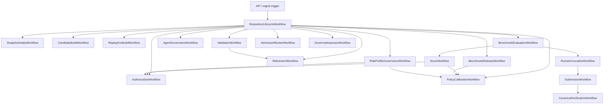

# Workflow Runtime Architecture

## 1. Purpose

This document refines the repository-specific benchmark system into runtime-facing workflow boundaries. It answers four implementation questions left open by the earlier architecture docs:

- which business chains should become Temporal Workflows versus Activities;
- how Workers and Task Queues should be split so replay, validation, runner integration, canonical verification, and scoring do not collapse into one trust boundary;
- where synchronous API requests hand off into durable asynchronous runner and verification workflows;
- how failure recovery, compensation, large payload handling, and evidence storage should work without changing the existing Temporal + Docker/OCI + gVisor + S3-compatible direction.

It stays aligned with:

- [docs/analysis/requirements.md](/Users/chenmohan/gits/barcarolle/docs/analysis/requirements.md)
- [docs/architecture/system-design.md](/Users/chenmohan/gits/barcarolle/docs/architecture/system-design.md)
- [docs/architecture/module-design.md](/Users/chenmohan/gits/barcarolle/docs/architecture/module-design.md)
- [docs/architecture/benchmark-admission-rubric.md](/Users/chenmohan/gits/barcarolle/docs/architecture/benchmark-admission-rubric.md)
- [docs/architecture/scoring-semantics.md](/Users/chenmohan/gits/barcarolle/docs/architecture/scoring-semantics.md)
- [docs/architecture/policy-calibration.md](/Users/chenmohan/gits/barcarolle/docs/architecture/policy-calibration.md)
- [docs/architecture/interface-contracts.md](/Users/chenmohan/gits/barcarolle/docs/architecture/interface-contracts.md)
- [docs/decisions/dependency-selection.md](/Users/chenmohan/gits/barcarolle/docs/decisions/dependency-selection.md)
- [docs/decisions/module-dependencies.md](/Users/chenmohan/gits/barcarolle/docs/decisions/module-dependencies.md)

## 2. Runtime stance

### 2.1 Workflow engine

Temporal remains the baseline orchestration layer. This document intentionally inherits the time-sensitive Temporal version and activity facts from the already-audited dependency memo in [docs/decisions/module-dependencies.md](/Users/chenmohan/gits/barcarolle/docs/decisions/module-dependencies.md), rather than restating a separate version snapshot here. For runtime planning in this document, treat that memo as the repository's audit anchor for current Temporal release/activity status, including the recorded server and Python SDK release points and the note that Python SDK `1.25.0` introduced external-storage support relevant to large evidence payloads.

### 2.2 Execution substrate

Docker/OCI remains the baseline environment format. Docker's official docs still describe BuildKit as the builder backend used by Docker, and `docker build` runs through Buildx with the default bundled BuildKit. This keeps the environment model close to existing repository and CI practice.

### 2.3 Isolation posture

gVisor remains the default shared-runner hardening layer on top of OCI containers. The official gVisor project and docs still describe `runsc` as an OCI runtime that integrates with Docker/Kubernetes, and the Docker quick start remains current. This supports the previously chosen "OCI first, stronger isolation than plain containers" direction without forcing a Firecracker-first execution model.

### 2.4 Storage posture

PostgreSQL remains the system of record for metadata, lineage, queue-visible state, and audit queries. Large immutable artifacts remain outside the relational store behind an S3-compatible blob interface. This preserves the existing separation between queryable control-plane state and replayable evidence bundles.

## 3. Design principles

- Keep workflow state small and durable; keep large logs, diffs, and bundles out of workflow history.
- Keep benchmark generation, replay planning, validation, runner integration, canonical verification, scoring, and authorization as separate failure domains.
- Keep task-level benchmark admission inside validation and release-level benchmark admission inside release publication; do not let runner integration, canonical verification, scoring, authorization, or repository admission retroactively approve candidate tasks.
- Keep Golden discovery/selection with candidate-build, Golden validation support with validation, and run-side Judge capability with scoring so benchmark-side assessment does not collapse into the runner-integration or policy lanes.
- Keep immutable benchmark facts, append-only repository admissions/change reviews, and mutable current operating-state projections as separate runtime outputs.
- Keep repository or organization risk appetite as an explicit append-only policy input. Do not infer risk tolerance from benchmark results or calibration evidence.
- Keep the verifier, canonical verification, and evidence writer outside the agent's writable workspace or native runner environment.
- Default to the Runner Integration Layer for native runner integration. Barcarolle must not own the tested agent's prompt, tool loop, memory, model proxy, or shell/edit interface unless the evaluation mode is explicitly `harness_native`, in which case the ACUT is `Agent + Harness`.
- Prefer child workflows for long-running business phases and activities for bounded side effects.
- Prefer explicit compensation or retirement markers over hidden mutation of prior audit state.
- Prefer conservative rejection when replay fidelity or oracle quality is unclear.

Evaluation modes are `patch_only`, `trace_submission`, `observed_run`, and `harness_native`. Adapter purity levels are `A0_transport_only`, `A1_environment_wrapper`, `A2_tool_mediation`, and `A3_harness_native_controller`.

The canonical runtime flow is: repository history -> explicit risk-profile resolution -> Golden-assisted discovery/selection when used -> task/verifier package generation -> Golden-assisted validation -> benchmark release -> runner integration -> run submission -> evidence ingestion -> clean-room canonical verification -> Judge assessment -> scorecard -> policy calibration under risk-profile constraints -> admission / authorization / operating state.

## 4. Temporal mapping

### 4.1 Workflow versus Activity rule

Use a Temporal Workflow when the step needs durable coordination, human-auditable state transitions, multi-step retry policy, or compensation logic across several side effects.

Use an Activity when the step is a bounded side effect such as:

- reading forge metadata;
- materializing a git snapshot;
- building or pulling an OCI image;
- launching an isolated runner;
- uploading artifacts;
- invoking repository-native verifiers;
- writing score records;
- applying a policy decision.

`Inference`: this split is the smallest one that preserves the earlier module boundaries while fitting Temporal's execution model. The exact class names can change later; the ownership boundaries should not.

### 4.2 Parent/child workflow topology

The parent workflow exists mainly to preserve repository-scoped correlation and to coordinate subchains. The heavy work happens in child workflows so each chain can be retried, continued-as-new, or repaired independently.

## 5. Workflow catalog

### 5.1 SnapshotIntakeWorkflow

Purpose:
- register repository snapshot;
- collect commits, issues, PRs, reviews, tests, CI, docs, and provenance;
- persist catalog metadata and enqueue downstream mining.

Workflow responsibilities:
- idempotency on `(repository_id, source_revision, import_mode)`;
- correlation IDs for all downstream chains;
- rejection if the snapshot is incomplete or provenance is ambiguous.

Activities:
- `FetchRepositorySnapshot`
- `CollectForgeMetadata`
- `NormalizeRepositoryArtifacts`
- `PersistSnapshotCatalog`

### 5.2 CandidateBuildWorkflow

Purpose:
- extract structured signals;
- record `candidate_generation_run` attempts for pre-candidate deterministic or Golden-assisted discovery/selection/contract synthesis;
- derive candidate tasks from commits, issues, PRs, CI failures, or migration evidence;
- freeze `T_task` and record source refs, allowed/disallowed inputs, expected artifacts, required permissions, capability/component/risk tags, high-impact path classes, duplicate-cluster identity, and provisional leakage/oracle profile;
- assign task family and source anchor;
- bind each candidate-generation instance to `snapshot_id + generation_context_lineage`, where the lineage includes candidate-specific selection identity, optional `candidate_generation_run_id`, and Golden-assisted discovery/selection/contract-synthesis lineage when Golden materially contributes, so regeneration under a different snapshot, extractor lineage, Golden configuration, Golden artifact digest, exact evidence-bundle version, or candidate selection becomes a distinct candidate.

Workflow responsibilities:
- one child workflow per candidate family when mining volume is large;
- invoke governed Golden discovery/selection only inside the trusted candidate-build lane or a child activity with no ACUT/runner workspace access;
- reserve a `candidate_generation_run` before candidate creation when Golden output needs an evidence subject, then append a completion event with exact output evidence-bundle refs after the bundle is sealed without changing the generation-run natural key;
- dedupe by candidate-generation identity before creating a new candidate record;
- emit `Draft -> Candidate -> Planned` state transitions only after provenance is persisted.
- reject candidates early when provenance or `T_task` is missing rather than sending them to replay.

Activities:
- `ExtractRepositorySignals`
- `LinkIssuePrCommitGraph`
- `RunGoldenCandidateDiscovery`
- `ReserveCandidateGenerationRun`
- `CompleteCandidateGenerationRun`
- `CreateTaskCandidate`
- `PersistCandidateDraft`
- `ComputeCandidateAdmissionDraft`

### 5.3 ReplayEnvBuildWorkflow

Purpose:
- decide replay strategy for a task candidate;
- reconstruct the candidate environment;
- externalize heavy build outputs and environment manifests.

Workflow responsibilities:
- keep only small references in history;
- use Continue-As-New if build orchestration becomes long-running across many retries or many artifact-upload events;
- fail with explicit `environment_unreplayable` rather than silently downgrading fidelity.

Activities:
- `PlanReplayEnvironment`
- `ResolveDependencyWindow`
- `BuildReplayImage`
- `FingerprintEnvironment`
- `UploadEnvironmentBundle`
- `PersistEnvironmentRecord`

### 5.4 ValidationWorkflow

Purpose:
- confirm the benchmark candidate has a meaningful executable transition;
- separate environment failure from task failure;
- decide `Validated`, `Rejected`, or `RepairRequired`, then gate later approval.
- compute the task-level benchmark-admission verdict under the active rubric.

Workflow responsibilities:
- run base-state and target-state checks as separate steps;
- run canonical-solution, no-op, known-bad, flakiness, runtime-budget, oracle-log-leakage, and optional mutation/equivalence probes;
- grade the oracle as A, B, C, or D and block certified approval unless the objective oracle is A or B;
- run future-leakage and answer-leakage scans across task prompt, context, retrieval corpus, workspace/package, examples, verifier logs, and hidden-test exposure;
- persist an exact `leakage_report` plus queryable `leakage_kind[]`, `leakage_severity`, `leakage_handling_decision`, `leakage_review_required`, `acut_visible_surfaces[]`, redaction/revalidation lineage, report ref, and report digest on the validation result and candidate projection;
- support repeated validation runs for flakiness detection;
- optionally generate or attach candidate-side Golden/reference artifacts before the final verdict, while keeping deterministic verifier outcomes primary;
- accept normal approval only after a successful validation result and automated policy-admission result exist;
- materialize the canonical `task` row only when approval is granted;
- route unstable, leaky, unreplayable, D-oracle, duplicate-overweight, or high-risk ambiguous candidates to exclusion, retirement, repair/revalidation, quarantine, or governance review instead of using them as normal admission or calibration evidence.
- enter candidate lifecycle state `RepairRequired` when validation returns `repair_required` or admission review records `review_state = repair_required`; repair must create a new validation basis and superseding review before approval can proceed.

Activities:
- `GenerateGoldenArtifacts`
- `RunBaseStateVerifier`
- `RunTargetStateVerifier`
- `RunCanonicalSolutionProbe`
- `RunNoOpProbe`
- `RunKnownBadProbe`
- `RunOracleLogLeakageProbe`
- `GradeOracleProfile`
- `EvaluateFailToPass`
- `RunLeakageChecks`
- `PersistLeakageReport`
- `ComputeTaskAdmissionGates`
- `PersistValidationVerdict`
- `MaterializeApprovedTask`

### 5.5 BenchmarkReleaseWorkflow

Purpose:
- own publication of one immutable benchmark release for one benchmark definition;
- freeze release membership before benchmark-authoritative evaluation begins.
- compute release-level benchmark-admission coverage and supported authorization scopes.

Workflow responsibilities:
- resolve the approved-task basis or publication rule for the release;
- read certified task profiles from approved tasks and membership weights;
- compute `release_coverage_profile`, oracle-grade weight distribution, duplicate-cluster caps, leakage clearance, task-family/component/capability/risk/permission coverage, high-impact path coverage, and recent-task coverage;
- derive `supported_authorization_scopes[]` and `unsupported_authorization_scopes[]`;
- persist the benchmark release and immutable membership snapshot as one publication action;
- reject inconsistent publication attempts rather than mutating an existing release;
- reject certified release claims with D-grade membership, confirmed leakage, unsupported high-risk scope, or missing release coverage profile;
- supersede earlier releases only by publishing a new release, never by editing historical membership.

Activities:
- `ResolveReleasePublicationInputs`
- `ComputeReleaseCoverageProfile`
- `EvaluateReleaseAdmissionCertification`
- `PersistBenchmarkRelease`
- `PersistBenchmarkReleaseMembership`
- `MarkSupersededRelease`

### 5.6 AgentGovernanceWorkflow

Purpose:
- register immutable tested-agent snapshots;
- record append-only change reviews for post-evaluation agent evolution;
- issue repository-agent admissions, record append-only operating observations, and maintain current operating-state projections.

Workflow responsibilities:
- keep the benchmark fact immutable while writing later governance records;
- classify later snapshot or condition changes across execution-condition and interpretation/authorization axes, then map them to outcomes such as carry-forward acceptable, targeted-review required, full re-benchmark required, or blocked;
- assign explicit evidence-lineage labels when non-fresh acceptance is recorded so `reused` or `supplemented` evidence is not inferred from downstream basis references alone;
- persist an explicit target-condition basis for change reviews and admissions so the approved execution boundary and interpretation/authorization basis are auditable rather than inferred from capability coverage alone;
- preserve reviewer identity, rationale, and applicability boundaries for every change review and admission;
- enforce that at most one repository-agent admission is `Effective` for any one `repository_id + scope + target_condition_basis_identity` by explicitly superseding the prior effective row before advancing that authorization tuple;
- update current operating state as one current row per repository scope with `coverage_entries[]` over all relevant target-condition/admission bases, projected from append-only benchmark, review, admission, and operating-observation facts.

Activities:
- `PersistTestedAgentSnapshot`
- `CompareAgentSnapshots`
- `PersistAgentChangeReview`
- `PersistRepositoryAgentAdmission`
- `PersistRepositoryAgentOperatingObservation`
- `ProjectRepositoryAgentOperatingState`

### 5.7 BenchmarkEvaluationWorkflow

Purpose:
- own one benchmark evaluation for one tested-agent snapshot on one benchmark release under one evaluation policy and assurance mode;
- coordinate child runs, scoring, and benchmark-scorecard completion.

Workflow responsibilities:
- durable benchmark-evaluation lifecycle from `Requested` to terminal state;
- cancellation, timeout, operator retry, and coverage tracking at benchmark level;
- ensure the benchmark fact is pinned to one tested-agent snapshot before any child runs begin;
- validate that evaluation mode, adapter purity, adapter manifest, and run-environment declaration match the referenced tested-agent snapshot's canonical normalized values before creating child-run plans;
- persist the immutable benchmark-basis and capability-envelope contract used to plan child runs;
- create one child run plan per benchmark-release membership item, or another explicit plan derived from that immutable release;
- ensure all child results remain pinned to the same benchmark release before benchmark scorecard aggregation;
- carry forward evaluated capability-envelope coverage and explicit authorization-readiness gating into the benchmark scorecard so minimum coverage, task-family distribution, and partial-evaluation policy are not left implicit.

Activities:
- `PersistBenchmarkEvaluationRequested`
- `PlanBenchmarkEvaluationRuns`
- `ReserveExecutionBudget`
- `PersistBenchmarkEvaluationTerminalState`

### 5.8 RunnerInvocationWorkflow

Purpose:
- package the task/verifier contract for the selected runner;
- invoke or hand off to an external/native runner without taking over the ACUT loop by default;
- declare evaluation mode, adapter purity, adapter manifest, and observation boundary;
- await or coordinate the run submission.

Workflow responsibilities:
- durable supervision of runner invocation, but not durable storage of every shell line in history;
- cancellation propagation to the adapter or wrapper when the mode supports cancellation;
- resumable polling while external evidence continues to land in object storage.
- materialize and persist the immutable run capability envelope before runner invocation so later steps cannot widen tool policy, network or egress posture, runtime limits, evidence destination, evaluation mode, adapter purity, or adapter manifest;
- verify that run-scoped evaluation mode, adapter purity, adapter manifest, and run-environment declaration match the referenced tested-agent snapshot and any parent benchmark evaluation before treating the request as a retry or accepted run;
- derive the envelope-independent `run_attempt_slot` before runner invocation and compare the normalized capability envelope, evaluation mode, adapter purity, and adapter manifest against any already accepted run in that slot; same slot plus same normalized values is replay of the same run fact, same slot plus a changed value is `policy_conflict`, and a different slot creates a new run identity;
- label `harness_native` or `A3_harness_native_controller` as `Agent + Harness` in the persisted ACUT.

Activities:
- `PersistRunCapabilityEnvelope`
- `PrepareTaskPackage`
- `InvokeRunnerAdapter`
- `RecordAdapterObservationBoundary`
- `AwaitRunSubmission`
- `CancelRunnerAdapter`

### 5.8a SubmissionWorkflow

Purpose:
- accept the patch/result/artifacts produced by the native agent, wrapper, or harness-backed runner;
- ingest submitted, observed, and third-party evidence with explicit trust tiers.

Workflow responsibilities:
- persist `run_submission`;
- normalize patch/result refs and submitted artifact refs;
- classify evidence as `trusted_barcarolle_evidence`, `adapter_observed_evidence`, `agent_submitted_evidence`, or `third_party_evidence`;
- mark agent-submitted traces as audit/risk/process evidence rather than correctness root evidence.

Activities:
- `PersistRunSubmission`
- `IngestSubmittedArtifacts`
- `IngestAdapterObservedArtifacts`
- `ClassifyEvidenceTrustTier`
- `UploadRunEvidenceBundle`

### 5.8b CanonicalVerificationWorkflow

Purpose:
- apply the submitted patch/result in a clean-room workspace;
- run the canonical verifier and persist trusted Barcarolle evidence.

Workflow responsibilities:
- use the approved task, replay environment, verifier image digest, and submitted result only;
- keep verifier code, hidden tests, and verdict persistence outside the runner's writable state;
- persist `canonical_verification_record`;
- block positive correctness, and block authorization eligibility for any score input that would otherwise claim positive or verified correctness, when canonical verification is missing, incomplete, or not rooted in trusted Barcarolle evidence;
- leave scoreable agent-owned terminal zeroes to `ScoreWorkflow` when trusted Barcarolle terminal-outcome evidence proves the accepted run timed out, produced a malformed/empty submission, or violated trusted policy before canonical verification could produce a record.

Activities:
- `PrepareCleanRoomWorkspace`
- `ApplySubmittedPatchOrResult`
- `RunCanonicalVerifier`
- `PersistCanonicalVerificationRecord`
- `UploadCanonicalVerificationEvidence`

For very long tasks, the workflow should persist only:

- run identifiers;
- runner/session identifiers;
- object-store manifest references;
- coarse progress markers;
- terminal verifier summary.

Detailed transcripts, command logs, PTY captures, wrapper observations, native traces, and diff bundles must be streamed to external storage and referenced back through evidence manifests with producer and trust-tier metadata.

### 5.9 ScoreWorkflow

Purpose:
- compute correctness, stability, and process signals from canonical verification records or trusted terminal-outcome evidence for scoreable pre-verification zeroes;
- write repository-queryable per-run score bundles and benchmark-queryable scorecards.

Workflow responsibilities:
- isolate scorer failures from runner-integration and canonical-verification failures;
- optionally generate mode-aware and evidence-trust-aware Judge-side assessment outputs from sealed evidence and carry their refs into score or review state without bypassing canonical verification;
- persist score bundles and benchmark scorecards against a score basis that is `policy version + score input evidence digest + score-contributing Judge lineage`, so evidence backfill, confidence-affecting observation changes, and shadow or challenger Judge variants can coexist under one scoring policy without inventing a fake policy-version bump;
- classify run outcomes under [scoring-semantics.md](./scoring-semantics.md), distinguishing scoreable agent-owned zeroes from missing, canceled, infra-failed, unverified, verifier-flaky, and policy-invalid entries;
- support repeat runs when the policy requires stability estimates instead of single-run outcomes, grouping semantic attempts separately from transport retries and canonical reverification attempts;
- derive release-weight coverage and score-weight aggregation weights from immutable release membership, oracle grade, duplicate-cluster caps, high-impact/risk policy, requested scope, and scorecard policy version;
- aggregate child-run outcomes into one benchmark scorecard tied to one benchmark release, one benchmark evaluation, and one tested-agent snapshot, using a complete score input set that includes both contributing score bundles and missing/blocked entries;
- persist the evaluated capability-envelope summary plus an explicit coverage gate that records minimum coverage threshold, task-family distribution, partial-evaluation policy, canonical-verification coverage, evidence trust-tier basis, and authorization-readiness state.

Activities:
- `LoadEvidenceManifest`
- `LoadCanonicalVerificationRecord`
- `LoadTrustedTerminalOutcomeEvidence`
- `GenerateJudgeAssessment`
- `ClassifyRunOutcomeForScoring`
- `ComputeCorrectnessScore`
- `ComputeStabilityLabel`
- `ComputeRepeatedRunSummary`
- `ComputeScoreWeights`
- `AssembleScoreInputSet`
- `PersistScoreBundle`
- `PersistBenchmarkScorecard`

### 5.10 AuthorizationWorkflow

Purpose:
- map benchmark scorecards to repository-scoped authorization output;
- keep policy decisions versioned and auditable.

Workflow responsibilities:
- no direct dependency on raw sandbox state;
- use benchmark scorecard, benchmark release, task-family metadata, evaluated capability-envelope coverage, and policy version as inputs;
- use the benchmark release coverage profile and supported/unsupported authorization scopes as hard inputs; scorecards may narrow release support but cannot widen it;
- emit decisions bound to an authorized capability envelope and `target_condition_basis_identity` rather than to snapshot identity alone;
- supersede rather than overwrite earlier decisions.
- keep authorization output separate from repository-agent admission; any admission issued from a decision should happen through the agent-governance workflow as a distinct append-only record.
- treat direct scorecard-based decisions as `fresh` benchmark evidence only relative to the exact immutable scorecard, including its `scorecard_policy_version`, `coverage_policy_version`, `reliability_policy_version`, calibrated policy-profile basis, effective risk-profile basis, and `evaluated_capability_envelope_id`; later `reused` or `supplemented` acceptance under changed conditions must remain on the agent-governance path.

Activities:
- `LoadPolicyInputs`
- `EvaluateAuthorizationPolicy`
- `PersistAuthorizationDecision`

### 5.11 RetirementWorkflow

Purpose:
- retire or repair candidates/tasks/runs when contamination, drift, weak oracles, or infra regressions are discovered.

Workflow responsibilities:
- durable handling of delayed evidence, such as later leakage discovery or repeated-run instability;
- persisted `task_retirement` records are required for task-level quarantine/retirement even if repair remains a manual review path;
- persist `release_maintenance_finding` records for release, release-membership, scorecard, authorization-decision, repository-agent-admission, or release-coverage invalidation that is not represented by a single task retirement;
- copy leakage summary fields and exact report ref/digest onto retirement or maintenance findings when delayed evidence is leakage-related;
- compute invalidation severity and affected benchmark release memberships, scorecards, authorization decisions, repository-agent admissions, and operating-state coverage entries;
- route scorecard-invalidating findings to targeted validation, new scorecard, or full rebenchmarking, and route admission-invalidating findings to suspension or revocation through agent-governance/authorization workflows;
- optional governance review hook before final retirement on ambiguous cases. Ambiguous cases stay blocked or quarantined while governance runs and do not become normal calibration evidence.

Activities:
- `ClassifyRetirementCause`
- `ComputeRetirementInvalidationImpact`
- `PersistRetirementRecord`
- `PersistReleaseMaintenanceFinding`
- `ScheduleRepairReview`

### 5.12 AdmissionReviewWorkflow

Purpose:
- write append-only admission-review records for task candidates, validation results, benchmark releases, task retirements, release maintenance findings, or other post-release invalidation findings;
- preserve reviewer identity, decision, rationale, and compliance state;
- supply the stable governance reference consumed by exception, repair, pause, override, rollback, or audit flows when governance is required.

Workflow responsibilities:
- append-only write path for admission-review lineage;
- enforce shared review states: `pending`, `approved`, `rejected`, `repair_required`, `waived_warning`, or `retired`; `not_required` is only a candidate projection;
- require `required_fixes[]` for `repair_required` and `waived_warning_codes[]` for `waived_warning`;
- no in-place edits to prior review records;
- review supersession must happen by writing a new record, not mutating an old one.

Activities:
- `PersistAdmissionReviewRecord`
- `PersistAdmissionReviewSupersession`

### 5.13 GovernedAssessorWorkflow

Purpose:
- register governed Golden/Judge assessor configurations;
- apply governed assessor promote, demote, and rollback transitions;
- preserve reviewer identity, rationale, and comparison/promotion lineage;
- keep governed assessor configuration state append-only and queryable.

Workflow responsibilities:
- register new Golden/Judge assessor configurations from normalized model/prompt/tool/memory/runtime/output-schema descriptors before they enter comparison or promotion;
- append-only transition path for governed assessor lineage;
- no in-place edits to prior configuration state;
- governance changes must be recorded as explicit new transitions.

Activities:
- `RegisterGovernedAssessorConfiguration`
- `PersistGovernedAssessorConfiguration`
- `ApplyGovernedAssessorTransition`
- `PersistGovernedAssessorTransition`

### 5.14 RiskProfileGovernanceWorkflow

Purpose:
- register organization, repository, and component/path risk-appetite profiles;
- resolve deterministic effective risk-profile basis for calibration and authorization scopes;
- apply append-only profile transitions and trigger impact, calibration, and authorization follow-up without rewriting historical facts.

Task Queue / worker role:
- `RiskProfileGovernanceWorkflow` and its write Activities run on the `risk-profile` Task Queue, polled by risk-profile governance workers;
- these workers own appetite profile registration, normalization, effective-profile resolution, append-only profile transitions, and impact-trigger writes;
- they must not run runner-integration, canonical-verification, scoring, authorization-decision, or calibrated-policy-profile write Activities.

Workflow responsibilities:
- normalize risk-profile constraints, recompute `risk_profile_digest`, and reject malformed tier/scope matrices;
- resolve organization default, repository profile, and narrower override precedence into an effective profile basis;
- persist risk-profile lifecycle transitions such as activate, pause, resume, supersede, rollback, and retire;
- trigger policy calibration when an active profile changes score, coverage, reliability, threshold, or promotion constraints;
- trigger impact preview and authorization/admission workflows when a stricter profile may require reauthorization, suspension, revocation, targeted validation, or full rebenchmarking;
- keep external License-consumption assumptions as metadata only, not as a Barcarolle runtime enforcement plane.

Activities:
- `RegisterRepositoryRiskProfile`
- `NormalizeRiskProfileConstraints`
- `ResolveEffectiveRiskProfile`
- `PersistRepositoryRiskProfile`
- `ApplyRepositoryRiskProfileTransition`
- `ComputeRiskProfileImpactPreview`
- `TriggerPolicyCalibrationForRiskProfile`
- `TriggerAuthorizationImpactReview`

Transition rules:
- `activate`, `pause`, `resume`, `supersede`, `rollback`, and `retire` write append-only transition records and never mutate historical scorecards, decisions, admissions, or operating-state entries.
- Active profile selection is deterministic for a repository scope. If inheritance or overrides conflict, write-capable authorization is blocked until a profile transition resolves the conflict.
- A profile transition is governance input, not calibration truth. It can change future risk appetite constraints, but it cannot supply labels or manually promote a calibrated policy profile.

### 5.15 PolicyCalibrationWorkflow

Purpose:
- automatically calibrate authorization thresholds, score weighting factors, coverage gates, reliability-label rules, and policy-version promotion gates;
- validate candidate policy profiles without human baselines, human labels, manual benchmark acceptance, or human participation in benchmark generation/running;
- publish calibrated policy profiles for future scoring and authorization without rewriting historical scorecards or decisions;
- optimize only under the effective repository or organization risk-profile constraints.

Workflow responsibilities:
- resolve and persist the effective risk-profile basis for the repository scope before building the manifest;
- build calibration input manifests from historical merged fixes, known pre-fix states, no-op controls, mutation controls, retrieval-only or rule-based baselines, prior agent configurations, repeated-run variance, canonical verification records, release coverage profiles, task-family/component/risk/high-impact slices, task retirements, release-maintenance findings, and risk-profile constraints;
- normalize manifest inputs into calibration truth observations with objective truth basis, expected policy effect, semantic slice, source refs, and explicit exclusions;
- generate and run automatic calibration controls through existing candidate-build, replay, validation, benchmark-release, benchmark-evaluation, canonical-verification, and scoring workflows rather than creating a parallel benchmark lifecycle;
- exclude any calibration candidate whose truth would require human judgment, unresolved leakage review, or manual acceptance;
- fit candidate policy profiles over score weights, thresholds, coverage gates, reliability labels, and promotion gates subject to risk-profile hard constraints and objective weights;
- validate profiles on held-out releases, time slices, task families, components, risk classes, high-impact path classes, prior-agent configurations, and high-tier safety-control slices;
- compute unsafe false-positive rates, confidence upper bounds, high-tier control power, control-separation margins, and positive-control false-negative metrics by claimed applicability slice;
- compute sensitivity analyses and impact previews for scorecards, authorization decisions, repository-agent admissions, and operating-state coverage entries;
- mark each produced parameter as `seed_default`, `evidence_fit`, `constraint_bound`, `shadow_only`, or `blocked` so risk appetite constraints are not reported as learned truth;
- promote or resume profiles automatically only when machine-checkable promotion gates pass; otherwise leave the profile in `candidate`, `shadow`, `paused`, or `blocked` state with exact blocker codes;
- allow human governance records only for audit, pause, annotation, rollback, or exceptional policy ownership, not as calibration labels or required promotion truth.

Activities:
- `ResolveEffectiveRiskProfile`
- `BuildCalibrationInputManifest`
- `NormalizeCalibrationTruthObservations`
- `GenerateCalibrationControls`
- `RunCalibrationBaselines`
- `FitPolicyProfileCandidates`
- `ValidatePolicyProfileCandidates`
- `MeasureUnsafeFalsePositiveRates`
- `EvaluateHighTierCalibrationPower`
- `ComputePolicySensitivityAnalysis`
- `ComputePolicyImpactPreview`
- `PersistPolicyCalibrationRun`
- `PersistCalibratedPolicyProfile`
- `ApplyCalibratedPolicyProfileTransition`

Transition rules:
- `promote`, `shadow`, `resume`, and activation transitions are workflow-owned and require machine-checkable gate refs from the calibration run, truth-observation completeness, unsafe false-positive measurement, high-tier applicability checks, held-out validation, sensitivity analysis, parameter-authority checks, and impact preview. A human governance rationale cannot satisfy these gates.
- `pause` is a governance transition that moves `active` or `shadow` profiles to `paused`, removes the profile from active selection for new scorecards and authorization decisions, and leaves all existing scorecards, decisions, admissions, and operating-state facts intact.
- While a profile is `paused`, active selection uses the latest non-paused active predecessor for the same semantic family, repository scope, applicability slice, and policy-version surface. If no predecessor is eligible, new materialization for that slice is blocked until an automated `resume` or `supersede` transition succeeds.
- `rollback` is a governance transition that changes active selection to an earlier eligible profile by writing a new transition record. It does not delete the rolled-back profile and does not rewrite historical facts.
- `supersede` activates a successor profile only through workflow-owned machine gates. If paused profile parameters or applicability need to change, the valid path is supersession rather than resume.

## 6. Chain coverage

The workflow set should cover the main benchmark chains as follows.

| Chain | Temporal path | Notes |
| --- | --- | --- |
| Snapshot intake | `SnapshotIntakeWorkflow` | Repository and provenance registration |
| Candidate build | `CandidateBuildWorkflow` | Task mining from history and signals, including candidate-generation-run reservation/completion |
| Replay/env build | `ReplayEnvBuildWorkflow` | OCI image build, dependency windowing, manifest capture |
| Validation | `ValidationWorkflow` | Fail/pass, build/pass, oracle grading, admission probes, leakage, flakiness, optional Golden artifacts |
| Benchmark release publication | `BenchmarkReleaseWorkflow` | Stable benchmark identity plus immutable release-membership snapshot, release coverage profile, and supported/unsupported authorization scopes |
| Admission review | `AdmissionReviewWorkflow` | Append-only review record for required approval lineage |
| Agent governance | `AgentGovernanceWorkflow` | Tested-agent snapshot registration, post-evaluation change review, repository admission, and operating-state projection |
| Benchmark evaluation | `BenchmarkEvaluationWorkflow -> RunnerInvocationWorkflow -> SubmissionWorkflow -> CanonicalVerificationWorkflow` | Child-run coordination for one ACUT/release pair without default loop ownership |
| Score | `BenchmarkEvaluationWorkflow -> ScoreWorkflow` | Correctness, stability, benchmark scorecard, and optional Judge assessment |
| Risk profile governance | `RiskProfileGovernanceWorkflow` | Append-only appetite profile registration, effective-profile resolution, lifecycle transitions, and impact triggers |
| Policy calibration | `PolicyCalibrationWorkflow` | Automatic empirical calibration of score weights, authorization thresholds, coverage gates, reliability labels, and policy-profile promotion under explicit risk-profile constraints |
| Governed assessor lifecycle | `GovernedAssessorWorkflow` | Append-only Golden/Judge governance transitions |
| Authorization | `AuthorizationWorkflow` | Trust tier or deny-by-default |
| Retirement | `RetirementWorkflow` | Drift, contamination, weak oracle, infra regression, post-release quarantine/invalidation |

## 7. Worker layers and Task Queues

### 7.1 Queueing model

Temporal Task Queues are lightweight, worker-polled queues. Official docs confirm they are created on demand, persist Workflow and Activity tasks, and require workers on the same queue name to register the same task types. The architecture should therefore use queue boundaries to encode capability and trust boundaries, not just throughput.

Recommended Task Queue split:

| Queue | Worker role | Runs | Trust boundary |
| --- | --- | --- | --- |
| `repo-intake` | intake workers | snapshot fetch, forge sync, artifact normalization | reads external systems; no runner invocation |
| `candidate-build` | mining workers | signal extraction, governed Golden discovery/selection/contract synthesis, `candidate_generation_run` recording, task candidate creation | trusted repository evidence only; no ACUT or runner workspace access |
| `replay-build` | replay workers | dependency recovery, OCI/BuildKit build, manifesting | touches build infra, no agent code |
| `validation` | verifier workers | base/target validation, flakiness checks, candidate-side Golden generation | trusted verifier side |
| `benchmark-registry` | release workers | benchmark-definition lookup, release publication, membership snapshot writes, release coverage profiling | freezes benchmark basis outside runner integration |
| `validation-governance-review` | review workers | admission-review writes and compliance review handoff | append-only review path |
| `benchmark-evaluation` | workflow workers | benchmark evaluation coordination and child-run planning | no direct sandbox shell access |
| `agent-governance` | governance workers | tested-agent snapshot registration, change-review writes, repository-admission writes, operating-state projection | keeps benchmark fact, admission, and current state distinct |
| `risk-profile` | risk-profile governance workers | appetite profile registration, constraint normalization, effective-profile resolution, lifecycle transitions, and impact triggers | writes policy appetite only; no benchmark truth, score, runtime enforcement, or runner workspace authority |
| `runner-integration` | runner workers | task package delivery, native runner invocation, wrapper observation, submission coordination | closest to untrusted agent code and external adapter outputs |
| `evidence-io` | evidence workers | bundle upload, checksum, manifest append | append-only storage path |
| `canonical-verification` | verifier workers | clean-room patch/result application and canonical verifier execution | trusted Barcarolle evidence path |
| `scoring` | scoring workers | score computation, repeated-run aggregation, benchmark scorecard assembly, run-side Judge assessment | reads sealed evidence and canonical verification only |
| `policy-calibration` | calibration workers | calibration manifests, truth observations, automated controls, baseline runs, unsafe false-positive measurement, high-tier control-power checks, sensitivity analysis, calibrated policy-profile writes | reads immutable benchmark/score/evidence facts and writes calibration/profile facts; no runner workspace access except through normal evaluation workflows |
| `governance` | governance workers | governed assessor lifecycle transitions | append-only assessor-configuration governance |
| `authorization` | policy workers | trust decision evaluation | no agent/runtime access |
| `retirement` | maintenance workers | repair/retire scheduling and release-maintenance invalidation writes | benchmark governance |

### 7.2 Worker layering

Use five runtime layers:

1. Control-plane workers
   - `repo-intake`, `candidate-build`, `benchmark-registry`, `benchmark-evaluation`, `agent-governance`, `scoring`, `authorization`, `retirement`, `validation-governance-review`
   - no runner invocation privileges beyond what their activities need

2. Build/validation workers
   - `replay-build`, `validation`
   - can build/pull OCI images and run trusted verifiers
   - separate from the runner integration fleet so validator state never shares a writable workspace with the agent

3. Runner integration workers
   - `runner-integration`, optionally `evidence-io`
   - can invoke native runners, wrappers, or explicit harness-native sessions
   - should be isolated operationally from the rest of the system because they are closest to untrusted repository code, adapter outputs, and reward-hacking risk

4. Canonical verification workers
   - `canonical-verification`, optionally `evidence-io`
   - can apply submitted results in clean-room workspaces and write trusted verification records
   - cannot invoke or modify the ACUT loop

5. Control-plane governance workers
   - `governance`, `agent-governance`, `risk-profile`, `policy-calibration`
   - handle append-only assessor lifecycle transitions, tested-agent evolution review, repository admissions, current operating-state projection, risk-profile lifecycle and effective-profile resolution, and calibrated policy-profile lifecycle without runner invocation privileges

`Inference`: the split above is stricter than the minimal number of queues Temporal would require, but it directly addresses the benchmark-gaming and evaluator-compromise risks documented in the research notes.

### 7.3 Queue inheritance and child workflow use

- Child workflows inherit the parent queue unless explicitly set otherwise. For this system, set child queues explicitly when crossing a trust boundary.
- Activities should inherit their workflow queue only when the worker capability already matches the side effect.
- Do not allow `RunnerInvocationWorkflow` activities to run on the same queue as validation, canonical verification, or scoring activities.
- Do not allow `AdmissionReviewWorkflow`, `AgentGovernanceWorkflow`, `RiskProfileGovernanceWorkflow`, `GovernedAssessorWorkflow`, or `PolicyCalibrationWorkflow` writes to share queues with runner-integration workers.

## 8. Synchronous API to asynchronous workflow handoff

### 8.1 API pattern

FastAPI endpoints remain synchronous command surfaces, but each mutating endpoint should do only four things synchronously:

1. validate request shape and idempotency key;
2. persist the initial command record in PostgreSQL;
3. start or signal a Temporal workflow with stable workflow ID conventions;
4. return a resource handle plus current status.

For `StartBenchmarkEvaluation` and `StartRunnerInvocation`, request validation must resolve `attempt_number`, `evaluation_mode`, `adapter_purity_level`, and adapter manifest before deriving any workflow ID. The value is command-supplied, not allocated by Temporal retry logic. Transport retries reuse the same idempotency key and attempt number; semantic reruns use a new idempotency key and the next attempt number.

Golden/Judge work remains behind candidate-build/validation and scoring surfaces, while benchmark release publication, tested-agent governance, benchmark evaluation, admission-review, and governed-assessor writes use dedicated control-plane workflows.

### 8.2 API command mapping

| API command | Temporal entrypoint | Sync response |
| --- | --- | --- |
| `RegisterRepositorySnapshot` | `SnapshotIntakeWorkflow` | `202 Accepted` with `snapshot_id` / workflow handle |
| `ReserveCandidateGenerationRun` | `CandidateBuildWorkflow` | generation-run handle |
| `CompleteCandidateGenerationRun` | `CandidateBuildWorkflow` | completion-event handle plus generation-run handle |
| `CreateTaskCandidate` | `CandidateBuildWorkflow` | candidate handle |
| `PlanReplayEnvironment` | `ReplayEnvBuildWorkflow` | replay plan handle |
| `BuildReplayEnvironment` | `ReplayEnvBuildWorkflow` | environment handle |
| `ValidateReplayEnvironment` | `ValidationWorkflow` | validation-result handle |
| `ApproveTaskCandidate` | signal `ValidationWorkflow` after successful validation | task handle |
| `PublishBenchmarkRelease` | `BenchmarkReleaseWorkflow` | benchmark-release handle |
| `CreateAdmissionReviewRecord` | `AdmissionReviewWorkflow` | admission-review handle |
| `RegisterTestedAgentSnapshot` | `AgentGovernanceWorkflow` | tested-agent snapshot handle |
| `RecordAgentChangeReview` | `AgentGovernanceWorkflow` | change-review handle |
| `RecordRepositoryAgentAdmission` | `AgentGovernanceWorkflow` | repository-admission handle |
| `RecordRepositoryAgentOperatingObservation` | `AgentGovernanceWorkflow` | operating-observation handle plus refreshed operating-state handle |
| `StartBenchmarkEvaluation` | `BenchmarkEvaluationWorkflow` | benchmark-evaluation handle |
| `StartRunnerInvocation` | signal `BenchmarkEvaluationWorkflow` or ad hoc runner-integration path | `run_id` and status URL |
| `SubmitRunResult` | `SubmissionWorkflow` | `run_submission_id` and ingestion status |
| `RecordCanonicalVerification` | `CanonicalVerificationWorkflow` | `canonical_verification_record_id` |
| `CancelRunnerInvocation` | signal/cancel `BenchmarkEvaluationWorkflow` or child run | cancellation accepted |
| `ComputeRunScore` | `ScoreWorkflow` or signal existing benchmark-evaluation workflow | score-bundle handle |
| `DecideAuthorization` | `AuthorizationWorkflow` | decision handle |
| `RegisterRepositoryRiskProfile` | `RiskProfileGovernanceWorkflow` | risk-profile handle |
| `ApplyRepositoryRiskProfileTransition` | `RiskProfileGovernanceWorkflow` | risk-profile transition handle |
| `ResolveEffectiveRiskProfile` | `RiskProfileGovernanceWorkflow` or local policy read model | effective risk-profile basis |
| `StartPolicyCalibration` | `PolicyCalibrationWorkflow` | calibration-run handle |
| `ApplyCalibratedPolicyProfileTransition` | `PolicyCalibrationWorkflow` | calibrated-policy-profile transition handle |
| `RegisterGovernedAssessorConfiguration` | `GovernedAssessorWorkflow` | `assessor_configuration_id` |
| `ApplyGovernedAssessorTransition` | `GovernedAssessorWorkflow` | assessor-governance handle |
| `RetireTaskCandidate` | `RetirementWorkflow` | retirement request handle |
| `RetireTask` | `RetirementWorkflow` | task-retirement handle plus invalidation-impact summary |
| `CreateReleaseMaintenanceFinding` | `RetirementWorkflow` | release-maintenance finding handle plus invalidation-impact summary |

### 8.3 Workflow ID strategy

Use deterministic workflow IDs so API retries do not create duplicates:

- snapshot intake: `snapshot:{repository_id}:{source_revision}`
- candidate build: `candidate:{repository_id}:{candidate_generation_identity}`
- replay env: `env:{task_candidate_id}:{plan_version}`
- validation: `validation:{task_candidate_id}:{environment_id}`
- benchmark release: `benchmark-release:{benchmark_definition_id}:{release_label}`
- tested-agent snapshot: `agent-snapshot:{repository_scope}:{snapshot_fingerprint}`
- agent governance: `agent-governance:{repository_scope}:{subject_key}`
- admission review: `admission-review:{review_subject_kind}:{subject_id}:{reviewer_id}`
- benchmark evaluation: `benchmark-eval:{benchmark_release_id}:{tested_agent_snapshot_id}:{evaluation_policy_version}:{evaluation_mode}:{adapter_purity_level}:{capability_envelope_contract_id}:{assurance_mode}:{attempt_number}`
- run attempt slot guard: benchmark-linked `run-slot:{benchmark_evaluation_id}:{benchmark_release_membership_id}:{attempt_number}`; ad hoc `run-slot:{task_id}:{tested_agent_snapshot_id}:{environment_id}:{attempt_number}`
- run: benchmark-linked `run:{benchmark_evaluation_id}:{benchmark_release_membership_id}:{capability_envelope_id}:{evaluation_mode}:{adapter_purity_level}:{adapter_manifest_digest}:{attempt_number}`; ad hoc `run:{task_id}:{tested_agent_snapshot_id}:{environment_id}:{capability_envelope_id}:{evaluation_mode}:{adapter_purity_level}:{adapter_manifest_digest}:{attempt_number}`
- governed assessor register: `assessor-register:{repository_scope}:{assessor_kind}:{configuration_fingerprint}`
- governed assessor transition: `assessor:{assessor_configuration_id}:{transition_type}`
- risk profile register: `risk-profile:{organization_or_repository_scope}:{scope_digest}:{risk_profile_version_or_constraint_digest}`
- risk profile transition: `risk-profile:{repository_risk_profile_id}:{transition_type}:{transition_basis_digest}`
- effective risk profile resolution: `risk-profile-resolve:{repository_scope}:{requested_slice_digest}`
- policy calibration: `policy-calibration:{repository_scope}:{target_policy_family_digest}:{repository_risk_profile_id_or_seed}:{risk_profile_digest}:{calibration_input_manifest_digest}:{run_attempt_number}`
- calibrated policy transition: `calibrated-policy:{calibrated_policy_profile_id}:{transition_type}:{transition_basis_digest}`
- authorization: `authz:{repository_scope}:{authorization_policy_version}:{calibrated_policy_profile_id_or_seed}:{repository_risk_profile_id_or_seed}:{risk_profile_digest}:{benchmark_scorecard_id}:{authorized_capability_envelope_id}:{target_condition_basis_identity}`
- task retirement: `task-retirement:{task_id}:{retirement_cause}:{finding_digest}`

The `agent-snapshot` workflow ID must use the backend-validated canonical `snapshot_fingerprint`, not an unchecked caller-provided value.

## 9. Failure recovery, retries, and compensation

### 9.1 Retry stance

Temporal's retry model is most useful for infrastructure or transport failures, not for deterministic domain rejection.

Recommended rule:

- retry Activities for transient failures such as network fetches, object-store writes, worker crashes, runner-adapter failures, or clean-room verifier bootstrap failures;
- mark deterministic domain failures as non-retryable once classified, such as `environment_unreplayable`, `contaminated_or_leaked`, `weak_oracle`, or policy denial;
- keep Workflow code responsible for branching on failure class rather than burying business semantics in generic retry loops.
- treat admission-review denial and governed-assessor rejection as non-retryable domain outcomes; model any superseding decision as a new append-only record.

Temporal's official docs still state that failed Activities retry by default under a Retry Policy and that idempotent Activities are strongly recommended because Activity execution is at-least-once.

### 9.2 Idempotency requirements

Every Activity that causes an external side effect must be idempotent or guarded by an idempotency key stored outside workflow history:

- object-store upload: keyed by content digest and artifact role;
- environment registration: keyed by `(task_id, plan_version, image_digest)`;
- candidate generation-run reservation: keyed by `(repository_id, snapshot_id, generation_strategy, signal_input_manifest_digest, selection_policy_version, optional golden_configuration_id, optional golden_input_manifest_digest, run_attempt_number)`, with exact Golden output evidence-bundle version/content digest and selection/ranking identity appended later as completion metadata when Golden contributed before a candidate exists;
- candidate creation: keyed by `(repository_id, snapshot_id, generation_context_lineage, task_family, contract_version)`, with `generation_context_lineage` carrying candidate-specific selection identity plus `candidate_generation_run_id`, Golden configuration identity, selected output digest, and exact evidence-bundle version/content digest when Golden-assisted discovery, selection, or contract synthesis materially contributed;
- repository risk profile persistence: keyed by `(organization_id_or_repository_id, scope_descriptor, risk_profile_version)` and idempotent for equivalent `(organization_id_or_repository_id, scope_descriptor, constraint_digest)`, with the digest recomputed by the backend from normalized constraints;
- effective risk profile resolution: keyed by `(repository_scope, requested_slice_digest, active_profile_selection_version)`, with the result carrying selected source profile refs and final risk-profile digest;
- tested-agent snapshot persistence: keyed by `(repository_scope, snapshot_fingerprint)`, with ACUT field evidence basis preserved for `declared`, `adapter_observed`, `third_party_attested`, and `barcarolle_trusted` fields;
- benchmark evaluation persistence: keyed by `(benchmark_release_id, tested_agent_snapshot_id, evaluation_policy_version, evaluation_mode, adapter_purity_level, capability_envelope_contract_id, assurance_mode, attempt_number)`;
- evaluation run attempt-slot guard: ad hoc keyed by `(task_id, tested_agent_snapshot_id, environment_id, attempt_number)` and benchmark-linked keyed by `(benchmark_evaluation_id, benchmark_release_membership_id, attempt_number)`, with the first accepted normalized `capability_envelope_id`, `evaluation_mode`, `adapter_purity_level`, and adapter manifest bound to that slot;
- evaluation run persistence: accepted identity is the attempt slot plus `capability_envelope_id`, `evaluation_mode`, `adapter_purity_level`, and adapter manifest digest; concretely, ad hoc accepted runs are keyed by `(task_id, tested_agent_snapshot_id, environment_id, attempt_number, capability_envelope_id, evaluation_mode, adapter_purity_level, adapter_manifest_digest)` and benchmark-linked accepted runs are keyed by `(benchmark_evaluation_id, benchmark_release_membership_id, attempt_number, capability_envelope_id, evaluation_mode, adapter_purity_level, adapter_manifest_digest)`. The persisted ACUT field evidence-basis summary is copied from the tested-agent snapshot; run-scoped adapter observations are stored as `run_observation_basis` and cannot upgrade snapshot identity in place;
- run submission persistence: keyed by `(run_id, submission_digest)` with one accepted submission per run;
- canonical verification persistence: keyed by `(run_submission_id, verifier_identity, verifier_image_digest, scoring_relevant_policy_version, verification_attempt_number)`. Idempotent retries reuse the same attempt number and must match trusted evidence digest and verifier evidence bundle digest; semantic reverification under the same verifier basis increments the attempt number;
- repository-agent admission persistence: keyed by `(repository_scope, tested_agent_snapshot_id, admission_basis_identity, target_condition_basis_identity)`;
- repository-agent operating observation persistence: keyed by `(repository_scope, observed_at, state_source, tested_agent_snapshot_id)`, with optional mode, purity, adapter manifest, and target-condition-basis fields stored for projection when no linked admission or change review supplies them;
- repository-agent operating-state projection: keyed by `(repository_scope)`, with authoritative `coverage_entries[]` keyed inside the projection by `target_condition_basis_identity` and linked admission/change-review basis so multiple effective target-condition admissions for the same current snapshot do not collapse into one summary field;
- evidence bundle persistence: keyed by `(subject_type, subject_id, bundle_kind, manifest_version)`, with `content_digest` recording the exact sealed manifest body and `subject_type + subject_id + bundle_kind` serving only as the current/latest read-model series. Pre-candidate Golden discovery artifacts use `candidate_generation_run` subjects; post-candidate validation artifacts use `task_candidate` or `validation_result` subjects before a task is approved;
- score persistence: keyed by `(run_id, canonical_verification_record_id_or_terminal_outcome_evidence_digest, scoring_policy_version, score_input_evidence_digest, score_basis_judge_lineage)`, where the canonical verification identity is used for verified outcomes and the trusted terminal outcome evidence digest is used for scoreable pre-verification zeroes. `score_input_evidence_digest` covers exact sealed evidence bundle versions/digests, run observation-basis digest, evidence trust-basis digest, contribution modes, run outcome classification inputs, and every score-contributing or confidence-contributing evidence input; the lineage axis is score-contributing `judge_configuration_id` or explicit `none` when all attached Judge output is advisory;
- benchmark scorecard persistence: keyed by `(benchmark_evaluation_id, scorecard_policy_version, coverage_policy_version, reliability_policy_version, calibrated_policy_profile_id_or_seed, repository_risk_profile_id_or_seed, risk_profile_digest_or_seed, evaluated_capability_envelope_id, evaluation_mode, adapter_purity_level, score_input_set_digest, evidence_trust_basis_digest, score_basis_judge_lineage)`, where `score_input_set_digest` is derived from the complete score input set, including requested release memberships, selected immutable score bundles and their score input evidence digests, repeated-run grouping, missing/blocked entries, weighting factors, and score-basis Judge lineage; `evidence_trust_basis_digest` is derived from the aggregate evidence trust basis, and the lineage axis is score-contributing `judge_configuration_id` or explicit `none` when Judge output stayed advisory;
- authorization persistence: keyed by `(repository_scope, authorization_policy_version, calibrated_policy_profile_id_or_seed, repository_risk_profile_id_or_seed, risk_profile_digest_or_seed, benchmark_scorecard_id, authorized_capability_envelope_id, target_condition_basis_identity)`. `authorization_decision.authorization_policy_version` is canonical; any legacy `policy_version` selector must alias the same value and must not be stored as an independent identity axis.
- governed assessor configuration persistence: keyed by `(repository_scope, assessor_kind, configuration_fingerprint)`, with the fingerprint recomputed by the backend from normalized assessor configuration descriptors.

`Inference`: `source_anchor` remains provenance for the historical source material, while the task-candidate identity used by `CandidateBuildWorkflow` is `snapshot_id + generation_context_lineage` plus the task-family and contract-version axes needed to keep regenerated candidates append-only and distinct when semantics change. The generation-context lineage must include candidate-specific selection identity and, when applicable, `candidate_generation_run_id`, Golden configuration, selected output digest, and exact evidence-bundle version/content digest, not just extractor lineage.

`Inference`: attempt-bearing workflow IDs are stable only if `attempt_number` is stable at command acceptance. The control plane must therefore reject an idempotency-key replay that changes `attempt_number` or the natural attempt basis, instead of silently allocating a new attempt during transport retry.

### 9.3 Compensation strategy

Use compensation only for side effects that must be undone, not for simple state transitions.

Examples:

- reserved compute slot -> compensation releases reservation;
- temporary runner-invocation lease -> compensation revokes lease;
- provisional authorization record -> compensation supersedes with denied/revoked state if upstream evidence fails.

For repository/task lifecycle records, prefer append-only reversal markers:

- `Rejected`
- `Retired`
- `Superseded`
- `RepairRequired`

Admission-review records and governed-assessor transitions follow the same append-only rule: supersede or roll forward with a new record rather than deleting or mutating prior review/governance entries.

Temporal's Python error-handling guide explicitly documents Saga-style rollback for multi-step workflows. That is the right fit for runtime reservations and provisional side effects, but not for immutable benchmark audit records.

### 9.4 Cancellation and timeout behavior

- API cancellation should signal the parent run workflow, which then cancels the child runner-invocation workflow and adapter or harness-native session when cancellation is available.
- Long-running activities in runner-integration workers should heartbeat so worker death or cancellation is detected promptly.
- Build, runner integration, submission, and canonical verification phases should use explicit schedule-to-close and start-to-close timeouts so "hung runner" and "still working" are distinguishable.

## 10. Long tasks and large payloads

### 10.1 Workflow history discipline

Do not store these inline in Temporal event history:

- full shell transcripts;
- PTY recordings;
- image build logs;
- patches above small-control-plane size;
- verifier raw XML/JSON bundles;
- screenshots, videos, or large binary artifacts.

Store only:

- artifact digests;
- object-store URIs or opaque blob references;
- small structured summaries;
- evidence manifest IDs.

### 10.2 External payload and artifact offload

Temporal Python SDK `1.25.0` added external storage support specifically to offload payloads to systems such as Amazon S3 and keep only a small reference token in Event History. That capability should be used conservatively for workflow-visible payloads that still need to be passed through Temporal boundaries, while the bulk of logs and evidence should already live in the normal evidence store abstraction.

Recommended split:

- Temporal external payload storage:
  - medium-size workflow inputs/outputs that are semantically part of workflow coordination
  - example: compact task manifests, replay plans, score summaries that exceed normal payload comfort
- evidence object storage:
  - large immutable run artifacts
  - example: transcripts, patches, build logs, verifier outputs, screenshots, session recordings

### 10.3 Continue-As-New usage

Use Continue-As-New on workflows that can accumulate long histories:

- repository lifecycle workflows spanning many candidates;
- benchmark runs with many repeated attempts;
- retirement/repair workflows that receive delayed evidence over time.

`Inference`: Continue-As-New is not required on every workflow, but the runtime design should assume it will be needed once a repository accumulates many child runs or large maintenance histories.

## 11. Docker, gVisor, and runner boundaries

### 11.1 Boundary model

Use three nested boundaries:

1. Temporal worker process boundary
   - trusted control plane
2. container boundary
   - reproducible environment packaging via OCI/Docker/BuildKit
3. gVisor `runsc` boundary
   - hardened execution for shared runners

When Barcarolle controls a wrapper, verifier, or harness-native environment, the agent's writable workspace must remain inside that declared boundary. For non-invasive external agents, the workspace and network posture are recorded as ACUT and adapter metadata rather than assumed controlled by Barcarolle. The following must stay outside any runner-writable boundary Barcarolle does control:

- verifier source and final verdict persistence;
- canonical verification records;
- score computation;
- authorization policy evaluation;
- artifact manifest append logic.

### 11.2 Build, runner integration, and canonical verification separation

- environment build can happen in standard OCI/BuildKit workers because it is reconstructing a benchmark environment, not yet running the evaluated agent;
- runner integration should preserve the ACUT's native loop unless the explicit mode is `harness_native`;
- harness-native or observed wrapper modes should execute in a hardened runner path that applies gVisor by default for shared runners when Barcarolle controls that path;
- trusted validation and canonical verification may reuse the replay image but must execute with separate mounts and fresh state from the agent run or native runner submission.

### 11.3 Filesystem and network posture

Required:

- read-only base image layers;
- writable ephemeral workspace mounted only for the Barcarolle-controlled wrapper, canonical verifier, or harness-native run;
- no direct write path from agent workspace to verifier/evidence control files;
- default deny on outbound network for Barcarolle-controlled verifier sandboxes and harness-native/observed wrapper portions unless a task family explicitly requires it and contamination policy allows it.
- external native-agent network posture in `patch_only` or `trace_submission` is recorded as ACUT/adapter metadata unless the adapter actually controls it.

Later hardening:

- stricter per-task network profiles;
- secret injection and masking policy;
- KVM-backed gVisor modes or microVM evaluation for higher-risk multi-tenancy.

## 12. Evidence external storage and backfill

### 12.1 Evidence write path

Evidence should be written in this order:

1. runner-integration, submission, canonical-verification, or evidence worker streams raw artifacts to object storage;
2. `evidence-io` worker computes digest, size, content type, retention tier, and provenance;
3. evidence manifest version is appended in PostgreSQL with `subject_type + subject_id + bundle_kind + manifest_version` and content digest;
4. workflow receives only the manifest reference and coarse summary;
5. scorer and auditors read by manifest, not by runner-local or sandbox path.

### 12.2 Evidence bundle contents

Minimum bundle for a benchmark run:

- repository snapshot ID and environment ID;
- tested-agent snapshot ID and optional upstream agent-configuration ID;
- run timeline and terminal state;
- command and tool trace references when available for the selected mode;
- patch/diff references;
- run-submission references;
- canonical verifier outputs;
- evidence trust-tier summary;
- runner or wrapper resource summary when observed;
- retry and cancellation history;
- score-bundle reference list, including `score_bundle_id`, scoring policy, score input evidence digest, run outcome class, score state, and score-basis Judge lineage for each referenced immutable score bundle. If a workflow read model exposes a selected score summary, it must record the selection policy instead of implicitly choosing one score.
- scorecard input-set summaries that include missing or blocked entries when a benchmark evaluation did not produce a score bundle for every requested release membership.

### 12.3 Evidence backfill

Backfill means turning externally written artifacts into queryable evidence records after the runner, submission, or canonical-verification step completes.

Use backfill when:

- artifacts arrive asynchronously after upload;
- a verifier produces late auxiliary outputs;
- repeated-run aggregation adds derived evidence after the original run completed;
- retirement later attaches contamination or leakage evidence to an older task/run.

Backfill must be append-only:

- add new manifest entries or new bundle versions;
- allocate a new `manifest_version` for the affected `subject_type + subject_id + bundle_kind` series and retain the older sealed bundle version;
- update only current/latest read projections; do not rewrite score, Judge, canonical-verification, scorecard, or authorization records that already reference an older sealed bundle version;
- trigger rescoring when a new bundle version changes any score-contributing or confidence-contributing evidence input, producing a new immutable `score_bundle` with a new `score_input_evidence_digest`;
- trigger scorecard recomputation when a run completion, evidence repair, missing-run classification, repeated-run grouping, weighting policy, or selected score bundle changes the complete score input set, producing a new immutable `benchmark_scorecard` with a new `score_input_set_digest`;
- do not rewrite prior raw evidence;
- if a checksum mismatch or upload gap is found, mark the evidence incomplete and route to `RetirementWorkflow` or repair review.

## 13. Required Scope and Later Work

### 13.1 Required

- first-release workflow coverage for snapshot intake, candidate-generation-run reservation/completion, candidate build, replay/env build, validation, benchmark release publication, admission review, tested-agent governance, benchmark evaluation, runner invocation, submission, canonical verification, score, risk-profile governance (`RiskProfileGovernanceWorkflow`), policy calibration (`PolicyCalibrationWorkflow`), governed assessor lifecycle, authorization, and retirement;
- separate Task Queues for intake/build, validation/review, governance, risk-profile governance, policy calibration, runner integration, canonical verification, scoring, and authorization;
- Docker/OCI + BuildKit environment reconstruction;
- gVisor-backed path for Barcarolle-controlled observed wrappers and harness-native shared runners;
- object-store offload for large artifacts;
- append-only evidence manifests and deterministic workflow IDs;
- explicit classification of retryable infra failure versus non-retryable domain rejection.
- deterministic scoring semantics for run outcome classification, repeated-run aggregation, score weighting, missing-run denominator handling, and benchmark scorecard aggregation.

### 13.2 Later extension or ops hardening

- advanced worker versioning rollout controls;
- stronger verifier isolation on separate hosts or stronger VM-backed sandboxes;
- automatic repair workflows for retired tasks;
- richer policy outputs such as module-scoped or task-family-scoped authorization;
- deeper redaction, compliance retention, and cold-storage tiering;
- broader GUI/browser execution families beyond repository shell workflows.

## 14. Source anchors

### Internal sources

- [docs/analysis/requirements.md](/Users/chenmohan/gits/barcarolle/docs/analysis/requirements.md)
- [docs/architecture/system-design.md](/Users/chenmohan/gits/barcarolle/docs/architecture/system-design.md)
- [docs/architecture/module-design.md](/Users/chenmohan/gits/barcarolle/docs/architecture/module-design.md)
- [docs/architecture/interface-contracts.md](/Users/chenmohan/gits/barcarolle/docs/architecture/interface-contracts.md)
- [docs/architecture/scoring-semantics.md](/Users/chenmohan/gits/barcarolle/docs/architecture/scoring-semantics.md)
- [docs/decisions/dependency-selection.md](/Users/chenmohan/gits/barcarolle/docs/decisions/dependency-selection.md)
- [docs/decisions/module-dependencies.md](/Users/chenmohan/gits/barcarolle/docs/decisions/module-dependencies.md) as the audited in-repo anchor for time-sensitive dependency/runtime facts, including Temporal release/activity status
- [docs/research/environment-replay-and-reproducible-execution.md](/Users/chenmohan/gits/barcarolle/docs/research/environment-replay-and-reproducible-execution.md)
- [docs/research/benchmark-trustworthiness-risks.md](/Users/chenmohan/gits/barcarolle/docs/research/benchmark-trustworthiness-risks.md)
- [docs/research/replayable-repository-task-construction.md](/Users/chenmohan/gits/barcarolle/docs/research/replayable-repository-task-construction.md)
- [docs/research/repository-evaluation-infrastructure-landscape.md](/Users/chenmohan/gits/barcarolle/docs/research/repository-evaluation-infrastructure-landscape.md)

### External primary sources verified on 2026-04-20

- [Temporal docs home](https://docs.temporal.io/)
- [Temporal Task Queues](https://docs.temporal.io/task-queue)
- [Temporal retry policies](https://docs.temporal.io/encyclopedia/retry-policies)
- [Temporal Python error handling and Saga pattern](https://docs.temporal.io/develop/python/best-practices/error-handling)
- [Temporal Python SDK developer guide](https://docs.temporal.io/develop/python)
- [Temporal server releases](https://github.com/temporalio/temporal/releases)
- [Temporal Python SDK releases](https://github.com/temporalio/sdk-python/releases)
- [Docker BuildKit docs](https://docs.docker.com/build/buildkit/)
- [Docker build overview](https://docs.docker.com/build/concepts/overview/)
- [gVisor official repository](https://github.com/google/gvisor)
- [gVisor install guide](https://gvisor.dev/docs/user_guide/install/)
- [gVisor Docker quick start](https://gvisor.dev/docs/user_guide/quick_start/docker/)
- [PostgreSQL news archive](https://www.postgresql.org/about/newsarchive/pgsql/)
