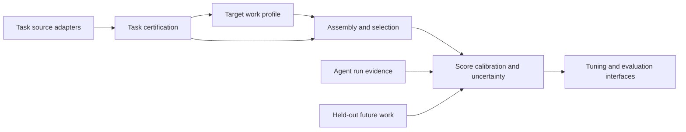

# Barcarolle Benchmark Compiler System Design

Status: active architecture snapshot, 2026-06-04.

## Purpose

Barcarolle compiles candidate software-engineering tasks into auditable,
versioned, target-repository benchmark releases. A release is meant to estimate
future work in a specific repository for a specified Agent family, budget, and
evaluation or tuning objective.

An Agent is the complete tested configuration: model, harness, prompt or skills,
tools, retrieval, runtime policy, and budget. Older reports call this ACUT
(`Agent Configuration Under Test`); the boundary is the same.

Barcarolle is not a generic coding leaderboard and not an Agent License product
by itself.

## Agent Harness Boundary

Barcarolle evaluates Agents; it does not implement the Agent harness. The Agent
owns file search, editing strategy, tool use, public-test policy, multi-turn
retry behavior, model calls, retrieval, and trace internals.

Barcarolle's execution boundary is a workspace adapter:

```text
task package + clean solver workspace
        |
configured Agent harness mutates the workspace
        |
Barcarolle captures git diff
        |
fresh verifier workspace + hidden oracle
        |
score, cost, latency, and failure taxonomy
```

The benchmark side gives the solver workspace only solver-visible task
statements and allowed context. Hidden tests, reference patches, source
provenance that leaks the answer, and verifier commands stay outside the Agent
workspace.

One-shot chat-completion diff generation is not the primary scoreable protocol.
It can remain a diagnostic baseline or negative control, but scoreable Agent
runs should let the configured harness modify a real worktree and let
Barcarolle capture the resulting patch with Git.

## Scope Boundaries

- Do not frame a general SWE task generator as the core contribution.
- Do not reimplement an Agent harness inside Barcarolle.
- Do not make license issuance or G0-G5 admission the current research proof.
- Do not rely on ranking reversal as the main claim.
- Do not treat public benchmark score as sufficient evidence for target-repo
  future performance.

These are contribution boundaries, not permanent exclusions. Barcarolle may
implement repo-history task mining or source adapters when external task
generators are unavailable. That component is candidate-supply infrastructure:
its value is measured by yield, replayability, certification rate, oracle
quality, and cost. The core claim remains benchmark compilation and calibration.

## Compiler Inputs

```text
target repository r
time cutoff tau
candidate task sources S
Agent family A
evaluation budget C
target work assumptions T_r
evaluation or tuning objective O
```

Candidate sources can include historical PRs and issues, external task
factories, synthetic or mutation tasks, manual canaries, and customer
regression tasks. External tasks must still be normalized and certified under
Barcarolle's release rules before they count as benchmark tasks.

## Compiler Output

```text
Barcarolle benchmark release B_{r,tau}
```

A release contains:

- certified task set;
- task strata and taxonomy;
- dev, eval, canary, and holdout splits;
- target-profile assumptions and optional task weights;
- execution environment and oracle metadata;
- leakage, ambiguity, flakiness, and replay reports;
- score aggregation and uncertainty estimates;
- failure taxonomy;
- optimizer-readable reward and metric schema;
- refresh policy.

## Architecture



## Layer 1: Task Source Adapters

Adapters normalize candidate tasks into a common schema:

```yaml
task_id:
source_type:
repo:
base_commit:
task_time:
problem_statement:
patch_reference_optional:
test_oracle:
environment:
changed_files:
candidate_labels:
source_confidence:
known_leakage_risks:
```

Barcarolle should stay source-agnostic. Stronger upstream generators improve
the candidate pool, but they do not remove the need for certification,
selection, release freezing, and future-work validation.

## Layer 2: Task Certification

Certification decides whether a candidate can enter a benchmark release. Gates
include replayability, oracle validity, no-op failure, reference pass, known-bad
failure, flakiness, ambiguity, leakage, task-boundary clarity, cost boundedness,
and taxonomy coverage.

Current oracle sources are mostly changed tests recovered from repository
history, pass-to-pass guards, and verifier packages. Future sources may include
external task-system oracles, manually written customer regressions, generated
oracles after review, and canaries. "Hidden oracle" is an access-control
property; "valid oracle" is a quality property.

## Layer 3: Target Work Distribution Modeling

Barcarolle estimates a target profile for future work in the repository over
module, task type, change size, test type, dependency radius, issue style, API
surface, runtime constraints, review conventions, frequency, and optional
business risk.

The target profile is explicit, auditable, and uncertainty-bearing. It is not
assumed to be perfect.

## Layer 4: Benchmark Assembly And Selection

Given candidates, target profile, Agent family, budget, and objective, the
compiler selects tasks and, when appropriate, weights them.

Required baselines:

- random same-budget samples;
- repo-unweighted pools;
- repo-stratified or simple stratified sampling;
- temporal recency baselines;
- external-generator defaults when available.

The old metadata-weighted target-profile design is not the mainline. It remains
diagnostic evidence: it showed that weak task selection can be misleading and
that the objective can be underidentified. The conservative mainline is simple
repo-stratified reporting until a candidate selector wins on preregistered
future holdout or rolling-origin validation.

## Layer 5: Score Calibration And Uncertainty

Benchmark score is an estimate of target-repo future-work pass rate, not just a
leaderboard percentage. Reports must include uncertainty and
insufficient-evidence labels by repository, adapter, window, and stratum.

Initial statistical tools:

- binomial intervals;
- bootstrap over tasks;
- MAE and RMSE against held-out future windows;
- catastrophic-miss rates;
- binomial negative log likelihood and Brier score where sample size permits.

## Layer 6: Tuning And Evaluation Interfaces

The release must be useful for optimizer loops. Outputs should support:

- Agent run manifests;
- per-task reward and metric schemas;
- failure labels;
- trace and cost summaries;
- dev/eval/canary split management;
- before/after tuning reports.

Agent Tuning is the nearest productization direction. Agent License remains a
possible later product, but the license/admission material is archived and is
not current system semantics.
