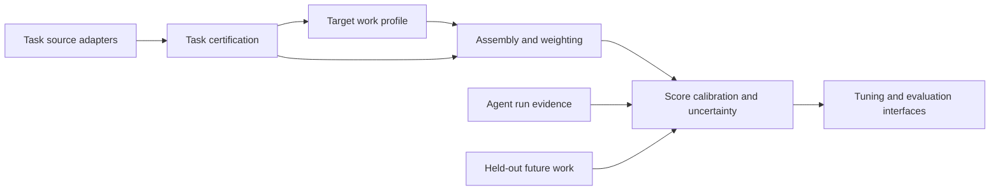

# Barcarolle Benchmark Compiler System Design

Status: restart draft, 2026-05-20.

## Purpose

Barcarolle compiles candidate software-engineering tasks into calibrated,
versioned, target-repository benchmark releases. The release is an estimator for
future work in a specific repository, not a generic coding leaderboard and not
the license or admission product itself.

The evaluated subject remains the ACUT, or Agent Configuration Under Test:
model, prompt or skill policy, tools, retrieval, runtime budget, harness,
execution mode, and adapter boundary.

## Scope Boundaries

- Do not frame another general-purpose SWE task generator as the core
  contribution.
- Do not make license issuance or G0-G5 authorization the primary deliverable in
  this research phase.
- Do not rely on ranking reversal as the main research claim.
- Do not treat public benchmark score as sufficient evidence for target-repo
  performance.

These are boundaries on the contribution, not permanent exclusions. If external
task-generation pipelines are unavailable for arbitrary repositories,
Barcarolle may implement a minimal repo-history task generator or source adapter
to create candidate inputs. That component should be evaluated as supply
infrastructure by yield, replayability, certification rate, and cost. The core
claim remains that Barcarolle compiles and calibrates the right benchmark for a
repository, agent family, budget, and objective.

Likewise, license issuance or G0-G5-style admission is a plausible downstream
product. This design keeps it out of the current research object while retaining
the archived material as a future productization path.

## Compiler Inputs

```text
target repository r
time cutoff tau
candidate task sources S
agent family A
evaluation budget C
target work distribution assumptions T_r
tuning or evaluation objective O
```

## Compiler Output

```text
Barcarolle benchmark release B_{r,tau}
```

A release contains:

- certified task set;
- task strata and taxonomy;
- dev, eval, canary, and holdout splits;
- target-profile weights;
- execution environments and oracle metadata;
- leakage, ambiguity, flakiness, and replay reports;
- score aggregation and uncertainty estimates;
- failure taxonomy;
- optimizer-readable reward and metric schema;
- refresh policy.

## Architecture



## Layer 1: Task Source Adapters

Adapters normalize candidate tasks from historical PRs/issues, external task
factories, synthetic or mutation tasks, manual canaries, and customer regression
tasks. Barcarolle should be source-agnostic; stronger upstream generators make
the candidate pool better.

If no usable upstream pipeline exists for the target repository, Layer 1 may
include a simple repo-history task construction path: mine candidate anchors
from commits, PRs, issues, or regression tests; reconstruct a base checkout;
derive a problem statement and oracle; and emit the normalized candidate schema
below. This generator is not the benchmark by itself. It is a feeder whose value
is measured by how many candidates survive certification.

Minimum normalized candidate fields:

```yaml
task_id:
source_type:
repo:
base_commit:
task_time:
problem_statement:
patch_reference_optional:
test_oracle:
environment:
changed_files:
candidate_labels:
source_confidence:
known_leakage_risks:
```

## Layer 2: Task Certification

Certification decides whether a candidate can enter a benchmark release. Gates
include replayability, oracle validity, no-op failure, reference pass,
known-bad failure, flakiness, ambiguity, leakage, task-boundary clarity, cost
boundedness, and taxonomy coverage.

Legacy material to reuse: the archived Click R0 leakage hygiene, task manifests,
fresh verification runner, and workspace-mode patch extraction.

## Layer 3: Target Work Distribution Modeling

This is the key new layer. Barcarolle estimates a target profile for future work
in the repository over module, task type, change size, test type, dependency
radius, issue style, API surface, runtime constraints, review conventions,
frequency, and optional business risk.

The target profile is explicit, auditable, and uncertainty-bearing. It is not
assumed to be perfect.

## Layer 4: Benchmark Assembly and Weighting

Given candidates, target profile, agent family, budget, and objective, the
compiler selects tasks and weights them. Required baselines:

- random same-budget;
- stratified sampling;
- coverage-constrained selection;
- unweighted repo pool;
- external-generator default.

Barcarolle v1 should start with weighted stratified scoring. Later versions can
add information-aware selection and active benchmark refinement.

## Layer 5: Score Calibration and Uncertainty

Benchmark score is an estimate of target-repo future-work pass rate, not just a
leaderboard percentage. Reports must include uncertainty and insufficient-
evidence labels by stratum.

Initial statistical tools:

- binomial intervals;
- beta-binomial estimates;
- bootstrap over tasks;
- MAE/RMSE against held-out future windows;
- binomial negative log likelihood and Brier score.

## Layer 6: Tuning and Evaluation Interfaces

The release must be useful for optimizer loops. Outputs should support:

- agent run manifests;
- per-task reward and metric schema;
- failure labels;
- trace and cost summaries;
- dev/eval/canary split management;
- before/after tuning reports.

DSPy and SkVM integrations are later adapters, not Phase 0 blockers.

## Reused Legacy Assets

The archive contains useful implementation material, but it is no longer active
architecture. Reusable assets include:

- ACUT manifest structure;
- task packaging and hidden verifier layout;
- leakage-hygiene checks;
- workspace-mode runner and fresh replay;
- scorecard outcome taxonomy;
- cost and artifact hygiene conventions.

The Agent License, G0-G5 authorization, Golden/Judge governance, operator
console, and policy-calibration documents are archived for this research phase.
They can re-enter as productization work after benchmark releases show credible
predictive, diagnostic, or tuning value.
