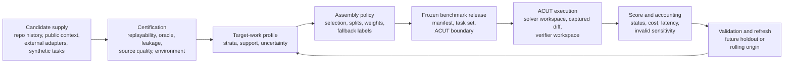
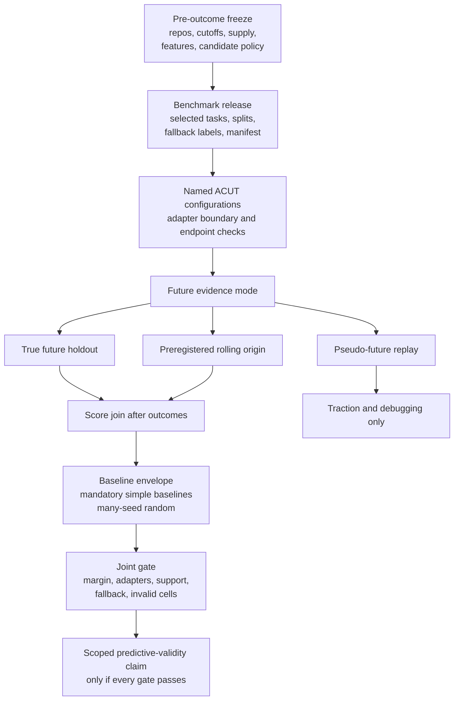

# Barcarolle Phase 1 Proposal Report V2

Status: reviewer-ready technical proposal report, 2026-06-01.

This report asks for approval to continue Barcarolle as a no-paid research
project toward repo-specific predictive validity. It does not claim that
predictive validity has been reached, and it does not authorize paid ACUT
validation.

## 1. Executive Summary

Barcarolle is a benchmark compiler for repo-specific coding-agent evaluation.
It is not an ACUT harness, a general SWE task factory, an agent-license
product, or a public leaderboard. The ACUT, or Agent Configuration Under Test,
keeps ownership of its agent loop, tools, prompts, retrieval, public-test
policy, retry behavior, and runtime budget. Barcarolle's job is to construct,
freeze, run, audit, and interpret repo-specific benchmark releases around that
ACUT boundary.

The long-term north star is predictive validity:

```text
Can a Barcarolle-compiled repo-specific benchmark predict future target-repo
ACUT performance better than naive same-repo sampling, generic benchmark
scores, or other simple baselines?
```

The current report asks reviewers to approve the next no-paid research phase
for that north star. The current claim is bounded: Phase 1 shows traction and a
credible validation path, not final predictive validity. Public benchmark
validity work makes the same distinction important: benchmark findings matter
only to the extent that they generalize to the settings where decisions are
made ([Validity-Challenges-2022](https://www2.eecs.berkeley.edu/Pubs/TechRpts/2022/EECS-2022-180.html)).

Phase 1 provides four approval-relevant results:

| Question | Phase 1 answer | Limit |
| --- | --- | --- |
| Is the target-repo prediction problem real? | Yes. The old weighted design failed materially, with paid-pilot weighted gaps of `0.3148` for attrs and `0.7481` for boltons against simple same-budget baselines of `0.25` and `0.125`. | This is a diagnostic negative result for naive weighting, not a successful compiler result. |
| Is benchmark-side execution feasible? | Yes. The three-repo pilot completed `120/120` cells with scoreability `1.0`, and click source context was repaired for `30/30` tasks without paid calls. | Feasibility does not prove future prediction. |
| Is the metric meaningful and optimizable? | Yes for proposal traction. The current candidate MAE is `0.209` versus `0.2149` for the best simple aggregate baseline, and it beats/ties `93.4%` of 1000 same-budget random selections. | The best-simple-baseline edge is only `0.0059` MAE. |
| Is the validation path concrete? | Yes. M4 defines study modes, per-named-ACUT estimands, fallback governance, support thresholds, mandatory baselines, a joint success gate, and release artifacts. | The current candidate does not pass those future standards. |

The decision requested now is approval for the next no-paid research phase:
optimize and harden the compiler, repair or narrow fallback behavior, freeze
validation artifacts before future outcomes, and prepare an M6 approval packet
after user-owned resource and format decisions are made. Paid validation
remains unauthorized.

## 2. Problem And Stakes

Repository teams deploy coding agents against future issues, APIs, tests,
dependency constraints, review norms, and failure modes in their own codebase.
A broad coding benchmark can be executable and fair while still being weak
evidence for that team's future work.

The central problem is target-repository shift. A benchmark score becomes
decision-relevant only if it estimates the future work distribution the team
will face. If that link is weak, teams can tune, select, or trust an ACUT from
evidence that is auditable in general but not predictive for their repository.

Public software-engineering benchmarks are important inputs, but they solve a
different problem:

| Public direction | What it contributes | Why Barcarolle is different |
| --- | --- | --- |
| SWE-bench | Repository-level issue-resolution tasks with execution-based scoring from real GitHub issues and PRs ([SWE-bench-2024](https://juanmirod.github.io/public/papers/swe-bench_2310.06770v3.pdf)). | Barcarolle asks which target-repo tasks should be selected, split, weighted, refreshed, and interpreted for a named future repo workload. |
| SWE-bench Verified | Human validation improved task quality by removing many infeasible or underspecified samples ([SWE-bench-Verified-2024](https://openai.com/index/introducing-swe-bench-verified/)). | Barcarolle treats quality review as one release gate, not as proof of target-repo prediction. |
| SWE-bench quality and contamination audits | Later analysis showed residual test-quality and contamination risks, reinforcing the need for evaluator-side governance ([SWE-bench-Verified-2026](https://openai.com/index/why-we-no-longer-evaluate-swe-bench-verified/)). | Barcarolle makes source quality, leakage checks, hidden-oracle handling, and release freezing explicit. |
| SWE-bench-Live | Live task maintenance addresses freshness and contamination pressure by adding newly verified issues over time ([SWE-bench-Live-2025](https://swe-bench-live.github.io/)). | Barcarolle can use fresh supply, but its claim is a frozen repo-specific release estimating future target-repo work. |
| SWE-smith | Scalable generation of many software-engineering task instances for agents ([SWE-smith-2025](https://swesmith.com/)). | Generated tasks are candidate supply only after local certification. They are not the compiler claim. |
| R2E-Gym | Procedurally curated executable environments and hybrid verifiers for training and scaling SWE agents ([R2E-Gym-2025](https://github.com/R2E-Gym/R2E-Gym)). | Barcarolle does not train or run the ACUT. It compiles and validates benchmark releases around a named ACUT boundary. |

The practical stakes are evaluation, tuning, and governance. Evaluation needs
future target-repo success estimates. Tuning needs diagnostics about which
repository strata and source reservoirs matter. Governance needs explicit
uncertainty, source-quality, leakage, adapter, and paid/no-paid boundaries.

## 3. Barcarolle Thesis And Boundary

Barcarolle's thesis is that repo-specific benchmark releases should be
compiled, calibrated, and validated against future target-repository work. The
research object is the release construction and evidence model.

A Barcarolle run is defined by:

```text
target repository r
time cutoff tau
candidate task sources S
ACUT boundary A
evaluation budget C
target-work distribution assumptions T_r
tuning or evaluation objective O
```

The benchmark score is a candidate predictor of:

```text
W_r(a) = E_{x ~ future target-repo work}[success(a, x)]
```

A strong future claim requires outcome-unseen evidence that a frozen benchmark
release predicts future work better than preregistered baselines under a frozen
ACUT, task-supply, adapter, metric, invalid-cell policy, and support threshold.
The current Phase 1 claim is narrower:

```text
Phase 1 supplies traction evidence and a credible validation path. It does not
establish formal predictive validity.
```

The boundary matters. Barcarolle may use repo-history mining, issue and PR
context, synthetic tasks, external task systems, or private regressions as
candidate supply. Those sources are inputs. The compiler contribution is
deciding which certified candidates enter a release, how they are stratified or
weighted, how splits and fallbacks are frozen, how uncertainty and invalid
cells are reported, and how future validation is interpreted.

## 4. Proposed Compiler Design

### 4.1 Architecture



### 4.2 Compiler Layers

| Layer | Proposal role |
| --- | --- |
| Task source adapters | Normalize candidate tasks from repo history, issue/PR context, external systems, synthetic tasks, and private regressions. |
| Task certification | Gate replayability, oracle validity, flakiness, ambiguity, leakage, source quality, task boundary, and cost. |
| Target-work profile modeling | Estimate future-work strata from pre-cutoff public or user-supplied signals, with support and uncertainty labels. |
| Benchmark assembly and weighting | Select, split, and optionally weight certified tasks under budget and support constraints. |
| Score calibration and uncertainty | Report prediction error, intervals or qualitative uncertainty, insufficient-support labels, and invalid-cell sensitivity. |
| Tuning and evaluation interfaces | Emit scorecards, failure labels, cost summaries, and optimizer-readable outputs without taking over the ACUT harness. |

### 4.3 Candidate Policy Object

The current candidate is:

```text
coverage_constrained_unweighted_v1_with_labeled_fallbacks
```

It is deterministic and outcome-blind under the current audit, but it remains a
research candidate rather than a validated compiler. Its fallback behavior is
claim-changing and must stay visible.

Policy sketch from M4:

```text
Input: certified candidate task rows for each target repo plus allowed
solver-visible feature fields.
Reject rows missing release eligibility, source-quality status, statement
digest, or leakage-risk status.
For each repo, derive supported feature dimensions from the frozen policy
feature list and source-quality overlays.
If repo has enough eligible tasks and supported feature coverage, select the
budgeted tasks that maximize unweighted coarse feature coverage.
Break ties by sha256(seed, repo, task_id, feature_vector) with the frozen seed.
If feature support is insufficient, use a labeled fallback.
If eligible budget is insufficient, use a labeled fallback.
Write selected and excluded task IDs with reasons before any score or future
outcome is visible.
```

## 5. Evidence For Project Approval

Phase 1 evidence is organized around three approval questions.

### 5.1 Is The Problem Real?

Yes. The old weighted target-profile design failed in a diagnosable way. The
paid pilot found weighted gaps of `0.3148` for attrs and `0.7481` for boltons,
while simple same-budget baselines were `0.25` and `0.125`. The local bakeoff
kept simple stratified designs as conservative baselines and did not promote
the old weighted objective.

Use in the proposal: construction choices materially affect target-repo
estimates, and naive high-dimensional weighting is unsafe under sparse support.

Do not use it to claim: the next compiler is already validated.

### 5.2 Is The Work Technically Feasible?

Yes. The three-repo pilot completed `120/120` planned cells with scoreability
`1.0`, endpoint compliance checks, and sanitized artifact handling. The click
source-context repair upgraded `30/30` frozen click tasks using public context
with zero paid LLM calls and zero paid ACUT cells. Adapter reporting now treats
Codex and Kilo as named ACUT configurations rather than collapsing the result
into a model-only comparison.

Use in the proposal: Barcarolle can run the benchmark-side protocol without
becoming the ACUT harness.

Do not use it to claim: clean execution proves future prediction.

### 5.3 Is There Enough Signal To Optimize?

Yes for no-paid project approval. The current candidate has aggregate MAE
`0.209`. The best simple aggregate baseline is `temporal_recent_baseline` at
MAE `0.2149`, giving a small candidate edge of `0.0059` MAE. A 1000-seed
same-budget random comparison shows the candidate beats/ties `93.4%` of random
selections on MAE.

MAE is the right headline metric here because it is average prediction error:
lower MAE means the benchmark score is closer to observed future target-repo
performance. The random comparison shows that selection has signal and is not
pure noise. The best-simple-baseline comparison shows that the current
candidate is not yet strong enough for validation claims.

Current caveats:

| Caveat | Evidence | Proposal interpretation |
| --- | --- | --- |
| Small aggregate edge | Candidate `0.209` MAE versus best simple baseline `0.2149`; edge `0.0059`. | Worth optimizing, below M4's future `0.02` MAE margin. |
| Adapter fragility | Codex candidate `0.267` versus best baseline `0.2417`; Kilo candidate `0.151` versus best baseline `0.1807`. | Report per named ACUT configuration; pooled summaries cannot rescue adapter failure. |
| Fallback composite | `6/18` selected slots use fallback; boltons is `6/6` fallback. | Name the object as a composite selector unless fallback support is repaired or the claim is narrowed. |
| Repo/window concentration | Boltons, click, and some windows are worse than their best simple baselines. | Treat current evidence as route-finding and optimize before paid validation. |

### 5.4 One-Page Evidence Summary

| Reader question | Claim strength | Key result/status | Canonical evidence | Limitation | Proposal use |
| --- | --- | --- | --- | --- | --- |
| Is target-repo benchmark construction real? | supported for proposal | Old weighted pilot gaps: attrs `0.3148`, boltons `0.7481`; simple baselines `0.25` and `0.125`. | `phase1_weighted_design_paid_pilot_decision.md`; `phase1_local_algorithm_bakeoff_decision.md` | Negative evidence for naive weighting. | Show construction choices matter. |
| Can benchmark-side ACUT execution work cleanly? | supported for proposal | Three-repo pilot completed `120/120` cells with scoreability `1.0`. | `phase1_three_repo_paid_validation_decision.md` | Exploratory pilot. | Show protocol feasibility. |
| Is source-quality repair tractable? | supported for proposal | Click repair: `30/30` public-context repaired; paid calls `0`. | `phase1_click_llm_source_context_repair_decision.md` | Does not rewrite paid outcomes. | Support source-quality governance. |
| Is there selection signal? | traction only | Candidate MAE `0.209`; best simple aggregate baseline `0.2149`; random beats/ties share `93.4%`. | `phase1_proposal_evidence_package_baseline_envelope.md`; `phase1_proposal_evidence_package_random_baseline_distribution.md` | Retrospective and underpowered. | Justify optimization and validation work. |
| Is the current candidate ready for paid validation? | no | M4 classifies it as `diagnostic_traction_candidate_not_paid_ready`. | `phase1_validation_protocol_candidate_policy_hardening_decision.md` | Fails future gate on margin, Codex, fallback, and support. | Define next-phase work, not a stop to the proposal. |

## 6. Validation Path And Success Standards

M4 defines how the next phase will know it is succeeding. It does not prove
current success, and it does not authorize paid validation.

### 6.1 North-Star Validation Design



### 6.2 Study Modes

| Mode | Can support | Cannot support | Freeze artifact |
| --- | --- | --- | --- |
| True future holdout | Predictive-validity evidence for the named scope if every frozen gate passes. | General claims outside named repos, adapters, task supply, source reservoirs, and release schema. | Benchmark release manifest plus protocol freeze JSON before future outcomes are collected or joined. |
| Preregistered rolling-origin | Predictive-validity evidence for preregistered cutoffs if candidate, baselines, seeds, estimand, invalid handling, support thresholds, and gate are frozen first. | Cutoffs chosen after seeing joined outcomes or pooled-only summaries that hide failed cutoffs. | Rolling-origin preregistration manifest with outcome-blind digest and seed list. |
| Pseudo-future replay | Traction, debugging, baseline stress testing, proposal motivation. | North-star validity claims. | Retrospective replay manifest and traction-only report. |

### 6.3 Estimand, Baselines, And Gates

Adapter estimand: primary claims are per named ACUT configuration. A
cross-adapter claim requires every named adapter in scope to pass. Equal-mixture
pooled metrics may appear only as preregistered secondary diagnostics.

Mandatory future baselines:

- `temporal_recent_baseline`
- `repo_unweighted_same_budget`
- `repo_stratified_by_target_profile`
- `many_seed_random_same_budget`

Fallback governance:

| Scope | Current M3 share | Future cap |
| --- | ---: | ---: |
| Overall | `0.3333` | `0.1` |
| attrs | `0.0` | `0.1667` |
| boltons | `1.0` | `0.1667` |
| click | `0.0` | `0.1667` |

Joint success gate:

| Gate component | Future rule | Current M3 diagnostic |
| --- | --- | --- |
| Meaningful MAE margin | Beat the best eligible simple baseline by at least `0.02` MAE. | Fails: aggregate edge is `0.0059`. |
| Many-seed random comparison | Beat/tie at least `95.0%` of frozen random seeds on primary MAE. | Fails: `93.4%`. |
| Adapter estimand | Every claimed named adapter must pass. | Fails: Codex fails while Kilo passes. |
| Fallback governance | Stay below overall and per-repo fallback caps or narrow the claim. | Fails: boltons is `6/6` fallback. |
| Repo/window non-concentration | Improvements cannot be concentrated in one favorable repo, adapter, or window. | Fails for primary future claim. |
| Source, endpoint, and artifact hygiene | Source-quality, endpoint, cost, latency, and sanitized-artifact checks must pass. | Passes for existing no-paid M3 artifacts; future paid cells would need fresh audit. |

Support thresholds:

| Threshold | Value | Blocks if unmet |
| --- | --- | --- |
| Minimum repos | `3` for narrow target-repo claim; `5` for broader method claim. | Primary claim for intended scope. |
| Future tasks per repo | `20` | Primary claim for sparse future outcomes. |
| Candidate pool support | at least `2x` selected budget per repo after filters | Coverage-policy claim for that repo. |
| Named ACUT configurations | `2` for adapter-general wording | Adapter-general claims. |
| Rolling-origin cutoffs | `2` | Rolling-origin claim. |
| Invalid/non-scoreable share | invalid overall <= `0.02`; non-scoreable overall <= `0.1`; non-scoreable slice <= `0.15` | Primary claim unless repair/rerun is preregistered. |
| Independent source reservoirs | `2` | Source-diversity claim for affected repo. |

### 6.4 Release Artifact Schema

The full M4 release schema has `35` fields in
`experiments/phase1_compiler/results/phase1_validation_protocol_candidate_policy_hardening_release_schema.json`
and
`experiments/phase1_compiler/reports/phase1_validation_protocol_candidate_policy_hardening_release_schema.md`.

| Field group | Examples | Claim function |
| --- | --- | --- |
| Reproducibility | `release_id`, `freeze_commit`, `target_repo`, `base_commit`, `task_id`, `dependency_lock` | Lets reviewers reconstruct the release boundary. |
| Source quality | `task_source`, `source_reservoir`, `source_license_status`, `oracle_source`, `source_quality_gate` | Shows what task supply can and cannot support. |
| Hidden-oracle protection | `solver_visible_context_path`, `oracle_path_or_digest`, `leakage_check_status` | Keeps solver-visible and verifier-only material separated. |
| Outcome blindness | `candidate_policy_id`, `split_label`, `time_cutoff`, `feature_values`, `tie_break_value` | Proves selection was frozen before score joins. |
| Adapter accounting | `acut_adapter_id`, `endpoint_compliance_status`, `cost_latency_accounting`, `terminal_status` | Makes ACUT configuration and paid/no-paid status auditable. |
| Artifact hygiene | `sanitized_artifact_manifest`, `raw_artifact_storage_policy`, `ignored_path_confirmation` | Keeps raw transcripts, prompts, workspaces, and hidden material out of commits. |

### 6.5 Power And Budget Boundary

M4's scenario note sets a future persuasive MAE margin of `0.02`. The current
aggregate edge is `0.0059`, which is `0.295` of that margin. M4 also records
historical cost proxies for possible future cell counts, but those scenarios
are not a budget ceiling and not an authorization. Staffing, duration, and
spending decisions remain user-owned.

## 7. Risks, Limits, And Mitigations

The proposal is strong only if it keeps its limits visible. The following risk
register is summarized here and maintained as a standalone M5 artifact in
`experiments/phase1_compiler/reports/phase1_proposal_report_reviewer_ready_revision_risk_register.md`.

| Risk | Why it does not invalidate the proposal | Next-phase response | Claim still prohibited |
| --- | --- | --- | --- |
| Failed weighted design | It is evidence that naive weighting is unsafe, not that benchmark compilation is impossible. | Keep it as a negative control; require support thresholds before weighting. | The old weighted design is the mainline compiler. |
| Random evidence versus small simple-baseline edge | Beating/tieing `93.4%` of random selections shows signal; the `0.0059` edge shows it is not enough for validity. | Optimize against the M4 gate and mandatory baselines. | Current candidate already passes validation standards. |
| Current candidate not ready for paid validation | M4 converts this into a clear project-stage target. | Repair fallback, improve support, and rerun no-paid diagnostics before any paid discussion. | Current evidence authorizes paid ACUT validation. |
| Fallback/composite policy | Labeled fallback makes the claim honest instead of hidden. | Repair boltons support or narrow to a composite-selector claim. | Uniform coverage-policy claim across all repos. |
| Adapter-specific support | Adapter differences are part of the estimand. | Report per named ACUT configuration and prevent pooled rescue. | Codex/Kilo differences prove only the model changed. |
| Task-generator scope drift | External generators improve supply but do not compile releases. | Keep generators as source adapters behind local certification. | Barcarolle is a general SWE task factory. |
| Source quality and release schema | The click repair and schema show this is governable. | Enforce source, oracle, license, leakage, and environment fields before release inclusion. | Any candidate source is trusted without certification. |
| Post-hoc validation risk | M4 already defines freeze artifacts and study modes. | Freeze repos, cutoffs, seeds, baselines, gates, and score joins before future outcomes. | Pseudo-future replay carries the north-star claim. |
| Budget and paid-validation boundary | The current proposal is no-paid and can proceed without budget values. | Keep paid validation blocked until later user decisions and gate evidence. | A paid run is approved by this report. |

## 8. Proposed Next Phase

The next phase should be a no-paid research phase focused on making the future
validation claim testable. It should not expand into a broad task-generator
project or an ACUT harness.

Workstreams:

| Workstream | Output | Acceptance function |
| --- | --- | --- |
| Compiler optimization | Improved candidate policy variants compared against mandatory simple baselines and many-seed random selections. | Shows whether selection can meet or approach the M4 margin without post-hoc tuning. |
| Fallback repair or narrowing | Feature-support repair for fallback repos, or explicit composite-selector claim narrowing. | Prevents fallback from hiding inside a coverage-policy claim. |
| Validation freeze package | Preregistered study-mode manifest, seeds, cutoffs, estimand, invalid-cell rules, support thresholds, and joint gate. | Makes later future evidence interpretable. |
| Release schema implementation | Versioned release artifact manifest with source, oracle, leakage, environment, adapter, and accounting fields. | Makes benchmark releases auditable. |
| Source-supply governance | Certified source reservoirs and rejected/repair-needed candidate accounting. | Keeps task supply inside Layer 1 infrastructure. |
| Proposal/approval packaging | M6 memo, report, deck, or combined packet after user decisions. | Gives reviewers the artifact format they need without inventing user-owned resource values. |

This phase should end with either a stronger no-paid candidate ready for a
separate paid-readiness decision, or a clear stop report explaining why the
candidate cannot meet the frozen standard without more source supply or a
narrower claim.

## 9. Deliverables And Decision Points

### 9.1 Technical Deliverables

| Deliverable | Acceptance criteria |
| --- | --- |
| Reviewer-ready technical proposal report | Current v2 report with no evidence placeholders, clear claim boundary, public related-work citations, M3 evidence, and M4 validation standards. |
| Compiler policy specification | Candidate policy pseudocode, support checks, deterministic tie-breaks, fallback labels, and forbidden outcome inputs. |
| Validation protocol package | Study modes, adapter estimand, baselines, metrics, support thresholds, invalid-cell handling, and joint gate. |
| Release artifact schema | Required fields tied to reproducibility, source quality, hidden-oracle protection, outcome blindness, adapter accounting, and artifact hygiene. |
| Risk register | Risks stated with mitigation, next-phase response, and prohibited claims. |
| Evidence index | Canonical report paths tied to claim function, result/status, and limitation. |

### 9.2 User-Owned Decision Points

| Decision | Owner | Needed before | Current default |
| --- | --- | --- | --- |
| M6 approval artifact format | User-owned | M6 artifact work starts | Unset; M5 technical report can proceed without this. |
| No-paid staffing and duration | User-owned | M6 resource ask | Unset; not needed for this v2 technical report. |
| Reviewer-facing deliverable owner categories | User-owned | M6 approval artifact | Unset; this report lists technical acceptance functions only. |
| Conditional paid-validation budget ceiling | User-owned | Any budget-bearing discussion | Unset; paid validation remains unauthorized. |
| Paid validation authorization | Explicit future user decision after gates | Before any paid ACUT cells | Not authorized. |

## 10. Appendices

### Appendix A: Claim Boundary

Allowed current claim:

```text
Phase 1 shows that repo-specific benchmark compilation is a real, measurable,
and technically tractable research problem. The metric is meaningful, benchmark
selection changes it, the current candidate beats/ties most same-budget random
selections, and M4 defines a credible future validation path.
```

Current non-claims:

- Predictive validity is not established.
- Paid validation remains unauthorized.
- Pseudo-future replay supports traction and debugging only.
- The current candidate is not ready for a primary coverage-policy claim.
- Pooled results cannot hide named-adapter failures.
- Task generation and agent-training environments are source or comparison
  layers, not Barcarolle's central contribution.

### Appendix B: Report Evidence Index

| Evidence report | Evidence type | Claim function | Key result/status | Limitation |
| --- | --- | --- | --- | --- |
| `phase1_weighted_design_paid_pilot_decision.md` | diagnostic negative | Shows naive weighting can fail materially. | Weighted gaps: attrs `0.3148`, boltons `0.7481`. | Two-repo paid pilot; not a validation result. |
| `phase1_local_algorithm_bakeoff_decision.md` | diagnostic negative | Explains underidentified weighted objective. | Old weighted design not promoted. | Local no-paid analysis. |
| `phase1_three_repo_paid_validation_decision.md` | technical tractability | Shows workspace ACUT protocol can run end to end. | `120/120` cells, scoreability `1.0`. | Exploratory pilot evidence. |
| `phase1_click_llm_source_context_repair_decision.md` | source quality | Repairs click source-context caveat. | `30/30` click tasks repaired; paid calls `0`. | Does not rewrite paid outcomes. |
| `phase1_blocked_split_supplement_fairness_gap_diagnostics_decision.md` | adapter reporting | Supports adapter-stratified reporting. | Adapter differences treated as ACUT-configuration evidence. | Post-hoc diagnostic supplement. |
| `phase1_proposal_evidence_package_random_baseline_distribution.md` | retrospective traction | Compares candidate against 1000 random selections. | Overall beats/ties share `93.4%`. | Pseudo-future replay. |
| `phase1_proposal_evidence_package_baseline_envelope.md` | retrospective traction | Compares candidate against best simple baselines. | Candidate `0.209` MAE vs best aggregate baseline `0.2149`. | Slice diagnostics are fragile. |
| `phase1_proposal_evidence_package_fallback_share.md` | fallback accounting | Quantifies composite selector behavior. | Overall fallback `0.3333`; boltons `1.0`. | Threshold set later by M4. |
| `phase1_validation_protocol_candidate_policy_hardening_decision.md` | validation governance | Freezes M4 interpretation. | Candidate classification: `diagnostic_traction_candidate_not_paid_ready`. | Future standards, not current proof. |

### Appendix C: Public Citation Bibliography

The full citation matrix is
`experiments/phase1_compiler/reports/phase1_proposal_report_reviewer_ready_revision_citation_matrix.md`.

| Label | Source |
| --- | --- |
| `SWE-bench-2024` | [SWE-bench ICLR 2024 paper](https://juanmirod.github.io/public/papers/swe-bench_2310.06770v3.pdf) |
| `SWE-bench-Verified-2024` | [OpenAI, Introducing SWE-bench Verified](https://openai.com/index/introducing-swe-bench-verified/) |
| `SWE-bench-Verified-2026` | [OpenAI, Why SWE-bench Verified no longer measures frontier coding capabilities](https://openai.com/index/why-we-no-longer-evaluate-swe-bench-verified/) |
| `SWE-bench-Live-2025` | [SWE-bench-Live project page](https://swe-bench-live.github.io/) |
| `SWE-smith-2025` | [SWE-smith project page](https://swesmith.com/) |
| `R2E-Gym-2025` | [R2E-Gym official repository](https://github.com/R2E-Gym/R2E-Gym) |
| `Validity-Challenges-2022` | [Validity Challenges in Machine Learning Benchmarks](https://www2.eecs.berkeley.edu/Pubs/TechRpts/2022/EECS-2022-180.html) |
