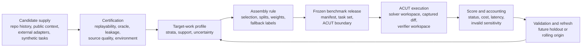
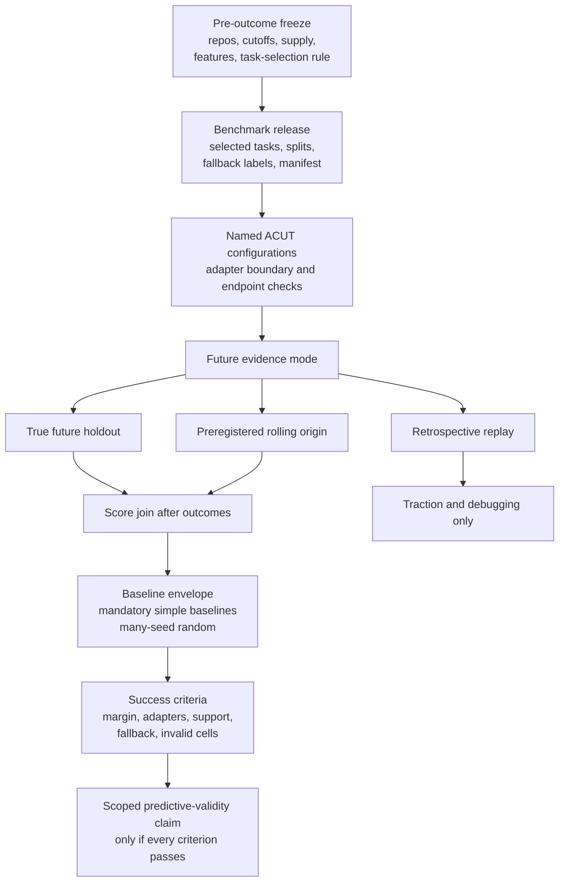

# Barcarolle Phase 1 Proposal Report V3

Status: proposal report for project approval, 2026-06-01.

This report asks reviewers to approve Barcarolle as a repo-specific
benchmark-compiler project. It presents Phase 1 as traction evidence and a
validation plan, not as proof that the north-star validity claim has already
been reached.

## 1. Executive Summary

Coding-agent evaluation has a target-repository prediction problem. Public
benchmarks and scalable task generators can show broad capability, task
quality, freshness, or training-environment scale, but a team deciding whether
to deploy an Agent Configuration Under Test, or ACUT, still needs a practical
answer to a narrower question: how is that configuration likely to perform on
future work in its own repository?

Barcarolle addresses the benchmark-construction layer between task supply and
agent evaluation. Given a target repository, candidate tasks, a defined ACUT
boundary, assumptions about future work, and an evaluation budget, Barcarolle
asks which tasks should be selected, certified, split, refreshed, weighted or
left unweighted, and interpreted as evidence about future target-repository
performance.

The long-term north star is predictive validity:

```text
Can a Barcarolle-compiled repo-specific benchmark predict future target-repo
ACUT performance better than naive same-repo sampling, generic benchmark
scores, or other simple baselines?
```

The approval request is to build and validate Barcarolle under that north star.
Approving the project means approving work on benchmark-selection algorithms,
task certification, versioned benchmark releases, validation protocols, and
reviewer-facing evidence reports. It also means allowing budgeted ACUT
evaluation when the benchmark release, task-selection rule, baselines,
score-join procedure, and success criteria are fixed in advance.

Phase 1 supports that request, but only as bounded traction:

| Approval question | Phase 1 answer | Proposal limit |
| --- | --- | --- |
| Is the target-repo prediction problem real? | Yes. The old weighted design failed materially, with weighted gaps of `0.3148` for attrs and `0.7481` for boltons against simple same-budget baselines of `0.25` and `0.125`. | This is a diagnostic negative result for naive weighting, not a successful compiler result. |
| Is benchmark-side execution feasible? | Yes. The three-repo pilot completed `120/120` exploratory cells with scoreability `1.0`, and click source context was repaired for `30/30` tasks. | Clean execution does not prove future prediction. |
| Is the prediction metric meaningful and optimizable? | Yes for traction. The current candidate's MAE is `0.209` versus `0.2149` for the best simple aggregate baseline, and it beats or ties `93.4%` of 1000 same-budget random selections. | The best-simple-baseline edge is only `0.0059` MAE, below the margin that would justify a validity claim. |
| Is the path to stronger validation concrete? | Yes. The current protocol separates retrospective replay from true future or preregistered rolling-origin evidence, requires simple baselines, and reports by named ACUT configuration. | The current candidate still has fallback, adapter, and support weaknesses that the project must fix or narrow. |

The decision requested now is project approval, not acceptance of a completed
validity claim. Predictive validity remains unproven. Phase 1 shows that the
problem is real, measurable, and technically tractable enough to justify the
approved project stage.

## 2. Problem And Stakes

Repository teams do not deploy coding agents against an abstract benchmark
distribution. They deploy them against future issues, APIs, tests, dependency
constraints, review norms, and failure modes in their own codebase. A benchmark
can be executable and fair while still being weak evidence for that team's
future workload.

The central condition is target-repository shift. General benchmark scores,
large generated task pools, and uncalibrated same-repo samples may all miss the
distribution that matters: later work in the repository where the ACUT will be
used. If that gap remains unresolved, teams can tune, select, or trust coding
agents from evidence that is auditable in general but not decision-relevant for
their repository.

Public software-engineering benchmarks and task systems are important inputs,
but they solve different parts of the evaluation problem:

| Public direction | What it contributes | Why Barcarolle is different |
| --- | --- | --- |
| SWE-bench | Repository-level issue-resolution tasks with execution-based scoring from real GitHub issues and pull requests ([SWE-bench-2024](https://juanmirod.github.io/public/papers/swe-bench_2310.06770v3.pdf)). | Barcarolle asks which target-repo tasks should enter a frozen release and how that release should estimate future work for a named repository and ACUT. |
| SWE-bench Verified | Human validation improved task quality by removing many infeasible or underspecified samples ([SWE-bench-Verified-2024](https://openai.com/index/introducing-swe-bench-verified/)). | Barcarolle treats quality review as one release gate, not as proof of target-repo prediction. |
| SWE-bench quality and contamination audits | Later public analysis showed that benchmark quality and contamination risks can change how scores should be interpreted ([SWE-bench-Verified-2026](https://openai.com/index/why-we-no-longer-evaluate-swe-bench-verified/)). | Barcarolle makes source quality, leakage checks, hidden-oracle handling, and release freezing explicit parts of the benchmark release. |
| SWE-bench-Live | Live maintenance addresses freshness pressure by adding newly verified issues over time ([SWE-bench-Live-2025](https://swe-bench-live.github.io/)). | Barcarolle can use fresh supply, but its claim depends on a frozen repo-specific release being tested against future work. |
| SWE-smith | Scalable generation of many software-engineering task instances for agents ([SWE-smith-2025](https://swesmith.com/)). | Generated tasks are candidate supply only after local certification; generation volume is not the compiler claim. |
| R2E-Gym | Procedurally curated executable environments and hybrid verifiers for training and scaling SWE agents ([R2E-Gym-2025](https://github.com/R2E-Gym/R2E-Gym)). | Barcarolle does not train or run the ACUT. It compiles and validates benchmark releases around a defined ACUT boundary. |

The practical stakes are evaluation, tuning, and governance. Evaluation needs
future target-repo success estimates. Tuning needs diagnostics about which
repository strata, task families, and source reservoirs matter. Governance
needs uncertainty, leakage controls, source-quality limits, adapter boundaries,
and clear rules for when evaluation budget should be spent.

## 3. Research Question And North Star

The research question is:

```text
For a target repository r and ACUT configuration a, can a compiled benchmark
release B_{r,tau} estimate future target-repo success W_r(a) better than simple
repo-local or generic alternatives?
```

The estimand is future target-repo ACUT success rate:

```text
W_r(a) = E_{x ~ future target-repo work}[success(a, x)]
```

The benchmark score is a candidate predictor of that future success rate. A
Barcarolle validity claim becomes strong only when a frozen benchmark release
predicts outcome-unseen future work better than preregistered baselines under a
fixed ACUT, task-supply boundary, adapter, metric, and invalid-cell policy.

Current claim boundary:

```text
Phase 1 supplies traction evidence and a credible validation path. It does not
establish formal predictive validity.
```

This distinction governs the project. Retrospective replay can motivate
candidate selection, debug baselines, and identify failure modes. It cannot by
itself establish predictive validity because task supply, features, and policy
choices may already have been influenced by inspected outcomes. A formal claim
requires true future holdout evidence or a strict preregistered rolling-origin
design with enough support.

## 4. Barcarolle Thesis And Boundary

Barcarolle's thesis is that repo-specific benchmark releases should be
compiled, calibrated, and validated against future target-repository work. The
research object is the release construction and evidence model, not the ACUT
harness.

The ACUT owns its own file search, editing strategy, prompts, tools, retrieval,
runtime budget, public-test policy, retry behavior, model calls, and trace
internals. Barcarolle provides solver-visible task statements and allowed
context, builds clean solver workspaces, invokes the configured ACUT harness,
captures the resulting workspace diff, replays that diff in a verifier
workspace, injects private oracle material only in the verifier workspace, and
records score, cost, latency, terminal status, and sanitized artifacts.

Barcarolle is also not a general task generator. It may use repository history,
public issue and pull-request context, external task systems, synthetic tasks,
or private regressions as candidate supply. Those sources are inputs. The
compiler contribution is deciding which certified candidates enter the release,
how they are stratified or weighted, how splits are defined, how uncertainty is
reported, and how future validation is interpreted.

The project boundary excludes:

- reimplementing ACUT internals;
- treating one-shot chat-completion diff generation as the primary scoreable
  protocol;
- making a public leaderboard the central deliverable;
- making task-generation yield the core research claim;
- treating license issuance or deployment authorization as the research
  product.

## 5. Proposed Benchmark-Compiler Design

A Barcarolle compiler instance is defined by:

```text
target repository r
time cutoff tau
candidate task sources S
ACUT boundary A
evaluation budget C
target-work distribution assumptions T_r
tuning or evaluation objective O
```

The design requires explicit source, cutoff, and ACUT boundaries because a
score is not interpretable without knowing what future work it is meant to
predict and which agent configuration produced it.



The proposed system has six layers:

| Layer | Project role |
| --- | --- |
| Task source adapters | Normalize candidate tasks from repository history, issue/PR context, external systems, synthetic tasks, and private regressions. |
| Task certification | Gate replayability, oracle validity, flakiness, ambiguity, leakage, source quality, task boundary, and cost. |
| Target-work profile modeling | Estimate future-work strata from pre-cutoff public or user-supplied signals, with support and uncertainty labels. |
| Benchmark assembly and weighting | Select, split, and optionally weight certified tasks under budget and support constraints. |
| Score calibration and uncertainty | Report prediction error, intervals or qualitative uncertainty, insufficient-support labels, and invalid-cell sensitivity. |
| Tuning and evaluation interfaces | Emit scorecards, failure labels, cost summaries, and optimizer-readable outputs without taking over the ACUT harness. |

The output is a versioned benchmark release, not a raw task list. A release
contains a certified task set, task strata, split definitions, source and oracle
metadata, leakage and replay reports, selection and aggregation rules, ACUT
boundary statement, uncertainty plan, refresh policy, and sanitized artifact
manifest.

The current research selector is best described as
`coverage_constrained_unweighted_v1_with_labeled_fallbacks`. It is deterministic
and outcome-blind under the current audit, but it remains a candidate selector
rather than a validated predictive compiler. Its fallback behavior changes the
claim and must remain visible in any future validation.

## 6. Validation Strategy For Predictive Validity

The validation strategy is simple in principle: freeze the benchmark before
future outcomes are known, run the named ACUT configurations under the frozen
protocol, compare the benchmark's predictions against future work and strong
simple baselines, then make only the claims supported by the result.



Three evidence designs should be kept separate:

| Design | What it can support | What it cannot support |
| --- | --- | --- |
| True future holdout | The strongest route to predictive-validity evidence for the named repos, ACUT configurations, task supply, and release boundary. | Claims outside the frozen scope. |
| Preregistered rolling origin | Limited predictive-validity evidence if cutoffs, seeds, task-selection rules, baselines, invalid handling, and success criteria are frozen before outcomes are joined. | Cutoffs or rules chosen after seeing joined outcomes. |
| Retrospective replay | Traction, debugging, baseline stress testing, and proposal motivation. | The north-star validity claim. |

Validation must compare Barcarolle against strong simple alternatives, not only
against random selection. The mandatory baseline suite should include a temporal
recent baseline, repo-unweighted same-budget baseline, repo-stratified
same-budget baseline, and many-seed random same-budget distribution. External
or general benchmark comparators can be added when candidate supply, licensing,
and certification permit a clean comparison.

Primary reporting should be by named ACUT configuration. A pooled summary can
be reported as secondary context only when the target quantity defines it in
advance.
This matters because the current evidence is stronger for Kilo than for Codex
under the existing workspace adapters. That difference is an ACUT-configuration
finding, not evidence that only the model changed.

The primary metric is MAE, mean absolute error. In plain language, MAE is
average prediction error: lower MAE means the benchmark's estimate is closer to
observed future-work performance. A future claim should require a practically
meaningful MAE improvement over the best eligible simple baseline, plus stable
support across adapters, repos, and time windows. It should also survive
predefined handling of invalid or non-scoreable cells, source-quality failures,
and fallback-heavy selections.

The project should spend evaluation budget only after the benchmark release,
task-selection rule, baseline suite, success criteria, and score-join procedure
are frozen. Before that point, retrospective replay and local diagnostics should
be used to reduce waste and prevent post-hoc validation.

## 7. Preliminary Evidence And Feasibility

Phase 1 evidence matters because it answers three proposal questions: whether
the problem is real, whether the work is technically feasible, and whether
there is enough signal to justify project work. The section is not a history
of the experiments; it is the evidence needed for an approval decision.

### 7.1 The Problem Is Real

The old weighted target-profile design failed in a diagnosable way. The pilot
found weighted gaps of `0.3148` for attrs and `0.7481` for boltons, while
simple same-budget baselines reported `0.25` and `0.125`. Follow-up local
analysis kept simple stratified designs as conservative baselines and did not
promote the old weighted objective.

This is negative evidence against naive high-dimensional weighting under sparse
support. It is also positive evidence that benchmark construction choices
materially affect target-repository estimates. If construction did not matter,
the compiler problem would be far less important.

### 7.2 The Work Is Technically Feasible

Phase 1 showed that benchmark-side execution can preserve the ACUT boundary:
workspace-mode runs completed, diffs were captured and replayed, hidden oracle
material stayed out of solver workspaces, endpoint and policy checks were
recorded, and raw artifacts were kept out of committed reports.

The three-repo pilot completed `120/120` planned exploratory cells with
scoreability `1.0`. Source-quality repair is also tractable: click source
context was upgraded for `30/30` frozen tasks using public issue and pull
request context, without changing completed outcomes.

This feasibility result does not prove future prediction. It shows that the
benchmark-side protocol can be executed and audited without becoming the ACUT
harness.

### 7.3 There Is Traction, Not Validation

The current candidate has aggregate MAE `0.209`. The best simple aggregate
baseline is `temporal_recent_baseline` at MAE `0.2149`, giving a candidate edge
of `0.0059` MAE. A 1000-seed same-budget random comparison shows that the
candidate beats or ties `93.4%` of random selections on MAE.

MAE means average prediction error: lower MAE means the benchmark estimate is
closer to observed future-work performance. The random comparison shows that
selection is not pure noise. The best-simple-baseline comparison shows that the
current selector is not yet strong enough for a validity claim. The edge is
small, and the slice diagnostics are fragile:

| Caveat | Evidence | Project interpretation |
| --- | --- | --- |
| Small aggregate edge | Candidate `0.209` MAE versus best simple aggregate baseline `0.2149`; edge `0.0059`. | Enough to motivate optimization, not enough to claim formal validity. |
| Adapter fragility | Codex candidate `0.267` versus best baseline `0.2417`; Kilo candidate `0.151` versus best baseline `0.1807`. | Report by named ACUT configuration and avoid pooled rescue. |
| Fallback composite | `6/18` selected slots use fallback; boltons is `6/6` fallback. | Repair feature support or narrow the claim before future validation. |
| Repo/window concentration | Boltons, click, and some windows are worse than their best simple baselines. | Treat current evidence as route-finding and protocol stress testing. |

The safe interpretation is therefore narrow: Phase 1 shows that the problem is
real, the machinery can run, MAE is a meaningful prediction-error metric, and
benchmark selection has preliminary signal. Predictive validity remains future
work.

## 8. Project Plan, Decision Gates, And Resource Ask

The approved project should be pulled by the predictive-validity claim, not by
a generic expansion of task supply. The work packages are:

| Work package | Output | Approval function |
| --- | --- | --- |
| Compiler algorithm development | Improved task-selection rules compared against temporal, unweighted, stratified, random, and feasible external baselines. | Shows whether benchmark selection can beat simple alternatives by a meaningful margin. |
| Task supply and certification | Certified candidate pools with provenance, source sufficiency, oracle, leakage, license, environment, and ambiguity status. | Ensures candidate supply supports benchmark claims instead of silently limiting them. |
| Release construction | Versioned benchmark releases with task IDs, split labels, feature values, fallback labels, ACUT boundary, and sanitized artifact manifests. | Makes each release reproducible and outcome-blind before score joins. |
| Validation execution | True future holdout or preregistered rolling-origin evaluation, with retrospective replay limited to debugging and traction. | Tests the north-star claim under frozen conditions. |
| Reporting and governance | Adapter-stratified scorecards, uncertainty summaries, source-quality reports, budget and latency accounting, and limitation statements. | Lets reviewers and engineering leaders decide what the result supports. |

Decision gates should be explicit:

- Gate 1: the benchmark release, task-selection rule, baselines, adapters,
  invalid-cell rules, and success criteria are frozen before future outcomes
  are joined.
- Gate 2: the candidate pool has enough source-quality and feature support for
  the intended claim, or the claim is narrowed before evaluation.
- Gate 3: the release beats the best eligible simple baseline by a practically
  meaningful MAE margin and does not hide adapter, repo, or time-window failure.
- Gate 4: fallback-heavy results are reported as composite or support-limited
  results unless feature support is repaired before evaluation.
- Gate 5: all evaluation spending has an approved scope, endpoint plan,
  accounting plan, and artifact-hygiene plan.

Resource ask:

- Project duration: `[DECISION NEEDED: duration for approved project phase]`.
- Staffing: `[DECISION NEEDED: research, engineering, and review roles]`.
- Evaluation budget: `[DECISION NEEDED: ceiling and approval path for gated
  ACUT evaluation]`.
- Review format: `[DECISION NEEDED: whether reviewers need a report, short
  memo, presentation, or combined packet]`.

Historical cost context can inform the budget discussion, but it should not set
the budget by itself. The completed pilot provides a rough cost proxy of
`$0.4272` per cell across `120` cells, and scenario notes estimate that narrow
three-repo/two-adapter follow-up designs could require on the order of `120` to
`240` cells while broader five-repo designs could require `200` to `400` cells.
Actual spending should wait for a frozen protocol and current endpoint pricing.

## 9. Risks, Objections, And Mitigations

### Objection: The failed weighted design shows the compiler idea failed.

Response: The failed design should not be defended. It shows that naive
high-dimensional metadata matching and uncalibrated weights are unsafe under
sparse support. The broader compiler question remains open because selection,
support checks, fallback handling, and validation design can all change the
benchmark estimate.

Mitigation: keep the old weighted design as a negative control, require support
checks before reviving any weighting method, and compare new selectors against
simple baselines first.

### Objection: Stronger task generators make Barcarolle unnecessary.

Response: Stronger task generators improve candidate supply. They do not decide
which tasks should enter a repo-specific release, how the release should be
stratified, how source reservoirs should be capped, or whether the release
predicts future work.

Mitigation: treat generated and external tasks as source adapters, require
local certification before release inclusion, and keep predictive benchmark
compilation as the contribution.

### Objection: The retrospective edge is too small.

Response: Correct. The current edge is traction evidence only. It shows enough
signal to justify optimization and validation design work, but not enough to
claim predictive validity.

Mitigation: require a practical MAE margin over the best eligible simple
baseline, report many-seed random comparisons, and use adapter/repo/window
diagnostics to prevent one favorable slice from carrying the claim.

### Objection: The current selector is composite because of fallback.

Response: The proposal should state this directly. The current selector uses
labeled fallback for `6/18` selected slots, including `6/6` boltons slots. That
does not invalidate the project, but it limits the current claim.

Mitigation: repair feature support before future outcomes are joined, or narrow
the claim to a composite selector and report sensitivity excluding repos whose
fallback share exceeds the cap.

### Objection: Adapter differences make the result hard to interpret.

Response: Adapter differences are part of the ACUT configuration. They should
be reported directly rather than pooled away.

Mitigation: report named-configuration metrics first, use pooled summaries only
as secondary preregistered diagnostics, and narrow any claim to the ACUT
configurations that pass.

### Objection: Future validation can become post-hoc.

Response: That is the main governance risk. A benchmark release can become
uninterpretable if the task-selection rule, baselines, cutoffs, seeds, or
success criteria move after outcomes are visible.

Mitigation: freeze releases and validation protocols before score joins, commit
digests for task and feature inputs, record invalid-cell rules in advance, and
publish limitations when support is insufficient.

### Objection: Evaluation budget could be spent before evidence is ready.

Response: The project should not treat spending as a substitute for design
discipline. Budgeted evaluation is valuable only when it tests a frozen,
auditable claim.

Mitigation: require a frozen protocol, simple-baseline comparison plan,
endpoint/accounting plan, and artifact-hygiene plan before budgeted ACUT
evaluation begins.

## 10. Expected Deliverables

The approved project should produce:

- a benchmark-compiler design document with architecture diagrams and release
  boundary definitions;
- source-adapter and task-certification procedures for provenance, licensing,
  oracle validity, leakage, environment setup, ambiguity, and source
  sufficiency;
- one or more frozen task-selection rules with pseudocode, deterministic
  tie-breaks, feature-support checks, and fallback labels;
- versioned benchmark release manifests with selected and excluded task IDs,
  split labels, feature values, ACUT boundaries, and artifact manifests;
- a baseline suite covering temporal recent, repo-unweighted, repo-stratified,
  many-seed random, and feasible external/general comparators;
- validation protocols for true future holdout and preregistered rolling-origin
  designs;
- adapter-stratified scorecards with MAE, signed error, catastrophic-miss
  diagnostics, invalid/non-scoreable sensitivity, cost, and latency;
- source-quality and fallback accounting reports;
- decision reports stating what each release can and cannot claim;
- a reviewer-facing approval artifact in the format selected by the project
  coordinator.

## 11. Appendices And Evidence Index

The main body intentionally avoids a chronological project ledger. Detailed
evidence and protocol material are indexed here for auditability.

### Appendix A: Current Claim Boundary

Supported current claim:

```text
Phase 1 shows that repo-specific benchmark compilation is a real, measurable,
and technically tractable research problem. The metric is meaningful, benchmark
selection changes it, the current candidate beats or ties most same-budget
random selections, and the validation path is concrete enough to justify
project approval.
```

Current non-claims:

- Predictive validity is not established.
- Retrospective replay supports traction and debugging only.
- The current selector is not ready for a primary coverage-policy claim across
  all repos.
- Pooled results cannot hide named-configuration failures.
- Task generation and agent-training environments are source or comparison
  layers, not Barcarolle's central contribution.

### Appendix B: Evidence Index

| Evidence report | Evidence type | Claim function | Key result/status | Limitation |
| --- | --- | --- | --- | --- |
| `experiments/phase1_compiler/reports/phase1_weighted_design_paid_pilot_decision.md` | diagnostic negative | Shows naive weighting can fail materially. | Weighted gaps: attrs `0.3148`, boltons `0.7481`. | Two-repo pilot; not a validation result. |
| `experiments/phase1_compiler/reports/phase1_local_algorithm_bakeoff_decision.md` | diagnostic negative | Explains underidentified weighted objective. | Old weighted design not promoted. | Local analysis, not future validation. |
| `experiments/phase1_compiler/reports/phase1_three_repo_paid_validation_decision.md` | technical tractability | Shows workspace ACUT protocol can run end to end. | `120/120` cells, scoreability `1.0`. | Exploratory pilot evidence. |
| `experiments/phase1_compiler/reports/phase1_click_llm_source_context_repair_decision.md` | source quality | Repairs click source-context caveat. | `30/30` click tasks repaired. | Does not rewrite completed outcomes. |
| `experiments/phase1_compiler/reports/phase1_blocked_split_supplement_fairness_gap_diagnostics_decision.md` | adapter reporting | Supports named-configuration reporting. | Adapter differences treated as ACUT-configuration evidence. | Diagnostic supplement. |
| `experiments/phase1_compiler/reports/phase1_proposal_evidence_package_random_baseline_distribution.md` | retrospective traction | Compares candidate against 1000 random selections. | Overall beats/ties share `93.4%`. | Retrospective replay. |
| `experiments/phase1_compiler/reports/phase1_proposal_evidence_package_baseline_envelope.md` | retrospective traction | Compares candidate against best simple baselines. | Candidate `0.209` MAE vs best aggregate baseline `0.2149`. | Slice diagnostics are fragile. |
| `experiments/phase1_compiler/reports/phase1_proposal_evidence_package_fallback_share.md` | fallback accounting | Quantifies composite selector behavior. | Overall fallback `0.3333`; boltons `1.0`. | Feature support must be repaired or claim narrowed. |
| `experiments/phase1_compiler/reports/phase1_validation_protocol_candidate_policy_hardening_decision.md` | validation governance | Records current protocol interpretation. | Current candidate classified as traction-only and not sufficient for a future validity claim. | Future standards, not current proof. |

### Appendix C: Protocol Details For Future Validation

Future validation should freeze and publish, before outcome joins:

- target repositories and time cutoffs;
- certified candidate supply and source-quality filters;
- feature extraction and task-selection rule;
- deterministic seeds and tie-breaks;
- selected task IDs, excluded task IDs, and reasons;
- split labels and fallback labels;
- named ACUT configurations and adapter boundaries;
- baseline suite;
- MAE, catastrophic-miss, invalid-cell, non-scoreable, cost, and latency
  reporting rules;
- success criteria and support thresholds;
- raw-artifact storage policy and sanitized artifact manifest.

The current detailed protocol artifacts include:

- `experiments/phase1_compiler/reports/phase1_validation_protocol_candidate_policy_hardening_claim_modes.md`
- `experiments/phase1_compiler/reports/phase1_validation_protocol_candidate_policy_hardening_candidate_policy.md`
- `experiments/phase1_compiler/reports/phase1_validation_protocol_candidate_policy_hardening_adapter_estimand.md`
- `experiments/phase1_compiler/reports/phase1_validation_protocol_candidate_policy_hardening_success_gate.md`
- `experiments/phase1_compiler/reports/phase1_validation_protocol_candidate_policy_hardening_support_thresholds.md`
- `experiments/phase1_compiler/reports/phase1_validation_protocol_candidate_policy_hardening_release_schema.md`
- `experiments/phase1_compiler/reports/phase1_validation_protocol_candidate_policy_hardening_power_budget_note.md`

### Appendix D: Public Citation Bibliography

The full citation matrix is
`experiments/phase1_compiler/reports/phase1_proposal_report_reviewer_ready_revision_citation_matrix.md`.

| Label | Source |
| --- | --- |
| `SWE-bench-2024` | [SWE-bench ICLR 2024 paper](https://juanmirod.github.io/public/papers/swe-bench_2310.06770v3.pdf) |
| `SWE-bench-Verified-2024` | [OpenAI, Introducing SWE-bench Verified](https://openai.com/index/introducing-swe-bench-verified/) |
| `SWE-bench-Verified-2026` | [OpenAI, Why SWE-bench Verified no longer measures frontier coding capabilities](https://openai.com/index/why-we-no-longer-evaluate-swe-bench-verified/) |
| `SWE-bench-Live-2025` | [SWE-bench-Live project page](https://swe-bench-live.github.io/) |
| `SWE-smith-2025` | [SWE-smith project page](https://swesmith.com/) |
| `R2E-Gym-2025` | [R2E-Gym official repository](https://github.com/R2E-Gym/R2E-Gym) |
| `Validity-Challenges-2022` | [Validity Challenges in Machine Learning Benchmarks](https://www2.eecs.berkeley.edu/Pubs/TechRpts/2022/EECS-2022-180.html) |
