# Agent 选型 Demo 最终包

生成日期：2026-06-13

## 一页摘要

这个 demo 在 `mahmoud/boltons` 上完成了一次端到端的目标仓库 Agent 选型流程：同一批仓库历史任务交给 4 个真实 Coding Agent 配置，系统捕获每次运行产生的代码 diff，再在干净验证工作区重放并运行隐藏验证。

选择集的冻结推荐是 `Codex + GPT mainline`。但这个推荐不是质量单独领先：`Codex + GPT mainline` 和 `Kilo + GPT mainline` 在 20 个选择集任务上同为 `15/20` verified pass。推荐锁定到 Codex，主要来自成本破平；后续诊断发现 Codex 有 observed token usage，Kilo 只有保守单次估算，所以这不是可比的真实成本证据。

留出检查给出了 demo 的关键结果：原推荐在新任务上被反转。`Kilo + GPT mainline` 在 10 个留出任务上是 `9/10`，`Codex + GPT mainline` 是 `5/10`。因此，本 demo 支持的结论不是“谁全局更强”，而是：目标仓库 Agent 选型必须有冻结推荐后的新任务检查、成本口径审计和适配器可靠性门禁。

后续 top-2 repeatability check 没有变成新的排名结果。Codex 在同一批留出任务 repeat 为 `7/10`；Kilo 连续两个 cell 触发 900 秒 adapter/CLI timeout，run 在 `12/20` completed cells 处停止，可评分率只有 `0.5`。这说明 Kilo repeat 路径需要工程修复，不能说明 Kilo 的 holdout 领先稳定，也不能推翻第一轮 demo 的端到端价值。

## Demo 问题

本 demo 回答一个很窄的问题：

> 对一个目标仓库和一组候选 Coding Agent 配置，Barcarolle 能否用同一批仓库任务比较它们，锁定一个选择集推荐，并用新留出任务检查这个推荐是否仍然合理？

它不回答这些问题：

- 哪个 Agent 在一般意义上更强；
- 哪个模型家族更适合所有代码任务；
- 任务选择方法是否已经具备长期预测有效性；
- Kilo 在 `boltons` holdout 上的领先是否稳定。

## 测试了什么

目标仓库：`mahmoud/boltons`。

任务来源：仓库历史中的真实改动。每个任务都有实现文件和测试文件变化；系统从测试变化构造隐藏验证，并在干净工作区检查 reference patch、no-op 和 Agent diff。

冻结任务划分：

| 部分 | 任务数 | 用途 |
| --- | ---: | --- |
| smoke tasks | 1 | 先检查候选 Agent 和验证链路能跑通 |
| selection tasks | 20 | 产生并锁定选择集推荐 |
| holdout tasks | 10 | 推荐锁定后的一次新任务检查 |

候选 Agent：

| Agent | 运行方式 | 模型 |
| --- | --- | --- |
| Codex + GPT mainline | codex | `gpt-5.4` |
| Kilo + GPT mainline | kilo | `gpt-5.4` |
| Kilo + GPT low-cost | kilo | `gpt-5.4-mini` |
| Kilo + Claude Sonnet | kilo | `claude-sonnet-4-6` |

## 系统实际做了什么

```mermaid
flowchart LR
    A["certified boltons task pool"] --> B["freeze selection / holdout split"]
    B --> C["run 4 Agents on selection tasks"]
    C --> D["capture each final diff"]
    D --> E["replay diff in clean verifier workspace"]
    E --> F["lock selection recommendation"]
    F --> G["run holdout tasks"]
    G --> H["compare recommendation with fresh outcomes"]
    H --> I["post-demo diagnostics and top-2 repeat blocker"]
```

关键约束：

- 每个 scoreable diff 都在干净验证工作区重放；
- hidden verifier material 只进入验证工作区；
- selection 和 holdout 之间不调 prompt、工具、模型或任务；
- 成本字段区分 observed token estimate 和 conservative per-cell estimate；
- 未提交的完整日志、工作区和 provider 会话明细不是读者理解报告所需材料。

## 核心结果

选择集：

| Agent | verified pass | scoreable | 成本口径 | 中位延迟秒 |
| --- | ---: | ---: | --- | ---: |
| Codex + GPT mainline | 15/20 | 20/20 | observed token estimate | 101.048 |
| Kilo + GPT mainline | 15/20 | 20/20 | conservative estimate | 48.297 |
| Kilo + Claude Sonnet | 14/20 | 18/20 | conservative estimate | 79.561 |
| Kilo + GPT low-cost | 13/20 | 18/20 | conservative estimate | 50.696 |

原始 selection lock 推荐：`Codex + GPT mainline`。

修正后的解释：质量视图应把 `Codex + GPT mainline` 和 `Kilo + GPT mainline` 视为 tied top；production-value 视图应标为 cost-inconclusive，而不是用不可比估算成本强行给单一成本赢家。

留出检查：

| Agent | verified pass | scoreable | 中位延迟秒 |
| --- | ---: | ---: | ---: |
| Kilo + GPT mainline | 9/10 | 10/10 | 47.921 |
| Kilo + Claude Sonnet | 8/10 | 10/10 | 275.456 |
| Kilo + GPT low-cost | 6/10 | 10/10 | 52.400 |
| Codex + GPT mainline | 5/10 | 10/10 | 110.617 |

留出结论：`contradicts`。这说明冻结推荐没有在 fresh holdout 上保持合理，而不是说明 Kilo 已经被证明为稳定赢家。

## 诊断结果

选择集推荐的脆弱点：

- top-2 质量打平：Codex GPT mainline 和 Kilo GPT mainline 都是 `15/20`；
- top-2 scoreable cell 都是 `20/20`；
- top-2 hidden verifier failure 都是 `5`；
- 原推荐依赖成本破平；
- Codex usage 覆盖为 `20/20`，Kilo usage 覆盖为 `0/20`，所以成本字段跨运行方式不可比。

selection/holdout 反转的最可解释原因是任务 split 差异：

| 维度 | selection | holdout | 含义 |
| --- | ---: | ---: | --- |
| 任务数 | 20 | 10 | 满足最小 demo split |
| `canonical_history` 任务 | 6 | 9 | holdout 明显更偏后期 history 任务 |
| 年份中位数 | 2018.5 | 2023 | holdout 更新 |
| Kilo GPT 在 holdout history 上 |  | 8/9 | later history 上明显领先 |
| Codex GPT 在 holdout history 上 |  | 4/9 | 原推荐在该子集上较弱 |

top-2 repeatability check 的结果：

| 项目 | 结果 |
| --- | --- |
| frozen repeat 计划 | Codex GPT mainline 与 Kilo GPT mainline 各跑同一批 10 个 holdout tasks |
| 已完成 cells | 12/20 |
| 可评分 cells | 10/20 |
| Codex repeat | 7/10 scoreable |
| Kilo repeat | 0/0 scoreable，2 个 adapter/CLI timeout |
| 解释 | infrastructure blocker，不是 ranking result |

## 可以直接放进 slide 的表

| 读者问题 | Demo 证据 | 一句话结论 |
| --- | --- | --- |
| 系统能比较完整 Agent 吗？ | 4 个 Agent、80 个 selection cells、40 个 holdout cells | 能，且每个 scoreable diff 都做了干净验证重放 |
| 冻结推荐有用吗？ | selection lock 先于 holdout | 有用，因为它让 holdout contradiction 可审计 |
| 推荐稳定吗？ | holdout 中 Kilo 9/10、Codex 5/10 | 这次不稳定，fresh holdout 暴露了反转 |
| 成本能破平吗？ | Codex usage observed，Kilo usage missing | 当前不能，production-value 应标为 cost-inconclusive |
| repeat 给出新排名了吗？ | Kilo repeat timeout，scoreable gate 失败 | 没有，Kilo repeat 是工程 blocker |

## 产品相关性

这个 demo 对 Agent 选型的价值在于：它把“某个 Agent 看起来更好”拆成了可审计证据，包括任务来源、选择集表现、留出表现、失败类型、成本口径和延迟。工程团队可以用这种包判断一次选型是否足够可信，或者是否需要更多 repeat、更多仓库、真实账单成本或 adapter 修复。

这个 demo 对 Agent tuning 的价值在于：它产生了可验证失败标签和 per-task pass/fail delta。例如，Codex 在若干后期 `canonical_history` holdout 任务上失败，而 Kilo GPT mainline 在第一轮通过；Kilo repeat 又暴露 adapter timeout。这些信号可以进入配置改进 backlog，但不能被表述为 tuning 已经改善了 Agent。

## 最终 claim boundary

可以 claim：

- 在 `mahmoud/boltons` 上，Barcarolle 完成了一次真实 Coding Agent 选型 demo；
- 系统能运行候选 Agent、捕获 diff、在干净工作区验证、记录质量/成本/延迟/失败类型；
- 原 selection 推荐被 fresh holdout contradicted；
- 这说明目标仓库 Agent 选型需要 holdout check、成本口径审计、uncertainty/repeatability 报告和 adapter 可靠性门禁。

不能 claim：

- predictive validity 已经被证明；
- Kilo、Codex、GPT 或 Claude 在一般意义上更强；
- Kilo 的 holdout 领先稳定；
- top-2 repeatability check 得到了有效排名；
- 第二仓库 paid scoring 已经通过 gate；
- learned selector 或 Agent tuning 已经产生效果。

## 推荐下一步

最合适的下一步不是扩大矩阵，也不是马上做第二仓库 paid scoring，而是把后续问题分清：

| 要强化的 claim | 下一步 |
| --- | --- |
| presentation-ready demo story | 使用本最终包作为主材料，top-2 timeout 放在 caveat/appendix |
| Kilo holdout lead 是否稳定 | 修复 Kilo adapter timeout 和 usage normalization 后，重复同一 frozen top-2 holdout batch |
| 系统是否能跨仓库工作 | 先做 no-paid 第二仓库 gate，只给 go/no-go 和预算估计 |
| Agent tuning 产品故事 | 用现有 verified failures 做反馈原型，不声称 tuning 已完成 |

## Claim 到 artifact 的映射

| Claim | Artifact |
| --- | --- |
| repository gate 和任务池可用 | `experiments/agent_selection_demo/reports/repository_gate.md`；`experiments/agent_selection_demo/results/repository_gate.json` |
| frozen split | `experiments/agent_selection_demo/results/frozen_split.json` |
| selection 运行结果 | `experiments/agent_selection_demo/results/selection_metrics.json`；`experiments/agent_selection_demo/results/selection_score_table.csv` |
| 原始 recommendation lock | `experiments/agent_selection_demo/results/recommendation_lock.json`；`experiments/agent_selection_demo/reports/recommendation_lock.md` |
| holdout contradiction | `experiments/agent_selection_demo/results/holdout_check.json`；`experiments/agent_selection_demo/results/holdout_metrics.json` |
| 成本/usage 口径诊断 | `experiments/agent_selection_demo/reports/post_demo_diagnostics_zh.md` |
| top-2 repeat blocker | `experiments/agent_selection_demo/reports/top2_repeatability_check_zh.md`；`experiments/agent_selection_demo/results/top2_repeatability_check.json` |
| 当前最终解释 | `experiments/agent_selection_demo/reports/final_agent_selection_demo_package_zh.md` |
